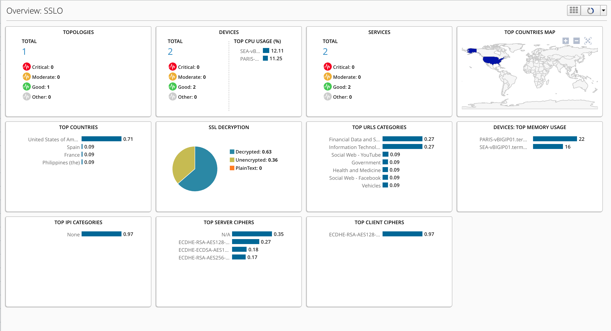

Lab 2.1: Review SSLo Overview dashboard
---------------------------------------

.. include:: /accesslab.rst

Tasks
^^^^^

- Click on Configuration > SSL Orchestrator > SSLo Overview

.. note:: You should see graphs and stats on this screen. If not, wait more minutes for that script populates the DB.

- Click on Top URL Categories chart

.. note:: You are redirected to the SSLo Analytics menu
