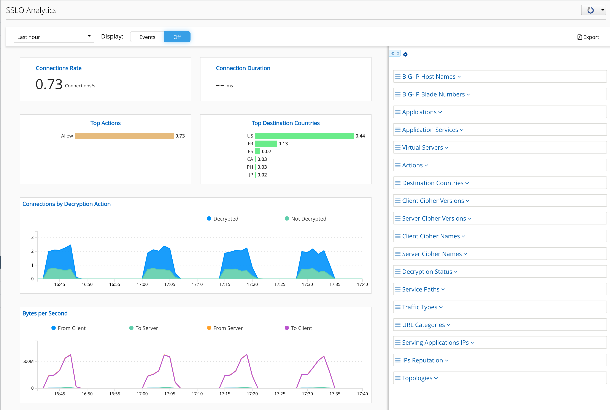
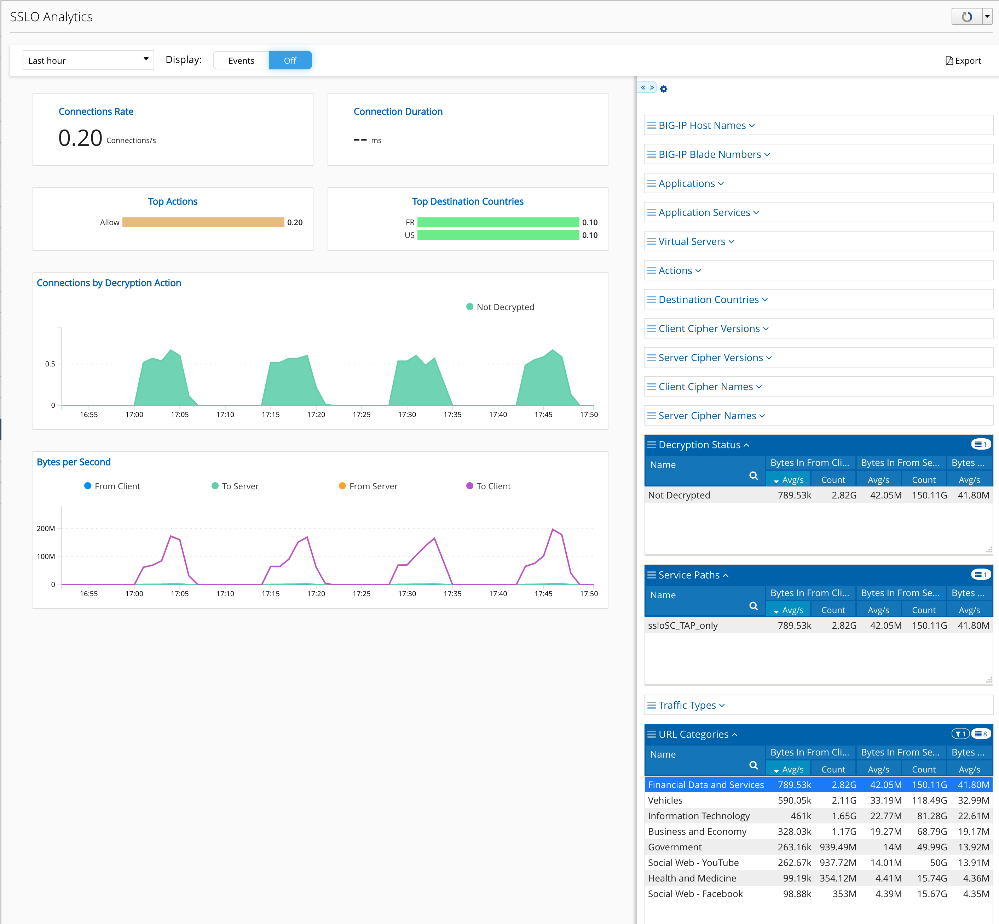

Lab 2.2: Review SSLo Analytics
------------------------------

- Click on Monitoring > SSL Orchestrator > SSLo Analytics

.. note:: This is the ElasticSearch for all SSLo. You can play with the filer to check the traffic steering.

- Expand Traffic Types, Service Paths and Decryption Status

.. note:: You can notice traffix passes through all Service Chains and traffic is decrypted and bypassed.

- Now, click on Financial Data and Services

.. note:: You can notice, when you click on Financial Data and Services, the Service Path is updated and only ssloSC_TAP_only is visible. Same for the Decryption Status, Not Decrypted. It means, the security policy is up and running (lab 1.4)
.. note:: All traffic going to Financial website is bypassed (not decrypted) and sent to Trend Micro TAP only.