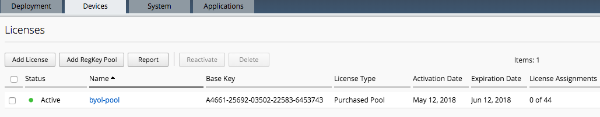
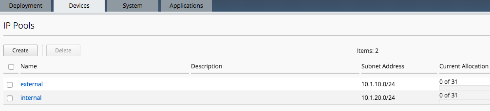
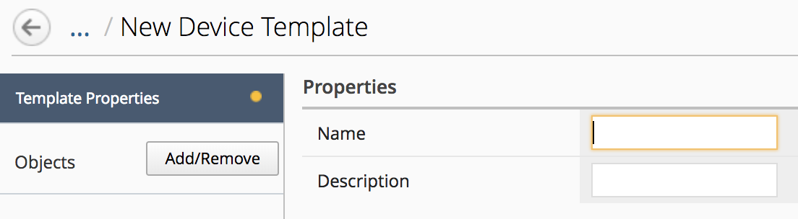
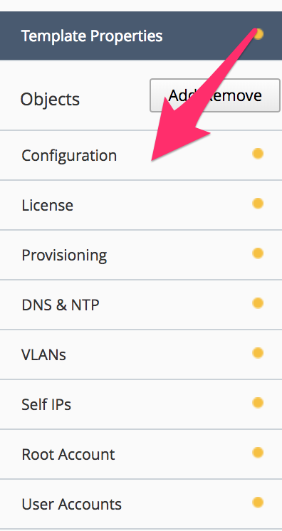
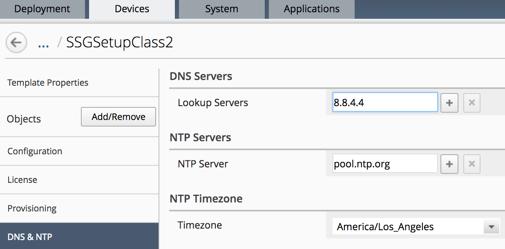
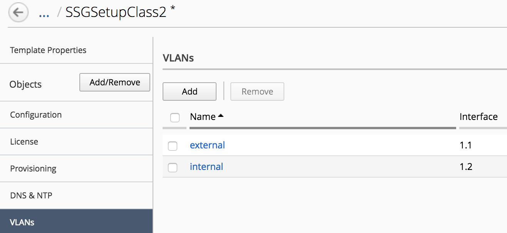

Lab 1.1: Setup a device template
--------------------------------

The first thing to setup to be able to deploy ``Service Scaling Group`` (SSG) is
to setup a ``device template``

A device template contains all the configuration items that should be pushed
on a newly provisioned F5 Virtual edition:

* Hostname (prefix/Serial Number/suffix)
* Default route (if you don't use DHCP)
* Management port (may vary if you use VMWare - 443 - or AWS - 8443 -)
* License
* Modules to provision
* VLANs
* Self-IPs
* User accounts

In this lab, we will create a device template that will be used for our ``SSG``

License Pool Setup
******************

Your BIG-IQ should already have a license pool setup.

Connect to your BIG-IQ (as *admin*)and go to : *Devices* > *License Management* > *Licenses*

Here you should see a license pool called ``byol-pool``

|

IP Pools Setup
**************

When you provision dynamically new F5 virtual edition, you need to be able to
automatically assign Self IPs to this instance. To do that, we will rely on
the ``IP Pool`` feature of ``BIG-IQ``

For our lab, we will need two IP pools:

* One for the network between Tier1 (``Service Scaler``) and Tier2 (``SSG``)
* One for the servers network

Go to *Devices* > *IP POOLS*, you should see two already defined ``IP Pool``:

* external
* internal

|

Device Template Setup
*********************

To create your Device Template, go to *Devices* > *Device Templates* and click
on *Create*

you should see this:

|

Click on the button *Add/remove* to select the configuration items you want to
enforce when deploying a new F5 virtual edition in your ``SSG``

Here, for the *Provider Type*, select *VMWare*. It will automatically select
all the required information related to a VMWare environment (in regards to Using
``Service Scaling Group``)

.. note:: **[New 6.0.1]** The Provider selection has been moved to Template Properties section in the device template.

.. image:: ../pictures/module1/img_module1_lab1_2.png
  :align: center
  :scale: 50%

|

Click *OK*. You'll see new tabs under the *Objects* column.

In the Name field, specify your ``Device Template`` name: *SSGSetupClass2*

.. image:: ../pictures/module1/img_module1_lab1_3.png
  :align: center
  :scale: 50%

|

Click on the **configuration** tab , DO NOT CLICK SAVE YET or you'll lose the
unconfigured tabs

|

Setup the configuration tab like this:

* Hostname Components:

  * Default Route: LEAVE EMPTY
  * Management port: 443
  * Check *Text (prefix)* and put: SSGClass2-
  * Check *Serial Number*
  * Check *Text (suffix)* and put: .f5demo.local

.. image:: ../pictures/module1/img_module1_lab1_5.png
  :align: center

|

Click on the *License* tab and setup the following:

* License Type : Select *Purchased Pool*
* License Name: Select *byol-pool*

.. image:: ../pictures/module1/img_module1_lab1_12.png
  :align: center
  :scale: 50%

|

Click on the *Provisioning* tab,

* Select the module *Local Traffic Manager (LTM)* and set it to *Nominal*
* Select the module *Application Visibility and Reporting* and set it to
  *Minimum*
* Select the module *Application Security (ASM)* and set it to *Nominal*

.. image:: ../pictures/module1/img_module1_lab1_7.png
  :align: center
  :scale: 50%

|

Click on the *DNS & NTP* tab and setup the following:

* Lookup Servers: 8.8.4.4
* NTP Server: pool.ntp.org
* Timezone: America/Los_Angeles

|

.. note:: **[New 6.0.1]** IP Pool can be used for the management IP. See BIG-IQ documentation for more information (the VM template need some pre-work).

**[New 6.0.1]**  Click on the *DManagement IP* tab and setup the following:

* IP Address: DHCP

.. image:: ../pictures/module1/img_module1_lab1_8b.png
  :align: center
  :scale: 50%

|

Click on the *VLANs* tab. You should see a vlan defined by default: *external*.

.. note::

  When you create/update a VLAN, you'll see the interface 1.1 being pre-populated.
  In fact, it is showed as an example. You need to type
  the interface yourself -ie 1.1 / 1.2 / ...

Click on the *Add* button:

* Name: internal
* Tag: EMPTY
* Interface: 1.2

Click on the *Save and Close* button. Click on the external vlan and assign the
interface 1.1 to it.

|

Click on the *Self IP's* tab. You should see a Self IP defined called *external*.
Click on the *Add* button:

* Name: internal
* IP Address: IP Pool > Select *internal*
* VLAN: internal
* Port lockdown: Allow None

.. image:: ../pictures/module1/img_module1_lab1_14.png
  :align: center
  :scale: 50%

|

Click on the *Save and Close* button. Click on the *external* self ip to set it up

* Name: external
* IP Address: IP Pool > Select *external*
* VLAN: external
* Port lockdown: Allow None

.. image:: ../pictures/module1/img_module1_lab1_15.png
  :align: center
  :scale: 50%

|

.. note::

  The ``external`` self IP is important because this is the self IP we will use
  to LB traffic between our tier1 (``Service Scaler``) and tier2 BIG-IPs (``SSG``).
  You need to use it as is. if you don't use a ``external`` self IP on your
  tier2 device, ``BIG-IQ`` won't know which interface to use

Click on the *Root Account* tab. Specify a new password for the root account:
*purple*

.. image:: ../pictures/module1/img_module1_lab1_16.png
  :align: center

|

Click on the *User Accounts* tab. You will see the admin user. Click on the *Admin*
user.

* Role: select *Administrator*
* Username: admin
* Password: purple
* Confirm Password: purple

.. image:: ../pictures/module1/img_module1_lab1_11.png
  :align: center
  :scale: 50%

|

Click on the button *Save & Close*, Click on the button *Save & Close* again

You should see your ``Device Template`` available now.
