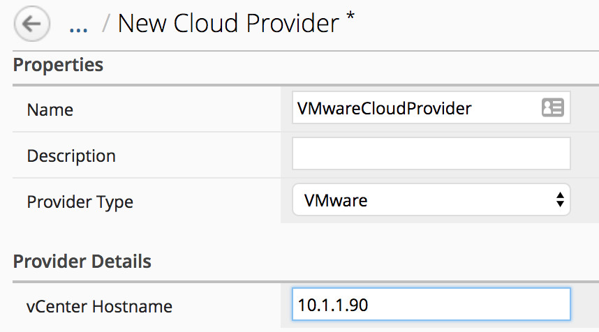
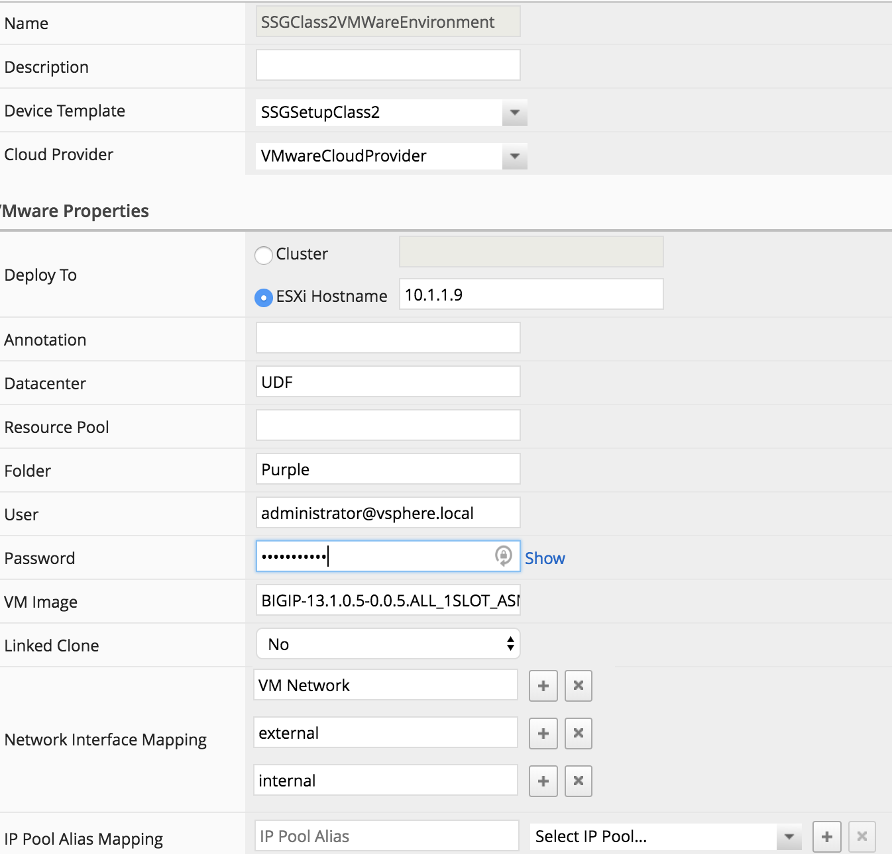

Lab 1.2: Define your Cloud Environment
--------------------------------------

The next step is to define your cloud environment so that BIG-IQ will be able
to communicate with it and deploy F5 virtual edition. For this lab we will
leverage a VMWare infrastructure

Cloud Provider Setup
********************

In your BIG-IQ interface, go to *Applications* > *Environments* > *Cloud Providers*

.. image:: ../pictures/module1/img_module1_lab2_1.png
  :align: center
  :scale: 50%

|

Click on the *Create* button:

* Name: VMWareCloudProvider
* Provider Type: select *VMWARE*
* vCenter Hostname: 10.1.1.90

|

Click *Save & Close*. Now that your Cloud provider is setup, we can define your
``Cloud Environment``. Go to *Applications* > *Environments* > *Cloud Environments*
and click on the *Create* button

General Properties:

* Name: SSGClass2VMWareEnvironment
* Device Template: Select your previously created device template *SSGSetupClass2*
* Cloud Provider: Select your previously created Cloud provider *VMWareCloudProvider*

.. warning:: Careful everything is **case sensitive** here

VMWare Properties:

* DeployTo: Select *ESXi Hostname* and type: 10.1.1.9
* Datacenter: UDF
* Folder: Purple
* User: administrator@vsphere.local
* Password: Purpl3$lab
* VM Image: BIGIP-13.1.1-0.0.4.ALL_1SLOT_template
* Network Interface Mappings

+------------+
|  Networks  |
+------------+
| VM Network |
+------------+
|  external  |
+------------+
|  internal  |
+------------+

.. note:: **[New 6.0.1]** the Network Interfaces have been removed in 6.0.1, the mapping is done in the order the interfaces are configured on the VM template.

.. warning:: **[New 7.0]** make sure the VMware tool are installed on the VM Image. Look at *Create a BIG-IP VE clone template* in `BIG-IQ Knowledge Center`_ for more details.

.. _`BIG-IQ Knowledge Center`: https://techdocs.f5.com/en-us/bigiq-7-0-0/managing-apps-in-auto-scaled-vmware-environment/vmware-scaling-groups-overview.html
             

|

Click *Save & Close*

.. note:: with the Liberty release, we have a 1:1 mapping between the cloud
  provider and cloud environment. So a cloud provider can be used with only one
  cloud environment.

We have setup all the different element defining our ``Service Scaling Group``
and can trigger its deployment now
