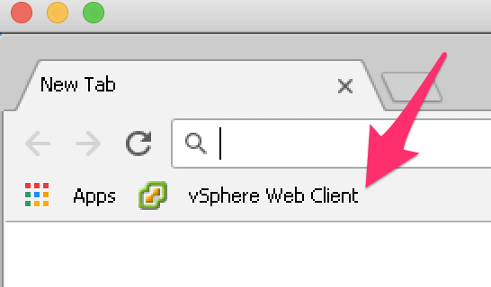
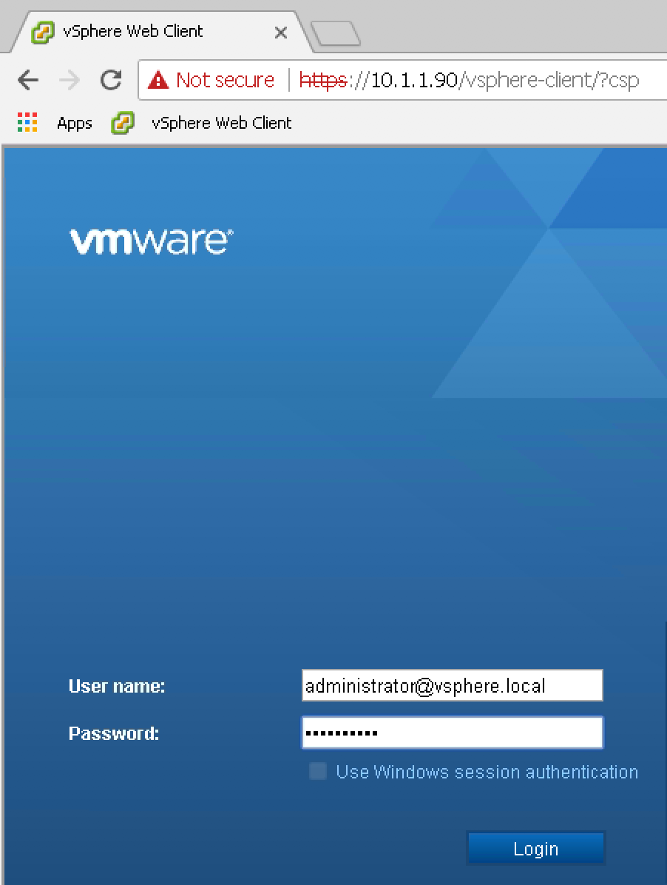
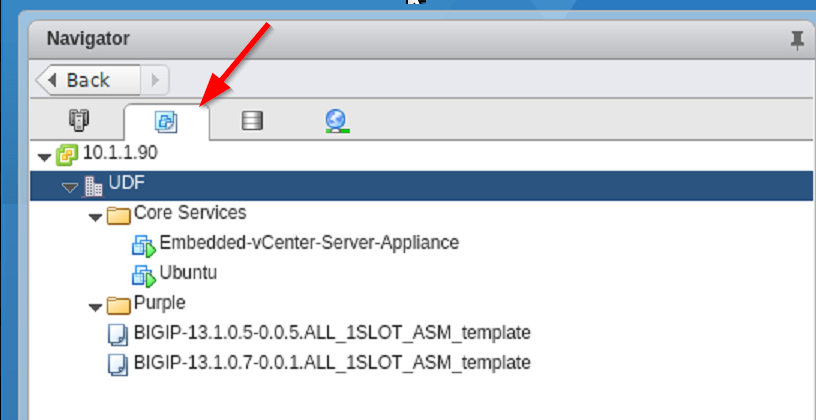
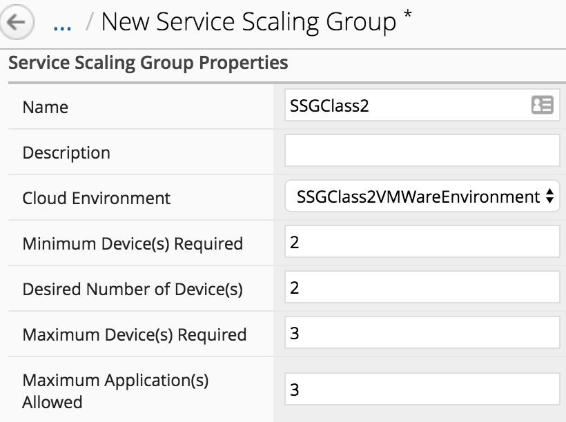
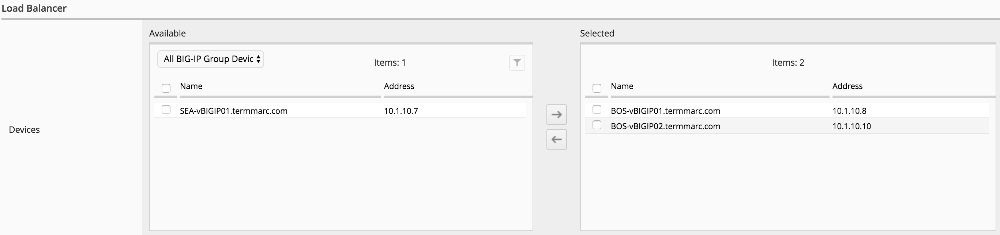
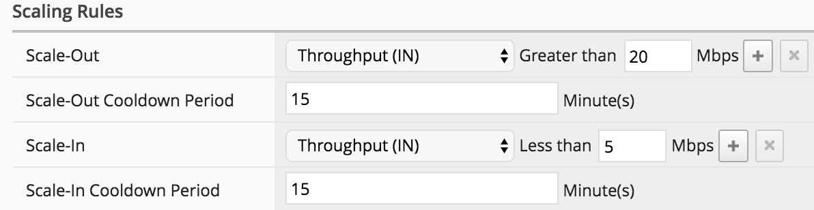

Lab 1.3: Deploy your Service Scaling Group
------------------------------------------

Before setting up our ``SSG`` and deploy it, do the following:

.. note:: it is recommended to launch your ``SSH`` sessions from the UDF portal.

* Open **2** ``SSH`` sessions on your ``BIG-IQ``.

* On the first ``SSH`` session, run the following command:

  ``tail -f /var/log/restjavad.0.log | grep vmware``

* On the second ``SSH`` session, run the following command:

  ``tail -f /var/log/orchestrator.log``

.. note:: Keep those sessions open until the end of the class.

* Connect via ``SSH`` to the system *Ubuntu Lamp Server*
  and run the command:

  ``sudo service isc-dhcp-server status``

  if you see something like this:

  .. code::

    f5@03a920f8b4c0410d8f:~$ sudo service isc-dhcp-server status
    isc-dhcp-server stop/waiting

  then run the command:

  ``sudo service isc-dhcp-server start``

  otherwise (to be safe), run the command:

  ``sudo service isc-dhcp-server force-reload``

From UDF, launch a Console/RDP session to have access to the Ubuntu Desktop. To do this, in your UDF deployment, click on the *Access* button
of the *Ubuntu Lamp Server* system and select *Console* or *XRDP*

.. image:: ../../pictures/udf_ubuntu.png
    :align: center
    :scale: 50%

|

.. note:: You may have a QWERTY keyboard for the password, keep this in mind

Launch Chrome and click on the *vSphere Web Client* bookmark.

|

Use the following credentials:

* login: administrator@vsphere.local
* password: Purpl3$lab

|

.. note:: the login/authentication takes a bit of time.

Once logged in, click on the *VMs and Templates* button to see the list of VMs
and folder.

|

In the previous lab, in our Cloud environment, we specified a VM template called
*BIGIP-13.1.0.5-0.0.5.ALL_1SLOT_template*. You can see that it is listed here.

This template will give us the required information to deploy the VEs related to
our ``SSG``:

* Nb of vCPUs
* Amount of memory allocated
* Disk size and datastore used by this ``SSG``

|

.. image:: ../pictures/module1/img_module1_lab3_8.png
   :align: center
   :scale: 50%

|

Service Scaling Group Setup
***************************

To deploy your ``Service Scaling Group`` (SSG), go to *Applications* >
*Environments* > *Service Scaling Groups* and click the *Create* button

.. image:: ../pictures/module1/img_module1_lab3_1.png
   :align: center
   :scale: 50%

|

Service Scaling Group Properties:

* Name : SSGClass2
* Cloud Environment: select *SSGClass2VMWAreEnvironment*
* Minimum Device(s) Required: 2
* Desired Number of Device(s): 2
* Maximum Device(s) Required : 3
* Maximum Application(s) Allowed: 3

.. note::

    **[New 6.0.1]** SSG can be used along with an Access Group. APM module will need to be provisioned in the device template and proper license pool will need to be configure.
    The access group to use need to be specified in the SSG configuration.
   
    .. image:: ../pictures/module1/img_module1_lab3_1b.png

.. warning::

   In UDF, the provisioning of a SSG VE may take up to 10 min. So it may takes
   up to 20 min to build those 2 devices. If you are short on time, it may be
   better to specify 1 minimum device and 1 desired device instead of 2.

|

Let's review those parameters.

* Minimum Device(s) Required : specify how many BIG-IP VE(s) should always
  be available at any time
* Desired Number of Device(s): specify the ideal number of BIG-IP VE(s)
  should be available when no scale-out scenario is triggered
* Maximum Device(s) Required: specify the maximum number of BIG-IP VE(s)
  that can be created in this SSG. The purpose is to make sure that under some
  scenarios (like being DDOS), we won't add constantly new devices
* Maximum Application(s) Allowed: specify how many applications we will
  be able to deploy on top of this SSG. The idea is to ensure that if we use a
  Cloud edition VE, we won't try to go over the license limit

Load-Balancer:

* Devices: Select the already discovered BIG-IPs *BOS-vBIGIP01.termmarc.com* and
  *BOS-vBIGIP02.termmarc.com*

|

The device(s) we select here will behave as our ``Service Scaler`` devices. They will load
balance the traffic aimed at this ``SSG``.

Scaling Rules:

* Scale-Out: Select *Throughput(In)* Greater than 20 Mbps
* Scale-In: Select *Troughput(In)* Less than 5 Mbps

|

Here we define our threshold to scale-in/scale-out.The ``cooldown period``
mentions an interval where we don't do any scaling. The idea is to see how
the situation evolves after a scale-in scale-out event.

Click on *Save & Close* and your SSG will start being provisioned.

In order to allow Paula to use the SSG previously created, go to : *System* > *Role Management* > *Roles*
and select *CUSTOM ROLES* > *Application Roles* > *Application Creator VMware* role (already assigned to Paula). Select the Service Scaling Groups *SSGClass2*, drag it to the right.

.. image:: ../pictures/module1/img_module1_lab3_10.png
   :align: center
   :scale: 50%

|

Click on *Save & Close*

Go to the next lab to see how to troubleshoot/monitor your SSG Deployment.
