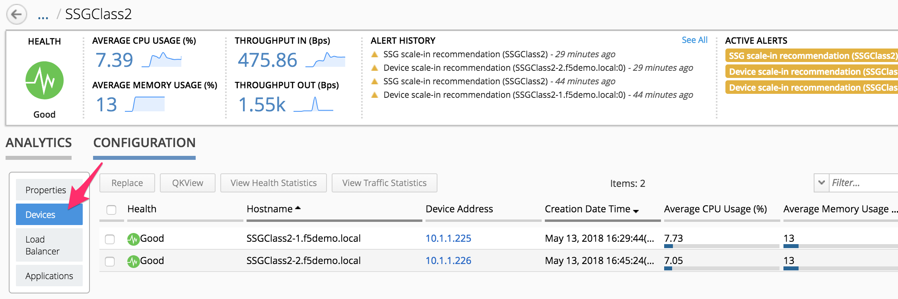

Lab 1.4: Troubleshoot a SSG
---------------------------

In this lab, we will show you how to monitor/troubleshoot your ``SSG``.

To track the activities related to your ``SSG`` (deployment, scale-in, scale-out,
delete), you can track two files on your BIG-IQ:

* ``/var/log/restjavad.0.log`` : in this file, you will be able to review and
  track all the actions done between ``BIG-IQ`` and your Cloud Provider (here VMWare)

* ``/var/log/orchestrator.log`` : in this file, you will be able to review and
  track all the actions done via ansible to deploy your ``SSG``

Since we launched our SSG in the previous lab, you should start seeing logs in
your two ``SSH`` sessions (opened during the previous lab)

example of logs for ``tail -f /var/log/restjavad.0.log | grep vmware``

.. code::

  [INFO][12 May 2018 07:17:32 PDT][/cm/cloud/tasks/vmware/scaling/299bb73f-fe9f-449c-9e79-4a6ef4a8dd0f/worker VmwScalingTaskWorker] Advancing from GET_SSG to GET_ENVIRONMENT
  [INFO][12 May 2018 07:17:32 PDT][/cm/cloud/tasks/vmware/scaling/299bb73f-fe9f-449c-9e79-4a6ef4a8dd0f/worker VmwScalingTaskWorker] Advancing from GET_ENVIRONMENT to GET_PROVIDER
  [INFO][12 May 2018 07:17:32 PDT][/cm/cloud/tasks/vmware/scaling/299bb73f-fe9f-449c-9e79-4a6ef4a8dd0f/worker VmwScalingTaskWorker] Advancing from GET_PROVIDER to VALIDATE_SSG
  [INFO][12 May 2018 07:17:32 PDT][/cm/cloud/tasks/vmware/scaling/299bb73f-fe9f-449c-9e79-4a6ef4a8dd0f/worker VmwScalingTaskWorker] Advancing from VALIDATE_SSG to CREATE_ASM_KEYS
  [INFO][12 May 2018 07:17:33 PDT][/cm/cloud/tasks/vmware/scaling/299bb73f-fe9f-449c-9e79-4a6ef4a8dd0f/worker VmwScalingTaskWorker] Updated service scaling group 'SSGClass2'
  [INFO][12 May 2018 07:17:33 PDT][/cm/cloud/tasks/vmware/scaling/299bb73f-fe9f-449c-9e79-4a6ef4a8dd0f/worker VmwScalingTaskWorker] Advancing from CREATE_ASM_KEYS to ADD_DEVICE
  [INFO][12 May 2018 07:17:33 PDT][/cm/cloud/tasks/vmware/scaling/299bb73f-fe9f-449c-9e79-4a6ef4a8dd0f/worker VmwScalingTaskWorker] Starting scale-out for service scaling group 'SSGClass2'
  [INFO][12 May 2018 07:17:33 PDT][/cm/cloud/tasks/vmware/scale-out/6bda7062-986c-4526-a895-374fa90f09e3/worker VmwScaleOutTaskWorker] Advancing from GET_SSG to GET_ENVIRONMENT
  [INFO][12 May 2018 07:17:33 PDT][/cm/cloud/tasks/vmware/scale-out/6bda7062-986c-4526-a895-374fa90f09e3/worker VmwScaleOutTaskWorker] Advancing from GET_ENVIRONMENT to GET_PROVIDER
  [INFO][12 May 2018 07:17:33 PDT][/cm/cloud/tasks/vmware/scale-out/6bda7062-986c-4526-a895-374fa90f09e3/worker VmwScaleOutTaskWorker] Advancing from GET_PROVIDER to VALIDATE_SSG
  [INFO][12 May 2018 07:17:33 PDT][/cm/cloud/tasks/vmware/scale-out/6bda7062-986c-4526-a895-374fa90f09e3/worker VmwScaleOutTaskWorker] Advancing from VALIDATE_SSG to CREATE_GUEST
  [INFO][12 May 2018 07:17:34 PDT][/cm/cloud/tasks/vmware/scale-out/6bda7062-986c-4526-a895-374fa90f09e3/worker VmwScaleOutTaskWorker] Polling: /mgmt/cm/cloud/orchestrator/vmware/tasks/create-vm/ad57d6e6-2a35-422e-8b90-f2d6108ee530

example of logs for ``tail -f /var/log/orchestrator.log``

.. code::

  2018-05-12 07:17:33 AM Provisioning VM in VMware...
  2018-05-12 07:17:33 AM post_item_state({"status": "STARTED", "kind": "cm:cloud:orchestrator:vmware:tasks:create-vm:createvmtaskitemstate", "generation": 0, "lastUpdateMicros": 0, "environmentReference": {"link": "https://localhost/mgmt/cm/cloud/environments/3d906980-66a7-3d24-aff4-2029ced9f27b"}, "startDateTime": "2018-05-12T14:17:33+0000", "vmName": "SSGClass2-b08ea97e-b2f1-4353-aace-11b150008341", "id": "ad57d6e6-2a35-422e-8b90-f2d6108ee530", "selfLink": "https://localhost:8000/mgmt/cm/cloud/orchestrator/vmware/tasks/create-vm/ad57d6e6-2a35-422e-8b90-f2d6108ee530"})
  2018-05-12 07:17:34 AM PID = 12365
  2018-05-12 07:17:34 AM post_item_state({"status": "STARTED", "kind": "cm:cloud:orchestrator:vmware:tasks:create-vm:createvmtaskitemstate", "generation": 0, "lastUpdateMicros": 0, "pid": 12365, "environmentReference": {"link": "https://localhost/mgmt/cm/cloud/environments/3d906980-66a7-3d24-aff4-2029ced9f27b"}, "startDateTime": "2018-05-12T14:17:33+0000", "vmName": "SSGClass2-b08ea97e-b2f1-4353-aace-11b150008341", "id": "ad57d6e6-2a35-422e-8b90-f2d6108ee530", "selfLink": "https://localhost:8000/mgmt/cm/cloud/orchestrator/vmware/tasks/create-vm/ad57d6e6-2a35-422e-8b90-f2d6108ee530"})
  2018-05-12 07:17:39 AM Fetching environment configuration from BIG-IQ
  2018-05-12 07:17:39 AM Create VM on vCenter
  2018-05-12 07:17:42 AM start task = TASK: Create VM

Here we can see that we are creating a VM. Go to your vCenter interface and
check that a VM is getting cloned

.. image:: ../pictures/module1/img_module1_lab4_1.png
    :align: center

|

.. note::

  Here we can see that only a single VM is getting cloned even if we requested
  2 minimum/required instances. This is because we will do it in a sequential
  manner (one after the other)

Once your VM is cloned and starting, you should see something like this in
your ``orchestrator.log`` file

.. code::

  2018-05-12 07:18:14 AM Wait for management ip and retrieve vm info
  2018-05-12 07:18:14 AM start task = TASK: Poll VM info for management IP
  2018-05-12 07:18:17 AM Ansible task retry...
  2018-05-12 07:18:31 AM Ansible task retry...
  2018-05-12 07:18:44 AM Ansible task retry...

Here your VM is starting and ansible waits for it to be up and that it retrieved
a Management IP address (provided through ``DHCP``)

.. note::

  You can open a VMWare console of your new VM instance to track its booting
  progress

Once your VM has a management IP address, Ansible will enforce the information
that have been defined in your device template.

You should see this kind of log in your ``/var/log/restjavad.0.log`` file

.. code::

  [INFO][19 Apr 2018 19:50:32 CEST][/cm/cloud/tasks/vmware/scale-out/ef16b0f9-ddfa-41d0-90a1-bc6ce747f513/worker VmwScaleOutTaskWorker] Device 10.1.1.115 created (SSGClass2-3f91f63b-6369-4edd-85c1-df229c8b4669 / 4235e453-adbb-0d44-d28f-aa8ab70bf2eb)
  [INFO][19 Apr 2018 19:50:32 CEST][/cm/cloud/tasks/vmware/scale-out/ef16b0f9-ddfa-41d0-90a1-bc6ce747f513/worker VmwScaleOutTaskWorker] Updated service scaling group 'SSGClass2'
  [INFO][19 Apr 2018 19:50:32 CEST][/cm/cloud/tasks/vmware/scale-out/ef16b0f9-ddfa-41d0-90a1-bc6ce747f513/worker VmwScaleOutTaskWorker] Advancing from CREATE_GUEST to RESET_DEFAULT_PASSWORDS
  [INFO][19 Apr 2018 19:50:33 CEST][/cm/cloud/tasks/vmware/scale-out/ef16b0f9-ddfa-41d0-90a1-bc6ce747f513/worker VmwScaleOutTaskWorker] Device template does not specify root password; random password will be used
  [INFO][19 Apr 2018 19:50:33 CEST][/cm/cloud/tasks/vmware/scale-out/ef16b0f9-ddfa-41d0-90a1-bc6ce747f513/worker VmwScaleOutTaskWorker] Using admin password specified in device template
  [INFO][19 Apr 2018 19:51:19 CEST][/cm/cloud/tasks/vmware/scale-out/ef16b0f9-ddfa-41d0-90a1-bc6ce747f513/worker VmwScaleOutTaskWorker] Advancing from RESET_DEFAULT_PASSWORDS to WAIT_FOR_DEVICE_READY
  [INFO][19 Apr 2018 19:51:21 CEST][/cm/cloud/tasks/vmware/scale-out/ef16b0f9-ddfa-41d0-90a1-bc6ce747f513/worker VmwScaleOutTaskWorker] Device 10.1.1.115 is a BIG-IP running version 13.1.0.5 build 0.0.5
  [INFO][19 Apr 2018 19:51:33 CEST][/cm/cloud/tasks/vmware/scale-out/ef16b0f9-ddfa-41d0-90a1-bc6ce747f513/worker VmwScaleOutTaskWorker] Advancing from WAIT_FOR_DEVICE_READY to APPLY_DEVICE_TEMPLATE
  [INFO][19 Apr 2018 19:51:34 CEST][/cm/cloud/tasks/vmware/scale-out/ef16b0f9-ddfa-41d0-90a1-bc6ce747f513/worker VmwScaleOutTaskWorker] Polling: /mgmt/cm/cloud/orchestrator/devicetemplate/6e39e51e-86d7-468d-8676-bf2ec4d4c999

You should see this kind of log in your ``/var/log/orchestrator.log`` file

.. code::

  2018-04-19 07:51:47 PM start task = TASK: Gathering Facts
  2018-04-19 07:51:52 PM Ansible callback on OK. result.rc=None
  2018-04-19 07:51:52 PM start task = TASK: name: test connection to BIG-IP
  2018-04-19 07:51:54 PM Ansible callback on OK. result.rc=None
  2018-04-19 07:51:54 PM start task = TASK: build launch command
  2018-04-19 07:51:54 PM Ansible callback on OK. result.rc=None
  2018-04-19 07:51:54 PM start task = TASK: copying f5-cloud-libs to device
  2018-04-19 07:52:19 PM Ansible callback on OK. result.rc=None
  2018-04-19 07:52:19 PM start task = TASK: change hostname to SSGClass21.f5demo.local
  2018-04-19 07:52:54 PM Ansible callback on OK. result.rc=0
  2018-04-19 07:52:54 PM start task = TASK: setting dns server to 8.8.4.4
  2018-04-19 07:53:03 PM Ansible callback on OK. result.rc=0
  2018-04-19 07:53:03 PM start task = TASK: setting ntp server to pool.ntp.org
  2018-04-19 07:53:08 PM Ansible callback on OK. result.rc=0
  2018-04-19 07:53:08 PM start task = TASK: setting user accounts to user:admin,role:admin
  2018-04-19 07:53:21 PM start task = TASK: change the management ssl port to 443
  2018-04-19 07:53:25 PM Ansible callback on OK. result.rc=0
  2018-04-19 07:53:25 PM start task = TASK: setting provisioned modules to ltm:nominal
  2018-04-19 07:53:30 PM Ansible callback on OK. result.rc=0

Once this VM is fully onboarded, you will be able to see that we will start
provisioning another VM to reach our target of 2 devices for our ``SSG``

We will know your SSG is done being deployed when you'll see such log files in
``/var/log/restjavad.0.log``

.. code::

  [INFO][19 Apr 2018 20:11:52 CEST][/cm/cloud/tasks/vmware/scaling/3de355e4-ea9f-46a6-8d0d-e02fb99e4c21/worker VmwScalingTaskWorker] Advancing from ADD_DEVICE to FINISHED
  [INFO][19 Apr 2018 20:11:52 CEST][/cm/cloud/tasks/vmware/scaling/3de355e4-ea9f-46a6-8d0d-e02fb99e4c21/worker VmwScalingTaskWorker] Updating service scaling group 'SSGClass2' status to ready
  [INFO][19 Apr 2018 20:11:52 CEST][/cm/cloud/tasks/vmware/scaling/3de355e4-ea9f-46a6-8d0d-e02fb99e4c21/worker VmwScalingTaskWorker] Updated service scaling group 'SSGClass2'
  [INFO][19 Apr 2018 20:11:52 CEST][/cm/cloud/tasks/vmware/scaling/3de355e4-ea9f-46a6-8d0d-e02fb99e4c21/worker VmwScalingTaskWorker] Finished scaling task for service scaling group 'SSGClass2' to create 2 and remove 0 device(s)

At this stage, if you check the status of your ``SSG`` in your ``BIG-IQ`` (Go to
*Applications* > *Environments* > *Service Scaling Groups*), you will see your
SSG being provisioned with a gray Health.

Once it is fully deployed, you'll see this:

.. image:: ../pictures/module1/img_module1_lab4_4.png
     :align: center
     :scale: 50%

|

.. note::

  Here you can see for the devices: 2/3 - you see the number of provisioned
  VEs and the max number of VEs that you're allowed to deployed in this SSG

Click on your SSG (``SSGClass2``)

.. image:: ../pictures/module1/img_module1_lab4_3.png
     :align: center
     :scale: 50%

|

This is the interface to monitor the status and performance of your ``SSG``. Click
on *Configuration*

The properties page will give you access to the previously defined parameters
related to your ``SSG``

If you click on *Devices*, You'll be able to review the devices deployed and
their Management IP addresses.

|

If you click on the ``management IP address`` of the devices. It will
open a new tab to access its UI.

.. note:: Here you'll need to connect to your ``BIG-IQ`` from the RDP session. The
  VEs in your ``SSG`` will not show up in UDF and have a mgmt IP in the subnet 10.1.1.0/24.
  In Chrome, connect to your ``BIG-IQ`` (10.1.1.4 admin/purple123), go to *Applications*
  > *Environments* > *Service Scaling Groups*, click on *SSGClass2*, go to
  *Configuration*, click on *Devices* and click on one of the management IP address.

.. note::

  Remember that we changed the default admin password

.. image:: ../pictures/module1/img_module1_lab4_6.png
     :align: center
     :scale: 50%

|

Browse through the ``BIG-IP`` UI to review the configuration that should have been
pushed:

* DNS & NTP
* modules provisioned
* VLANs
* Self-IPs

.. note::

  If you pay attention to the DNS setup, you should realize that the DNS setup
  on your ``BIG-IP`` is not the one from your device template. This got overwritten
  by the DHCP server (which is setup to push 8.8.8.8 as a DNS server)

.. note::

  if you go to your ``BIG-IQ`` UI and go to *Devices* > *BIG-IP Devices* , you will
  not be able to see your ``SSG`` devices. They won't be listed here.
