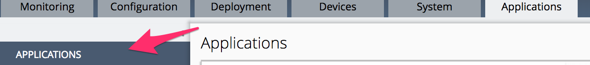
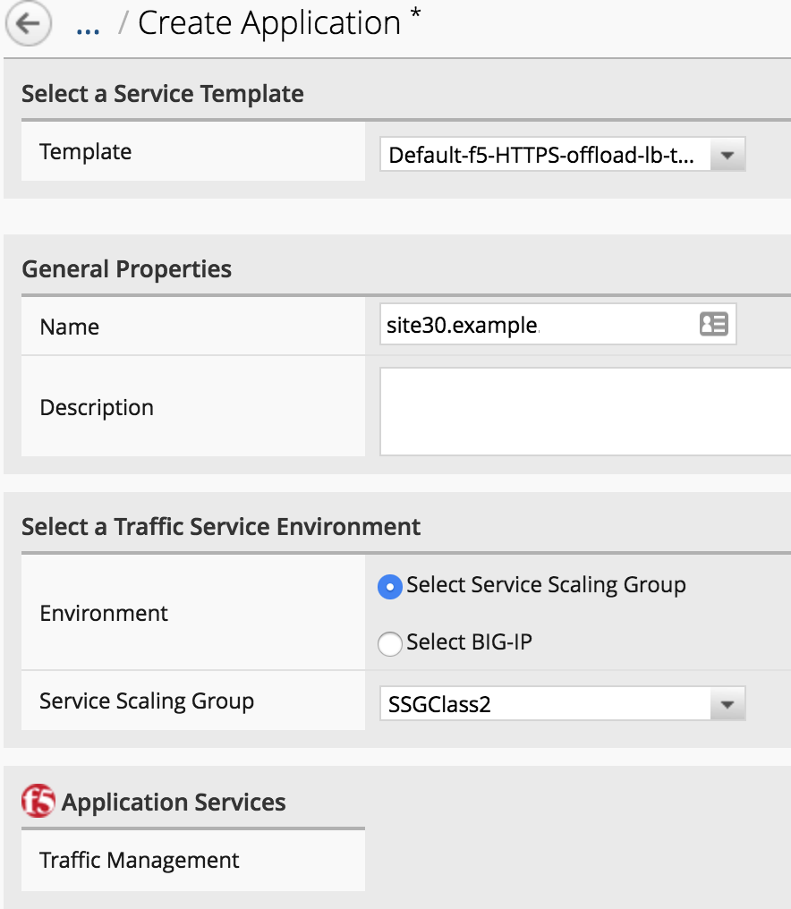
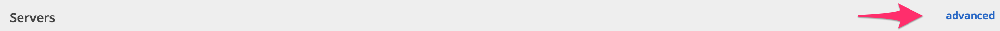
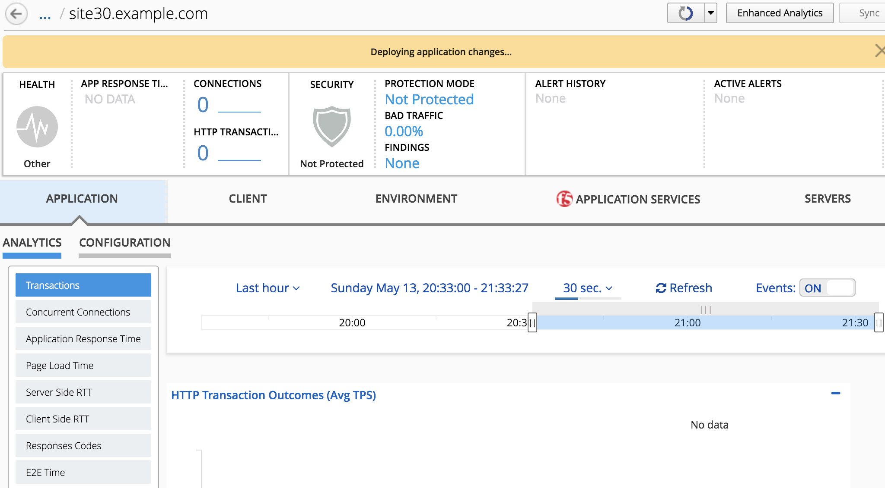
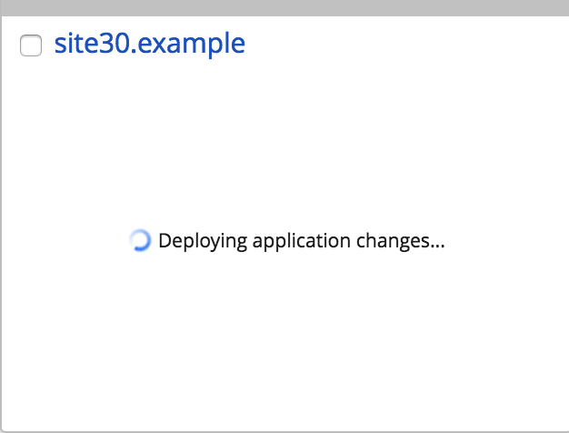
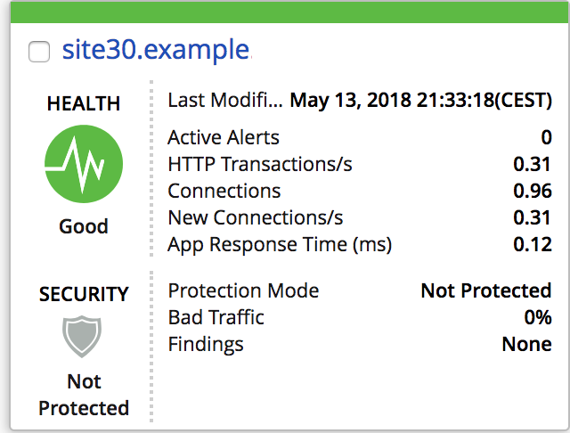

Lab 2.1: Deploy an application
------------------------------

We will deploy an application via the app template feature on our ``SSG`` called
*SSGClass2*

On your ``BIG-IQ``, go to *Applications* > *Applications*

|

Click on the *Create* button. Select the Template *Default-f5-HTTPS-offload-lb-template*

.. note::

  A SSG will only support applications with a HTTP profile attached to it. If you
  try without assigning a HTTP Profile, it will return an explicit error message

* Name : site30.example
* Environment: *Select Service Scaling Group*
* Service Scaling Group: Select *SSGClass2*

|

* Servers : Click on the advanced view

|

.. note:: You'll need to setup the *Application Server Nodes* first to be able
   to select them as your pool members. So create the nodes as shown in the
   screenshot **below** and then setup the pool member. To setup the pool member, it
   may be easier to click on the drop down list and type the beginning of the
   node name (ie 10.1.20.130 or 10.1.20.131)

.. image:: ../pictures/module2/img_module2_lab1_4.png
   :align: center
   :scale: 50%

|

* Application Server Pool:

    * Name: pool_site30
    * Pool members:

      * Port: 80
      * node: Select *# 10.1.20.130*

      * Port: 80
      * node: Select *# 10.1.20.131*

* Application Server Node

    * Name: 10.1.20.130
    * Address: 10.1.20.130

    * Name: 10.1.20.131
    * Address: 10.1.20.131

* Load Balancer:

  * Name: site30_vs_443
  * Destination Address: 10.1.10.130
  * Destination Network Mask: 255.255.255.255
  * Service Port: 443

|

* HTTP Redirect:

  * Name: site30_redirect_vs80
  * Destination Address: 10.1.10.130
  * Destination Network Mask: 255.255.255.255
  * Service Port: 80

  |

  .. image:: ../pictures/module2/img_module2_lab1_5.png
    :align: center
    :scale: 50%

  |

Click on *Create*. You'll see your application being created

|

On the page *Applications* > *Applications*, you'll see this while the app is
getting deployed (Tile view):

|

.. note::

  Deployment might take some time because the service scaler in the lab has lots of modules provisioned so it takes time to refresh the config.
  It would be much faster in a none nested virtualized environment with a Service Scaler with only LTM module provisioned as it should be.

You can also follow your application service deployment on the page *Applications* > Application Deployments.
If the deployment fails, you may check if the service scaler Boston Cluster is sync correctly.

As soon as the app is configured, you'll see this:

|

You can access your app from the **RDP session**. You should see this:

.. image:: ../pictures/module2/img_module2_lab1_9.png
  :align: center
  :scale: 50%

|

Next, we will review the configuration on our ``SSG`` devices and on our
``Service Scaler`` devices
