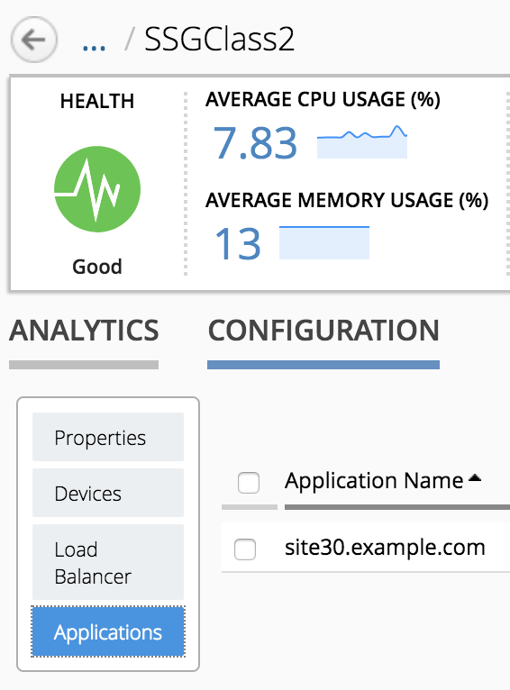
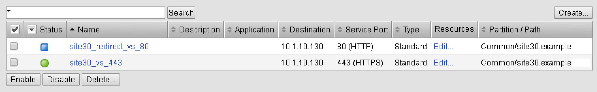
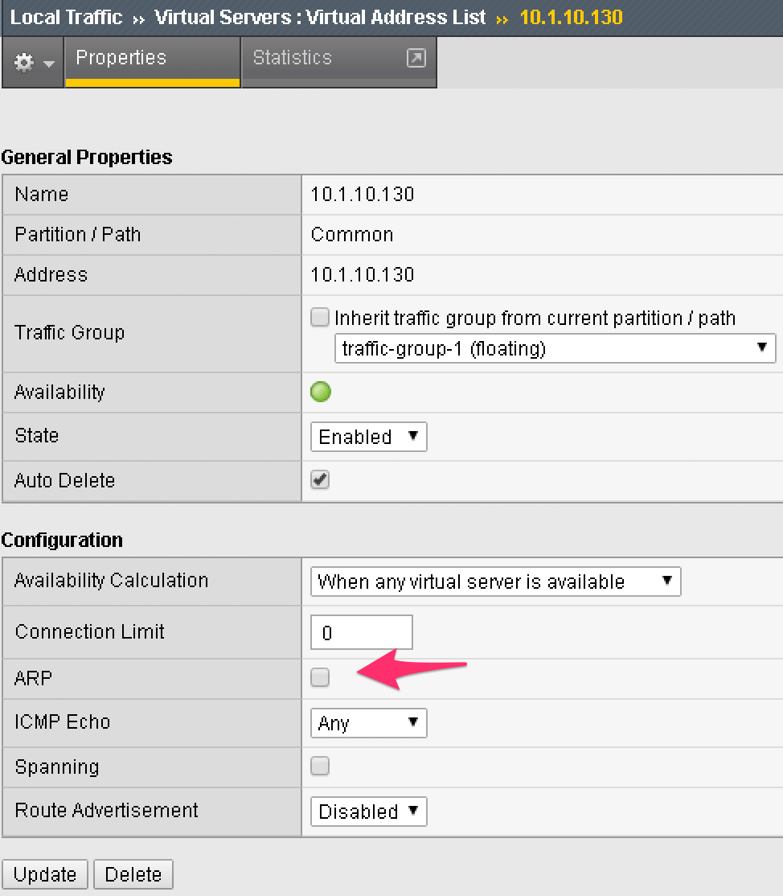
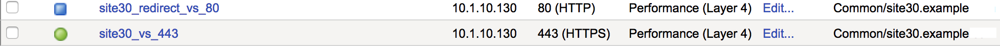
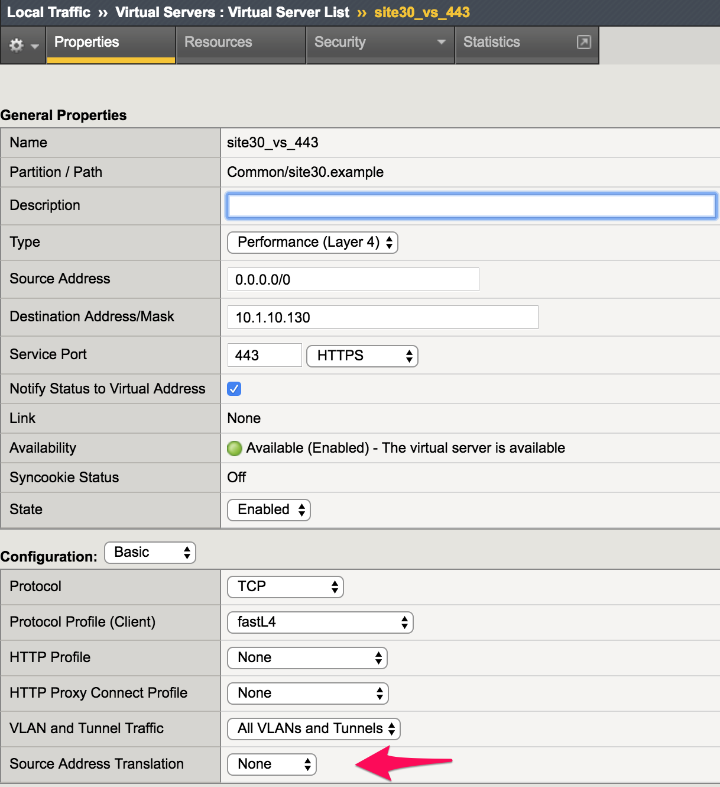
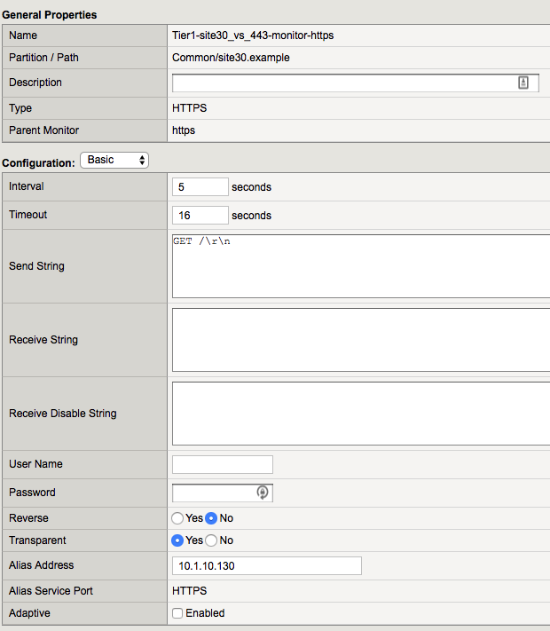

Lab 2.2: Review our application deployment
------------------------------------------

Now that our application is deployed, we can review the configuration of our
``BIG-IPs`` in the ``Service Scaling Group`` and in our ``Service Scaler``
cluster

If you go in your ``SSG`` *SSGClass2*, click on *Configuration* and then on
*Applications*. You'll see our application listed here

|

``SSG`` Setup for our Application
*********************************

Use again the **RDP session** to have access to your ``BIG-IPs`` in your ``SSG``
*SSGClass2*

.. note:: you can review their IP address by going in your ``SSG``, Click on
  *Configuration* and then *Devices*

On each ``BIG-IP`` in your ``SSG``, you should have an identical setup:

|

.. image:: ../pictures/module2/img_module2_lab2_3.png
  :align: center
  :scale: 50%

|

|

.. note:: we disable ARP on the Virtual Address since the same VS IP is used on
  all our ``SSG`` devices

``Service Scaler`` Setup for our Application
********************************************

Connect to your ``BIG-IPs`` used as ``Service Scaler``: *BOS-vBIGIP01.termmarc.com* and
*BOS-vBIGIP02.termmarc.com*

Here you should see this setup:

|

.. note:: we do L4 LB, so we use FastL4 VS.

|

.. note:: we don't do Destination IP translation and if you switch to *advanced view*,
  you'll see that *Address Translation* and *Port Translation* are disabled.
  This means that your ``Service Scaler`` ``BIG-IP`` and ``BIG-IPs`` in your
  ``SSG`` must be able to communicate via L2.

.. image:: ../pictures/module2/img_module2_lab2_8.png
  :align: center

|

For the pool setup, you can see that we use our ``BIG-IPs`` Self-IPs and not the VS
address 10.1.10.130

.. note::

  Remember that ``BIG-IQ`` will use the SSG Device Self IP called *external* as pool member

.. image:: ../pictures/module2/img_module2_lab2_7.png
  :align: center
  :scale: 50%

|

For the pool monitor, we created a custom http monitor with the following settings: 

|

We have enabled the ``transparent`` option and setup the ``Alias address`` (ie send the monitor to this destination IP 
*through* the ``Alias Address`` specified)

Next we can review the different analytics data available for your ``SSG`` *SSGClass2*
