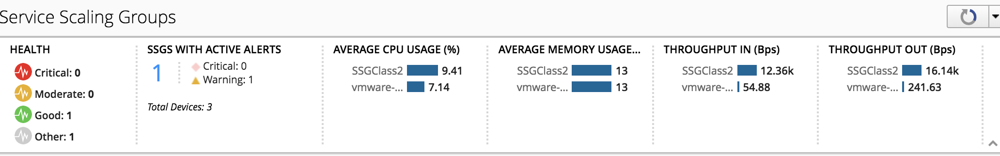

Lab 2.3: Review our SSG Analytics
---------------------------------

Our ``SSG`` host a service and we sent some traffic through it. We can now review
the kind of data that is available to us

Overall SSGs Analytics
**********************

Go to *Applications* > *Environments* > *Service Scaling Groups*

The screen lists all of your ``service scaling groups`` (``SSG``) and current summary data
about their overall health, ``BIG-IP`` device performance and active alerts.
Use this screen to create, delete or oversee all of your SSGs.

The ``Summary Bar`` provides summary information about your SSGs' overall health,
active alerts and device performance. Click the elements in this area to filter
or sort the ``SSG`` list.

|

*SSGs with Active Alerts* lists the number of ``SSGs`` with either active warning or
critical alerts. if you have alerts, click on this block to filter the involved
``SSGs``

Below the summary bar, the screen lists all ``SSGs`` in either in a grid or tile mode.
From here, you can create, delete or monitor your ``SSGs``.

Use one of the screen's filter and sort settings to isolate information of
interest.You can adjust the columns displayed by selecting the gear icon in the filter area.

SSG Specific Analytics
**********************

Click on our ``SSG`` *SSGClass2*, this will redirect us to a dashboard specific to this
``SSG``.

At the top you get another Summary bar related to your ``SSG``: Health, Active Alerts,
Alert History, Average CPU Usage, Throughput (IN/OUT)

.. image:: ../pictures/module2/img_module2_lab3_3.png
 :align: center
 :scale: 50%

|

Under the Summary bar, you can either review the analytics related to this ``SSG``
(*Analytics* tab ) or its Setup (*Configuration* tab - already reviewed previously)

Use the *Analytics* tab area to identify data trends and events, or alerts,
within a selected time period. To further isolate information, expand the
dimensions area to the right of the chart.
Select specific entities within each dimension to adjust the data displayed
in this tab. To view specific alert details, select an in-line notification,
or choose one of the filters below each chart.

Take the time to navigate in all the different charts.

.. image:: ../pictures/module2/img_module2_lab3_2.png
  :align: center
  :scale: 50%
