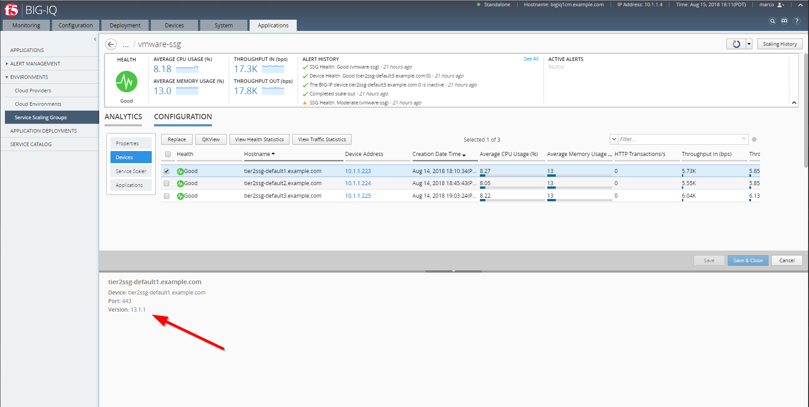
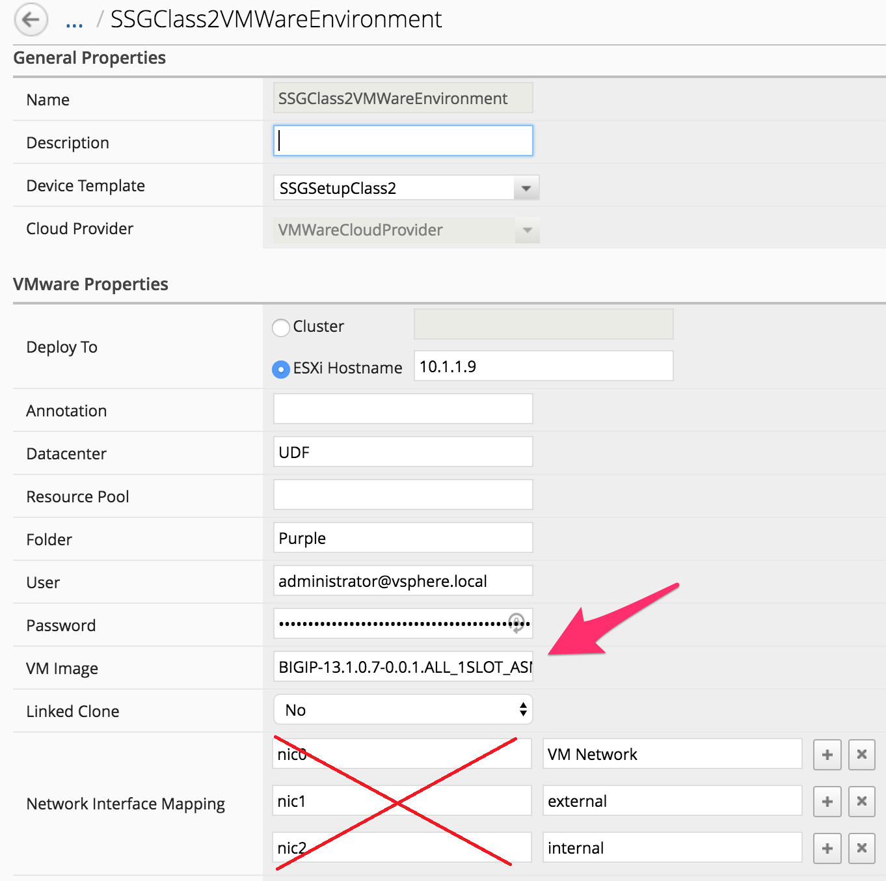

Lab 3.1: Update our Cloud Environment
-------------------------------------

When we deploy or scale-out a ``SSG``. The provisioned instances will rely on the 
information specified in the ``Cloud Environment`` to know what it needs to deploy. 

In the **(Module1)Lab 1.2: Define your Cloud Environment**, we defined the ``Cloud Environment`` 
used by our ``SSG`` **SSGClass2** 

This ``Cloud Environment`` specifies a few information:

* vCenter credentials
* VMWare specific information like Datacenter name, resource pool, folder, ...
* VM image template to clone and start as a new SSG instance
* Networking setup for the new VM image 

The key component for the upgrade/scale-up use cases is the ``VM Image`` field. This field 
specifies the VM Template we need to clone as our new instance. What is important is that 
when we created this template we: 

* used a specific F5 Virtual edition image that will enforce the version to use 
* we allocated compute resources to it: vCPUs, Memory, Datastore to it. 
* we specified the number of interfaces to attach to our Virtual edition 

Here is the configuration of the VM template we use in our existing ``SSG`` **SSGClass2**

.. image:: ../pictures/module3/img_module3_lab1_4.png
   :align: center
   :scale: 50%

|

Here we can see that we use: 

* 2 vCPUs
* 8 Gb of Memory
* BIG-IP version 13.1.1

You can also check the BIG-IP version by selecting the device part of the SSG.

If we need to upgrade AND/OR scale-up our ``SSG``, we just need to do the following: 

* Deploy a new F5 Virtual Edition image as a template with the relevant version
* Update (or not) the resources allocated to it if we want to scale up (more vCPUs, memory)

.. note:: we could also scale down a SSG if we realized we allocated too much compute to it

In this lab, we already have another VM template available to test this: 
BIGIP-14.1.0.5-0.0.5.ALL_1SLOT_template

.. image:: ../pictures/module3/img_module3_lab1_1.png
   :align: center
   :scale: 50%

|

We can review the configuration of this VM template: 

* 4 vCPUs
* 8 Gb of Memory
* BIG-IP Version 14.0.0

.. image:: ../pictures/module3/img_module3_lab1_3.png
   :align: center
   :scale: 50%

|

So if we switch from our previous template to this one, we will UPGRADE our environment AND SCALE-UP: 

* upgrade from 13.1.1 to 14.1.0
* add more vCPUs to the instances (2 -> 4 vCPUs)

In your ``BIG-IQ`` UI, Go to *Applications* > *Environments* > *Cloud Environments*, Select 
**SSGClass2VMWareEnvironment** to edit it. 

Update the *VM Image* field to use the new VM Template: BIGIP-14.1.0.5-0.0.5.ALL_1SLOT_template

|

.. warning:: make sure the VMware tool are installed on the VM Image. Look at *Create a BIG-IP VE clone template* in `BIG-IQ Knowledge Center`_ for more details.

.. _`BIG-IQ Knowledge Center`: https://techdocs.f5.com/en-us/bigiq-7-0-0/managing-apps-in-auto-scaled-vmware-environment/vmware-scaling-groups-overview.html

Click *Save & Close*. Now that our ``Cloud Environment`` is updated, we can upgrade our ``SSG``. 

.. note:: bear in the mind that from now on, if our ``SSG`` need to scale-out, it will use 
   this new VM Template also
