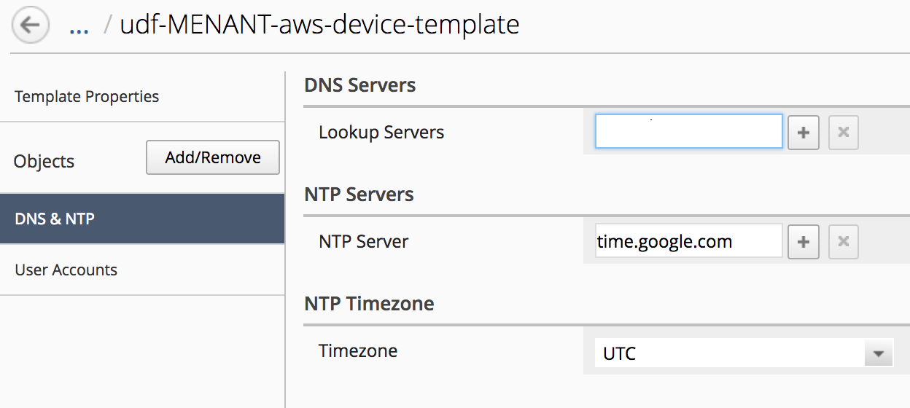
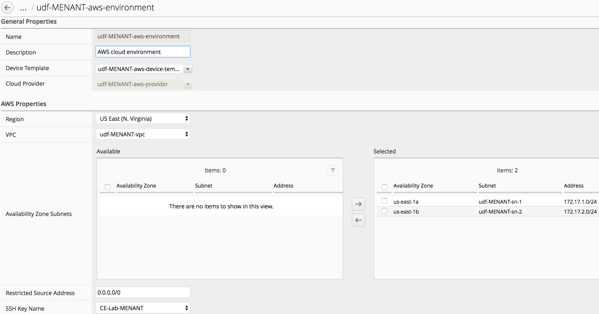
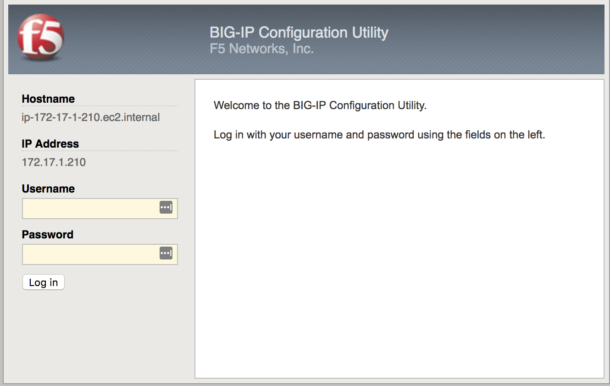

Lab 4.3: Review our ``SSG`` deployment in ``AWS``
-------------------------------------------------

``AWS`` configuration review
****************************

Connect to your ``AWS Console`` to review what has been created already (the AWS console URL, login, password are in the Cloud Accounts tab if using lab environment).

Go to **Services** > **CloudFormation**

.. image:: ../pictures/module4/img_module4_lab3_12.png
  :align: center
  :scale: 50%

|

Here you can see that 4 ``AWS Stacks`` have been deployed:

* <YOUR PREFIX>-vpc-elb-cf-stack : This stack deploys a new VPC called **<YOUR PREFIX>-vpc**.
    We use this new VPC to avoid any conflict and ensure we won't disrupt anything. We will
    create the subnets, security groups and an ELB called **<YOUR PREFIX>-elb** that can be used
    to deploy an App later
* <YOUR PREFIX>-vpn-cf-stack : This stack depoys the ``VPN`` configuration in ``AWS``. We
    use this ``VPN`` to send data back to ``BIG-IQ DCDs``.
* <YOUR PREFIX>-ubuntu-cf-stack : This stack deploys an ubuntu instance that will behave
    as our app
* <YOUR PREFIX>-aws-ssg : this will create the ``AWS autoscale`` deployment : launch
    configuration, auto scaling groups, ...

Those stacks were deployed from our system called **Ubuntu Lamp Server**.
If you want to review those stacks, connect to this system and go to :

.. code::

    f5student@xjumpbox:~/$ cd f5-aws-vpn-ssg/cft/
    f5student@xjumpbox:~/f5-aws-vpn-ssg$ ls -l
    -rw-r--r-- 1 f5 f5 7148 May  3 06:49 Servers-Setup.template
    -rw-r--r-- 1 f5 f5 5367 Jun 11 00:27 Setup-Ubuntu.template
    -rw-r--r-- 1 f5 f5 8425 May  9 11:02 Setup-VPC.template
    -rw-r--r-- 1 f5 f5 2642 May  9 08:33 Setup-VPN.template

Take some time to review the different things setup in your own VPC.


``BIG-IQ SSG`` configuration review
***********************************

Connect to the ``BIG-IQ UI`` and go to **Devices** > **Device Templates**.
You should see a new device template called <your PREFIX>-aws-device-template

.. image:: ../pictures/module4/img_module4_lab3_1.png
  :align: center
  :scale: 50%

|

Click on this new device template to review its configuration. You'll see that
only **NTP** and **User Accounts** have been setup.

.. note:: the admin password used here is <it's in your config.yml file, BIGIP_PWD ATTRIBUTE>

.. note:: **[New 6.0.1]** DNS server shouldn't be set in the device template



|

Next, you may go to **Applications** > **Environments** > **Cloud Providers**.
You will see a new Cloud Providers called **<YOUR prefix>-aws-provider**:

.. image:: ../pictures/module4/img_module4_lab3_3.png
  :align: center
  :scale: 50%

|

Click on this new cloud provider. You'll see that it contains your ``AWS Access Key``
and your ``AWS Secret Access Key``.

Click on the **Test** button when you need to make sure your credentials are fine.

.. image:: ../pictures/module4/img_module4_lab3_4.png
  :align: center
  :scale: 50%

|

Go to **Applications** > **Environments** > **Cloud Environments**. Click on your cloud
environment called **<YOUR PREFIX>-aws-environment**

.. image:: ../pictures/module4/img_module4_lab3_5.png
  :align: center
  :scale: 50%

|

You will be able to retrieve a lot of the information that were defined in the **config.yml** file:

* Region
* AZ
* SSH Key Name
* License type
* AMI
* BIG-IQ information

...



|

Go to **Applications** > **Environments** > **Service Scaling Groups**. Click on your ``SSG``
called **<YOUR PREFIX>-MENANT-aws-ssg**

.. image:: ../pictures/module4/img_module4_lab3_7.png
  :align: center
  :scale: 50%

|

Go to **Configuration** > **Devices**. You'll be able to see your two provisioned ``BIG-IPs```

.. image:: ../pictures/module4/img_module4_lab3_8.png
  :align: center
  :scale: 50%

|

Click on one of your ``BIG-IP`` to open its GUI in a new tab.



|

* Login: admin
* Password: <it's in your config.yml file, BIGIP_PWD ATTRIBUTE>

``SSG BIG-IP`` configuration review
***********************************

Once you're logged in your ``BIG-IP``, you can see a few things:

* it's offically managed by ``BIG-IQ``
* it's in SYNC. Our ``BIG-IPs`` part of a ``SSG`` deployed in ``AWS`` will be setup as a cluster


|

Go to **Device Management** > Overview

.. image:: ../pictures/module4/img_module4_lab3_11.png
  :align: center
  :scale: 50%

|

You can see that **Auto Sync** is enabled for a Device Group called **autoscale-group**.

Let's deploy an application to see how it is setup on our different components (``AWS ELB``,
``BIG-IPs`` in the ``SSG``).
