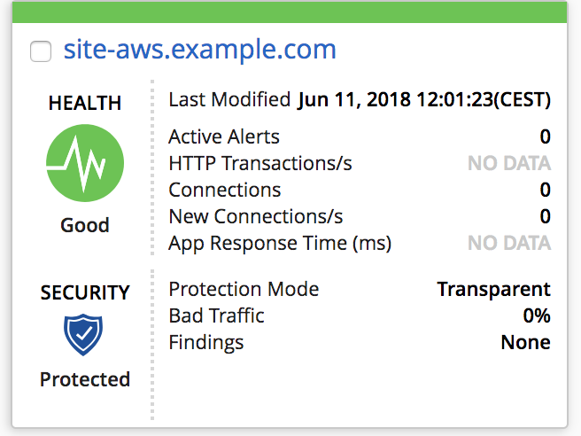
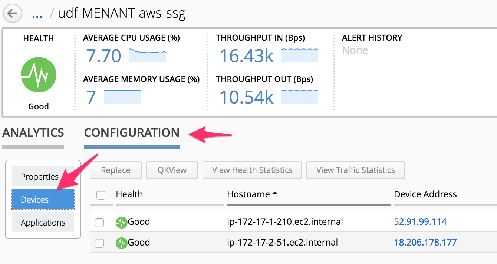
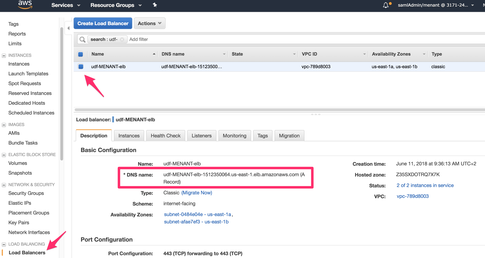

Lab 4.4: Deploy an application (AWS)
------------------------------------

.. warning:: A default Application should be already deloy (by admin user). If you want to proceed delete the existing application deployed on the AWS SSG (udf-<your name>-elb).

Deploy your application (optional)
**********************************

In your ``BIG-IQ UI`` , Go to **Applications** > **Applications** and click on the
**Create** button.

.. image:: ../pictures/module4/img_module4_lab4_1.png
   :align: center
   :scale: 50%

|

Select the template called **Default-AWS-f5-HTTPS-WAF-lb-template**.

General properties:

* Name: **site-aws.example.com**
* Domain Names: **site-aws.example.com**

.. image:: ../pictures/module4/img_module4_lab4_3.png
   :align: center
   :scale: 50%

|

Select a Traffic Service Environment:

* Environment: Select **Service Scaling Group**
* Service Scaling Group: Select **<YOUR PREFIX>-aws-ssg**

.. image:: ../pictures/module4/img_module4_lab4_4.png
   :align: center
   :scale: 50%

|

AWS ELB settings:

* Name of Classic Load Balancer: **<YOUR PREFIX>-elb**

  .. note:: You can retrieve the name of your ``AWS ELB`` by going to your ``AWS Console``
     and go to **Services** > **EC2** > **Load Balancing** > **Load Balancer**

     .. image:: ../pictures/module4/img_module4_lab4_2.png
        :align: center
        :scale: 50%

  .. note:: Remember that we don't create the ``AWS ELB`` here. It has to exist before
     deploying an App.

* Listeners:

  .. list-table::
     :widths: 15 30 30 30
     :header-rows: 1

     * - **LB PROTOCOL**
       - **LB PORT**
       - **INSTANCE PROTOCOL**
       - **INSTANCE PORT**
     * - TCP
       - 443
       - TCP
       - 443
     * - TCP
       - 80
       - TCP
       - 80

.. image:: ../pictures/module4/img_module4_lab4_5.png
   :align: center
   :scale: 50%

|

Servers:

* Servers: 172.100.1.50 / Port 80

.. image:: ../pictures/module4/img_module4_lab4_6.png
   :align: center
   :scale: 50%

|

Web Application Firewall & Load Balancer:

* Name: default_vs

.. image:: ../pictures/module4/img_module4_lab4_7.png
   :align: center
   :scale: 50%

|

Click on the **Create** button.

After some time, you should see this:

|

Review your ``SSG`` devices setup
*********************************

To review the app configuration on the ``SSG`` devices, in your ``BIG-IQ UI``, go to
**Applications** > **Environments** > **Service SCaling Groups**.

Click on your ``SSG`` and then go to **Configuration** > **Devices**. Here you can click
on the Address of one of your devices.

|

.. note::

    * Login: admin
    * Password: <it's in your config.yml file, BIGIP_PWD ATTRIBUTE>

.. image:: ../pictures/module4/img_module4_lab4_9.png
   :align: center
   :scale: 50%

|

.. note:: Keep in mind that because we deploy single nic ``BIG-IPs``, all the VS will
   rely on the self-IP address. Therefore the virtual address we use is 0.0.0.0

Spend some time reviewing your app configuration on your ``SSG Devices``.

Review your ``AWS ELB`` setup
*****************************

In your ``AWS Console`` , go to **Services** > **EC2** > **Load Balancing** > **Load Balancers**.

Click on the ``AWS ELB`` we specified in the app settings (**<YOUR PREFIX>-elb**)

Retrieve the DNS Name tied to this ELB:

|

Open a new tab in your browser and go to this DNS name (https)

.. image:: ../pictures/module4/img_module4_lab4_11.png
   :align: center
   :scale: 50%

|

Your application is deployed successfully.
