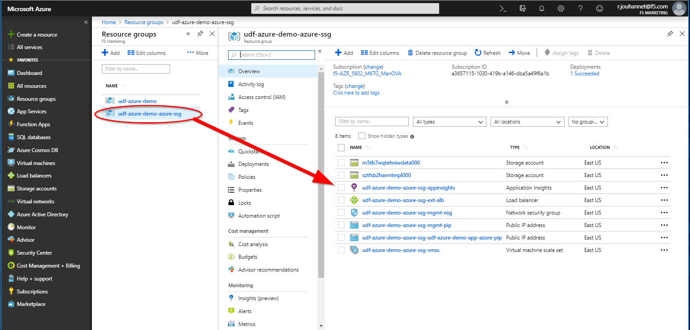
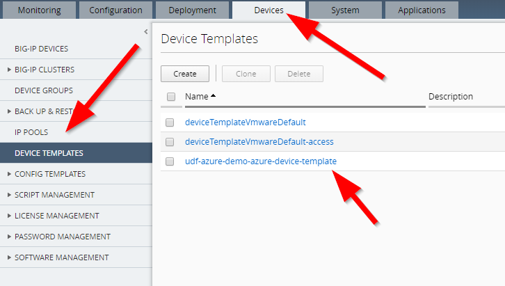
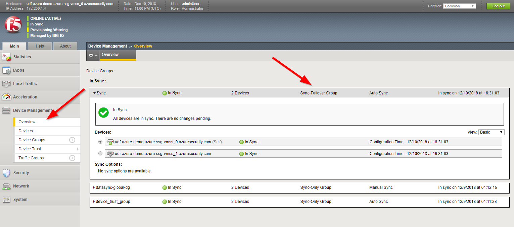

Lab 5.3: Review our ``SSG`` deployment in ``Azure``
---------------------------------------------------

``Azure`` configuration review
******************************

Connect to your ``Azure Console`` to review what has been created already.

Go to **Resource groups**



|

Here you can see that 2 ``Resource groups`` have been deployed:

* <YOUR PREFIX> : This stack deploys a new VNET called **vnet1demo**.
    We use this new VNET to avoid any conflict and ensure we won't disrupt anything. We will
    create the subnets, gateway, VPN, an ubuntu instance that will behave
    as our app.
* <YOUR PREFIX>-azure-ssg : this will create the ``Azure autoscale`` deployment : launch
    configuration, auto scaling groups, ...

Those resource groups were deployed from our system called **Ubuntu Lamp Server**.
If you want to review those, connect to this system and go to :

.. code::

    f5student@ip-10-1-1-5:~$ cd f5-azure-vpn-ssg
    f5student@ip-10-1-1-5:~/f5-azure-vpn-ssg$  ls -l
    -rwxrwxr-x 1 f5student f5student  6736 Dec  8 11:54 000-RUN_ALL.sh
    -rwxrwxr-x 1 f5student f5student  1653 Dec  8 11:54 01-install_azure_cli.sh
    -rwxrwxr-x 1 f5student f5student  5703 Dec  8 11:54 02-create-vpn-azure_cli.sh
    -rwxrwxr-x 1 f5student f5student  4905 Dec  8 11:54 03-configure-bigip.sh
    -rw-rw-r-- 1 f5student f5student   868 Dec  8 12:38 04-docker-on-ubuntu-azure.log
    -rw-rw-r-- 1 f5student f5student  4757 Dec  8 11:54 04-docker-on-ubuntu-azure.yml
    -rw-rw-r-- 1 f5student f5student 14896 Dec  8 12:01 08a-create-azure-auto-scaling.yml
    -rwxrwxr-x 1 f5student f5student  6357 Dec  8 11:54 09a-create-azure-waf-app.py
    -rwxrwxr-x 1 f5student f5student  6463 Dec  8 11:54 09b-create-azure-https-app.py
    -rw-rw-r-- 1 f5student f5student  1045 Dec  8 11:54 10-delete-azure-app.yml
    -rwxrwxr-x 1 f5student f5student  4669 Dec  8 11:54 111-DELETE_ALL.sh
    -rwxrwxr-x 1 f5student f5student  1547 Dec  8 11:54 11-delete-azure-ssg-resources-check.py
    -rw-rw-r-- 1 f5student f5student  1082 Dec  8 11:54 11-delete-azure-ssg-resources.yml

Take some time to review the different things setup in your own VNET.


``BIG-IQ SSG`` configuration review - Azure
*******************************************

Connect to the ``BIG-IQ UI`` and go to **Devices** > **Device Templates**.
You should see a new device template called <your PREFIX>-Azure-device-template



|

Click on this new device template to review its configuration. You'll see that
only **NTP** and **User Accounts** have been setup.

.. note:: the admin password used here is <it's in your config.yml file, BIGIP_PWD ATTRIBUTE>

.. note:: DNS server shouldn't be set in the device template

.. image:: ../pictures/module5/img_module5_lab3_3.png
  :align: center
  :scale: 50%

|

Next, you may go to **Applications** > **Environments** > **Cloud Providers**.
You will see a new Cloud Providers called **<YOUR prefix>-Azure-provider**:

.. image:: ../pictures/module5/img_module5_lab3_4.png
  :align: center
  :scale: 50%

|

Click on this new cloud provider. You'll see that it contains your ``Tenant ID``, ``Client ID``, ``Service Principal Secret``
and your ``Subscription ID``.

Click on the **Test** button when you need to make sure your credentials are fine.

.. image:: ../pictures/module5/img_module5_lab3_5.png
  :align: center
  :scale: 50%

|

Go to **Applications** > **Environments** > **Cloud Environments**. Click on your cloud
environment called **<YOUR PREFIX>-Azure-environment**

.. image:: ../pictures/module5/img_module5_lab3_6.png
  :align: center
  :scale: 50%

|

You will be able to retrieve a lot of the information that were defined in the **config.yml** file:

* Location
* License type
* BIG-IP image
* BIG-IQ information

...

.. note:: It may take some time for the page to load.

.. image:: ../pictures/module5/img_module5_lab3_7.png
  :align: center
  :scale: 50%

|

Go to **Applications** > **Environments** > **Service Scaling Groups**. Click on your ``SSG``
called **<YOUR PREFIX>-azure-ssg**

.. image:: ../pictures/module5/img_module5_lab3_8.png
  :align: center
  :scale: 50%

|

Go to **Configuration** > **Devices**. You'll be able to see your two provisioned ``BIG-IPs```

.. image:: ../pictures/module5/img_module5_lab3_9.png
  :align: center
  :scale: 50%

|

Click on one of your ``BIG-IP`` to open its GUI in a new tab.

.. image:: ../pictures/module5/img_module5_lab3_10.png
  :align: center
  :scale: 50%

|

* Login: adminUser
* Password: <it's in your config.yml file, BIGIP_PWD ATTRIBUTE>

``SSG BIG-IP`` configuration review - Azure
*******************************************

Once you're logged in your ``BIG-IP``, you can see a few things:

* it's offically managed by ``BIG-IQ``
* it's in SYNC. Our ``BIG-IPs`` part of a ``SSG`` deployed in ``Azure`` will be setup as a cluster

.. image:: ../pictures/module5/img_module5_lab3_11.png
  :align: center
  :scale: 50%

|

.. note:: Ignore the Provisioning Warning which is due to the license used.

Go to **Device Management** > Overview



|

You can see that **Auto Sync** is enabled for a Device Group called **autoscale-group**.

Let's deploy an application to see how it is setup on our different components (``Azure ALB``,
``BIG-IPs`` in the ``SSG``).
