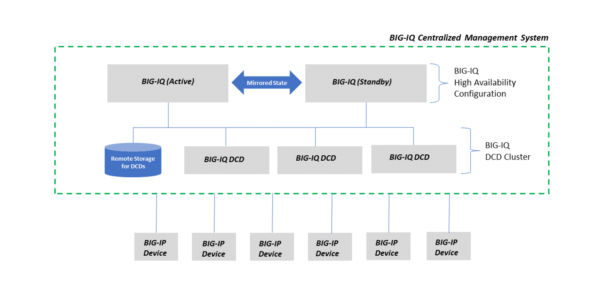

Class 3: BIG-IQ Analytics
=========================

Overview
^^^^^^^^

In this class, we will review the various analytics available for the applications in BIG-IQ.

A data collection device (DCD) is a specially provisioned BIG-IQ system that you use to manage and store alerts,
events, and statistical data from one or more BIG-IP systems.

Configuration tasks on the BIG-IP system determine when and how alerts or events are triggered on the client. The
alerts or events are sent to a BIG-IQ data collection device, and the BIG-IQ system retrieves them for your analysis.
When you opt to collect statistical data from the BIG-IP devices, the DCD periodically (at an interval that you
configure) retrieves those statistics from your devices, and then processes and stores that data.

|

Beginning in BIG-IQ 6.0.0 and BIG-IP 13.1.0.5, the Analytics are being pushed from the BIG-IP to the DCDs.
Therefore, the communication between the BIG-IP and DCD needs to be bi-directional (e.g. if your BIG-IQ/DCD are on premises
the BIG-IP VE are in the public cloud such as AWS or Azure, you will need a VPN between you Datacenter and your public cloud network).

.. warning:: For more details on how the Analytics are collected on the BIG-IQ, 
             read `K96505382`_: The BIG-IP system now pushes statistics data to BIG-IQ DCD.

.. _K96505382: https://support.f5.com/csp/article/K96505382

Modules/Labs
^^^^^^^^^^^^

.. toctree::
   :maxdepth: 1
   :glob:

   module*/module*

