Module 1: Analytics in BIG-IQ
=============================

.. note:: Estimated time to complete: **15 minutes**

BIG-IQ preserve all the Analytics from the previous release 5.4, 
under the **Monitoring** Tab: Device Health, DNS, Access, WAF.

Starting BIG-IQ 6.x, BIG-IQ brings the Analytics per Application under the **Application** tab.

Beginning in BIG-IQ 6.0.0 and BIG-IP 13.1.0.5, the Analytics are being pushed from the BIG-IP to the DCDs.
Therefore, the communication between the BIG-IP and DCD needs to be bi-directional (e.g. if your BIG-IQ/DCD are on premises
the BIG-IP VE are in the public cloud such as AWS or Azure, you will need a VPN between you Datacenter and your public cloud network).

.. warning:: For more details on how the Analytics are collected on the BIG-IQ, 
             read `K96505382`_: The BIG-IP system now pushes statistics data to BIG-IQ DCD.

.. _K96505382: https://support.f5.com/csp/article/K96505382

Check the BIG-IQ documentation on the BIG-IQ knowledge center to learn more on how to `Configuring Statistics Collection`_ for your Application Service.

.. _Configuring Statistics Collection: https://techdocs.f5.com/en-us/bigiq-7-1-0/big-iq-monitoring-and-reports/configuring-statistics-collection.html

.. raw:: html

    <iframe width="560" height="315" src="https://www.youtube.com/embed/5iWZQihMV_8" frameborder="0" allow="accelerometer; autoplay; encrypted-media; gyroscope; picture-in-picture" allowfullscreen></iframe>

.. include:: /accesslab.rst

General Views and Configuration Applications
^^^^^^^^^^^^^^^^^^^^^^^^^^^^^^^^^^^^^^^^^^^^

1. Login as **paula**.

The screen lists all of your applications and current summary data about health, traffic performance and security. 
Use this screen to create, delete, deploy and oversee all of your applications.

Summary Bar provides summary information about your application's health, traffic and security status.
Click the elements in this area to filter or sort the application list.

- **Health**: Lists the number of applications at each health status.
- **Traffic Performance**: Lists the top 5 applications for each performance data indicator.
- **Security**: Lists the number of applications that have an active security alert.

2. Use one of the screen's filter and sort settings to isolate an application of interest, 
based on summary data or active alerts.

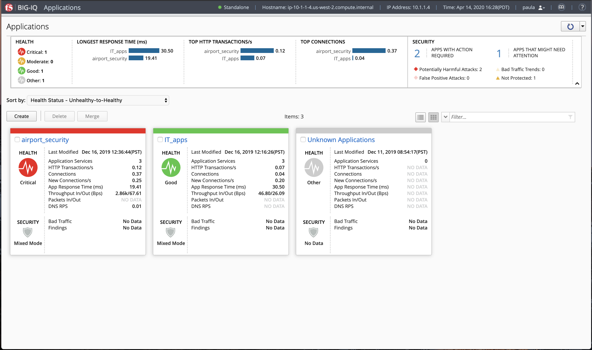

|

3. Filter on **Not Protected** Applications:

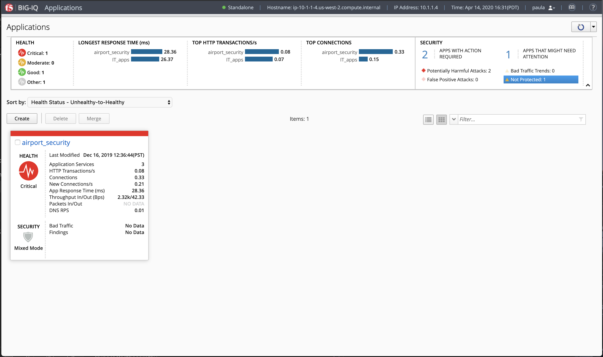

|

4. Click on the ``airport_security`` application. 
This screen lists all of the application services that make up this specific application. 

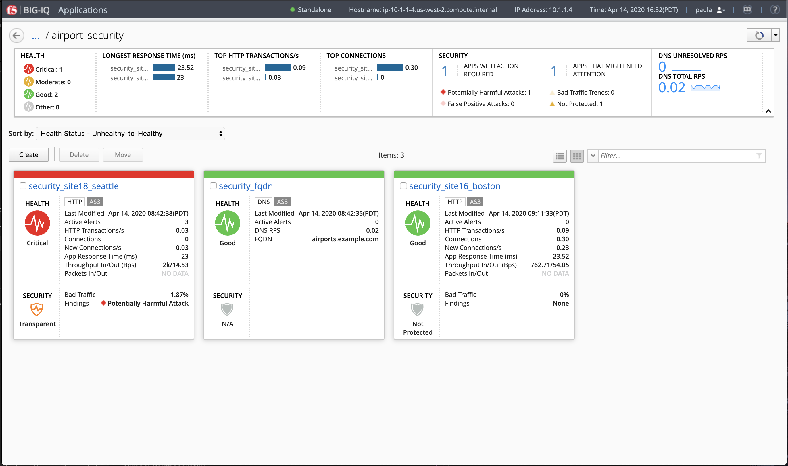

|

5. Select an application name (e.g. ``security_site16_boston``) to redirect you to a more detailed dashboard.

This screen displays the current health, traffic performance, security, and configuration details for an application.
Use this screen to detect application trends, to identify issues that can affect performance, and to adjust application configuration settings.

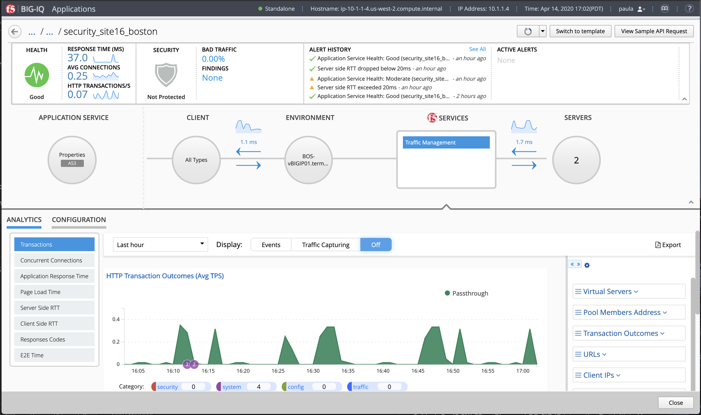

|

The summary bar at the top of the screen provides information about the application's health, traffic performance, security status, and alerts.
The Health area indicates the application's health status.

- The Traffic Performance area provides current information about the application's Longest Response Time, Top HTTP Transactions, and Top Connections.
- The Security area provides current information about the Web Application Security policy's protection status, the amount of malicious traffic, and the active, critical security findings.
- The alerts areas list the application's alerts. You can click See All to see a full list of the application's alerts.
- The Alert History area lists the application's five most recent alerts.
- The Active Alerts area lists the application's ongoing and most severe alerts.

6. Click the icon to view, or edit, the application health alert rules.

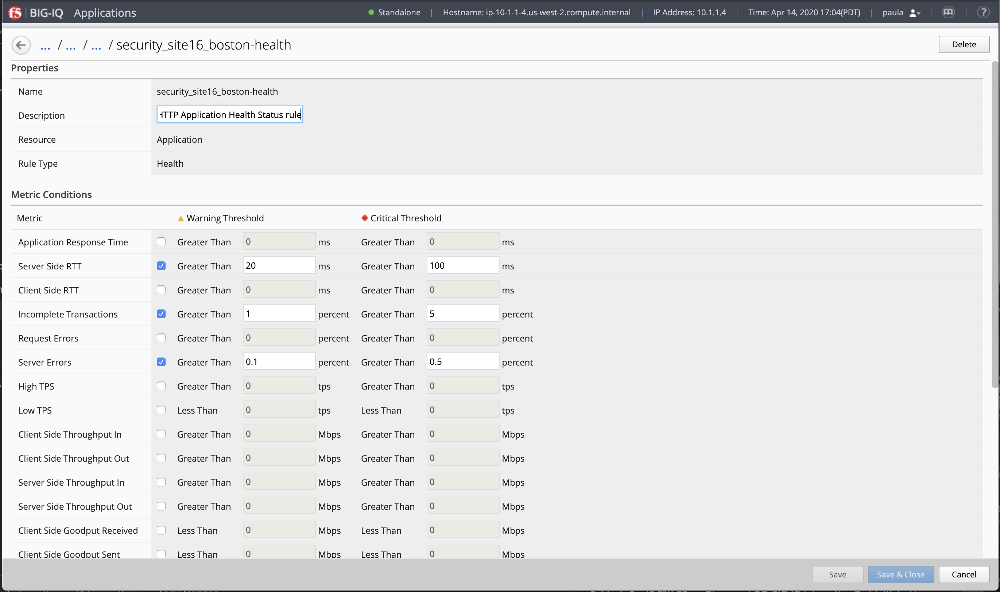

The application configuration map directly below the summary bar provides information about your application's properties, client types,
network and device configuration, F5 application services, and server configuration. 
You can click the icons to display detailed information in the ANALYTICS and CONFIGURATION areas.

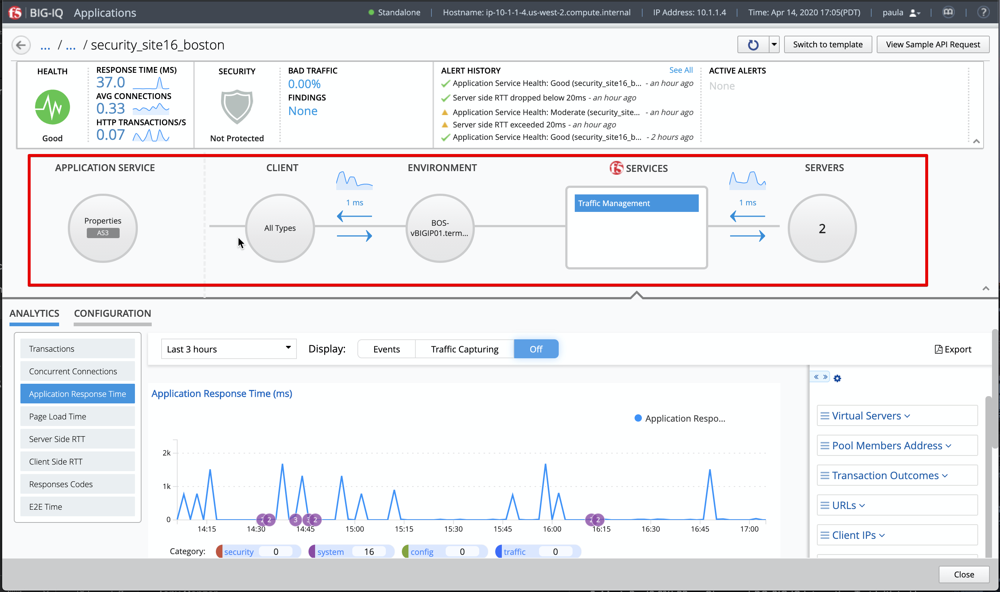

|

**Analytics Tab**

The ANALYTICS area displays the application's traffic data trends and events and alerts, within a selected time period.

**Tip:** You can use the arrow at the bottom right of application configuration map and summary bar to expand the Analytics area on the screen.

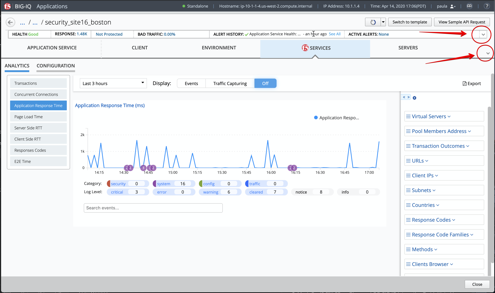

|

1. You can use the time settings above the chart to focus the data to a specific time period. You can also control the data refresh period and events in the charts.

.. note:: To view events and alerts in charts, ensure that the Events button is set to ON.

The charts display interactive information about the application's traffic connections, latency times, and response outcomes.
Click the menu to the left to navigate among the charts. Take the time to navigate through the different graphs.

The events and alerts are displayed as numbered icons within the charts. You can click these icons to display an information table below the chart.
You can click rows within the table to view detailed information. Click the buttons below the chart area to filter out displayed events and alerts by Category or Log Level.

2. Click the arrow tab to the right of the chart to expand the dimensions area.
To filter data in charts and dimensions, expand the dimensions to select specific objects listed.
Note: Certain dimensions list aggregated data. Click Enhanced Analytics to enable object data for these dimensions.

3. Take the time to navigate in all the different charts.

.. note:: When using the filters, do not enter the first ``/`` in your query.

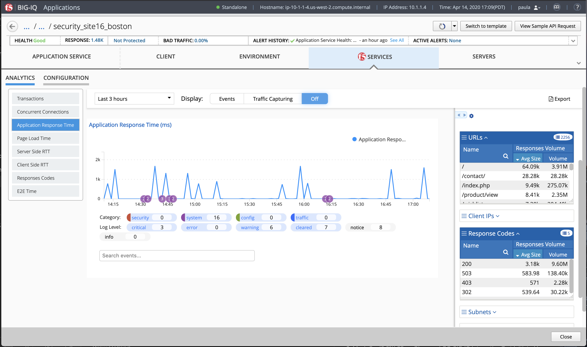

|

**Configuration Tab**

1. Click CONFIGURATION to view and evaluate the settings for application properties.
The Application owner can easily update the BIG-IP configuration (Virtual Server, Node, etc..).

2. Take the time to navigate in all the different menu.

3. See example below with an Application Service deployed using an AS3 template.

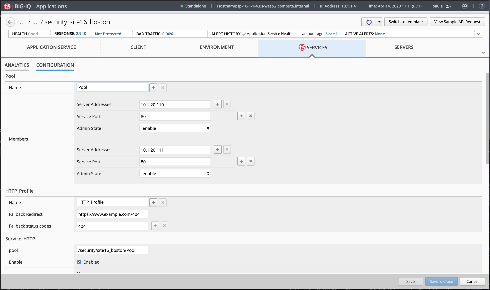

Traffic Generation with locus.io
^^^^^^^^^^^^^^^^^^^^^^^^^^^^^^^^

The Ubuntu Jump-host in the lab environment has multiple cron jobs that are generating traffic that populates the Monitoring tab 
and Application dashboard in BIG-IQ.

This lab also includes an open source load testing tool called locust.io which can be used to generate HTTP traffic from multiple users.

Let's try to use it!

1. Click on the *Locust* button on the system *Ubuntu Lamp Server* in the lab environment.

2. Enter the following options:

  - Number of total user: ``50``
  - Hatch Rate: ``2``
  - Host: ``http://10.1.10.116`` (airport_security > security_site16_boston)

3. The hatch rate is the number of users to spawn per second, starting from zero when load generation first begins until the total number of users is reached.

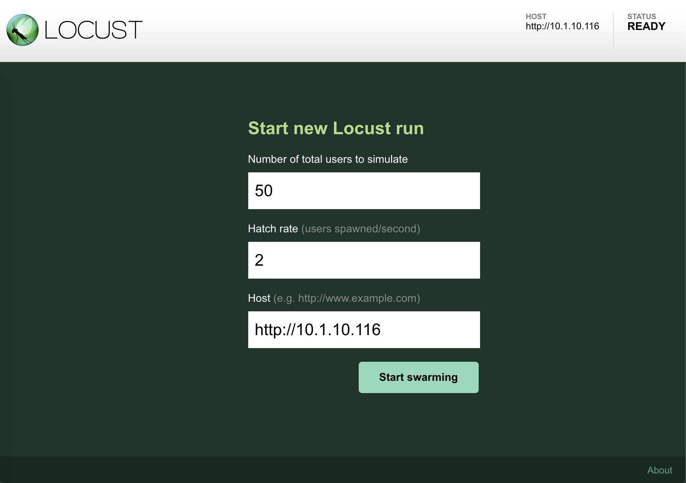

The HTTP traffic simulator is started.

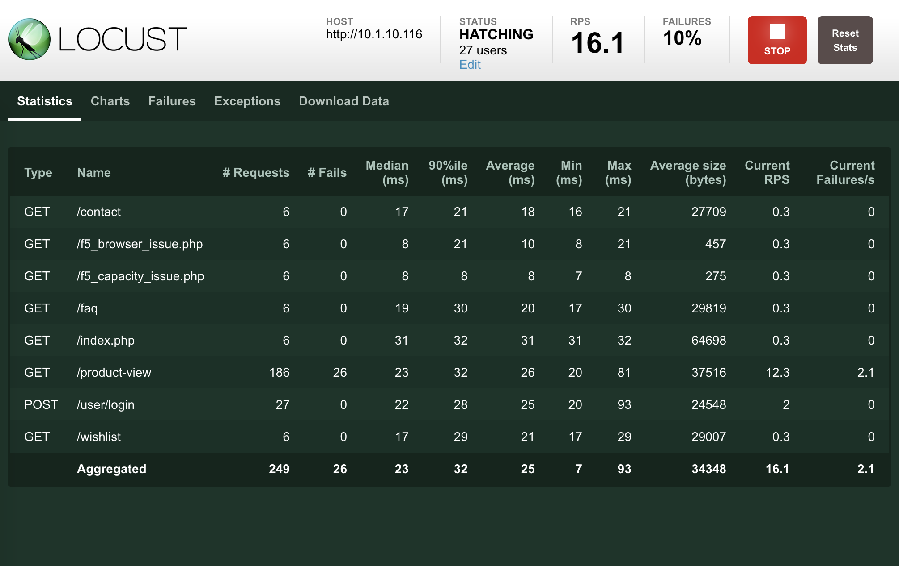

4. Swtich to the **Charts** tab to see various metrics such as *Total Requests per seconds*, *Response Time* and *Number of users*.

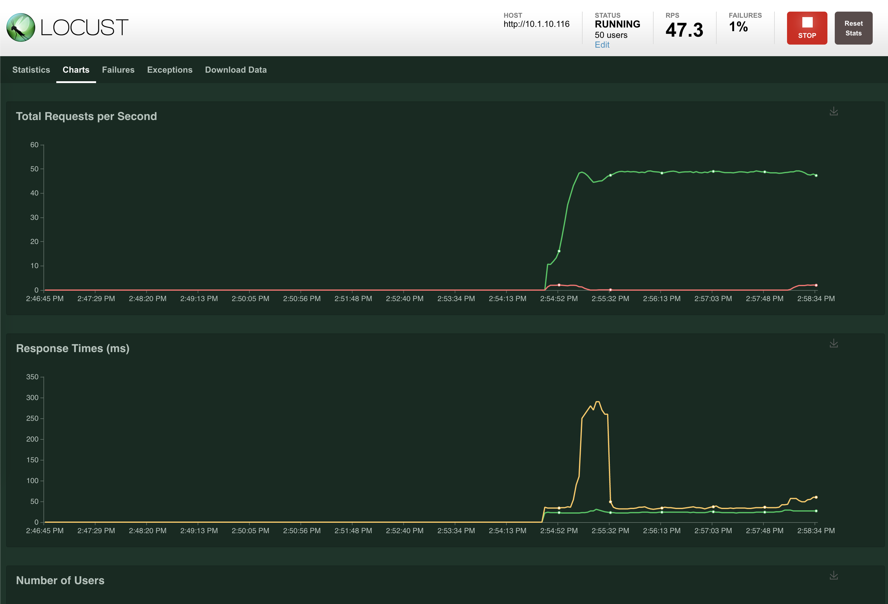

5. Now, let's go back on BIG-IQ dahsboard and navigate in the various HTTP analytics collected while locust.io 
is sending traffic through ``security_site16_boston`` application service down to the application servers.

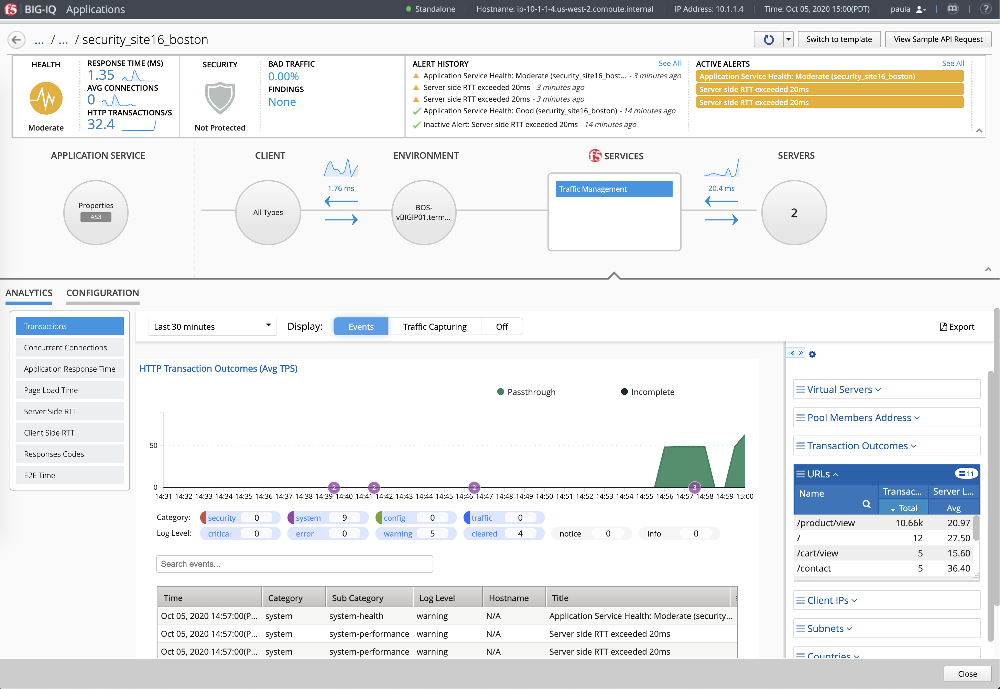

6. Once you have finished, do not forget to stop the Load testing tool.

.. image:: ../pictures/module1/img_module1_lab1_13.png
  :align: center
  :scale: 40%