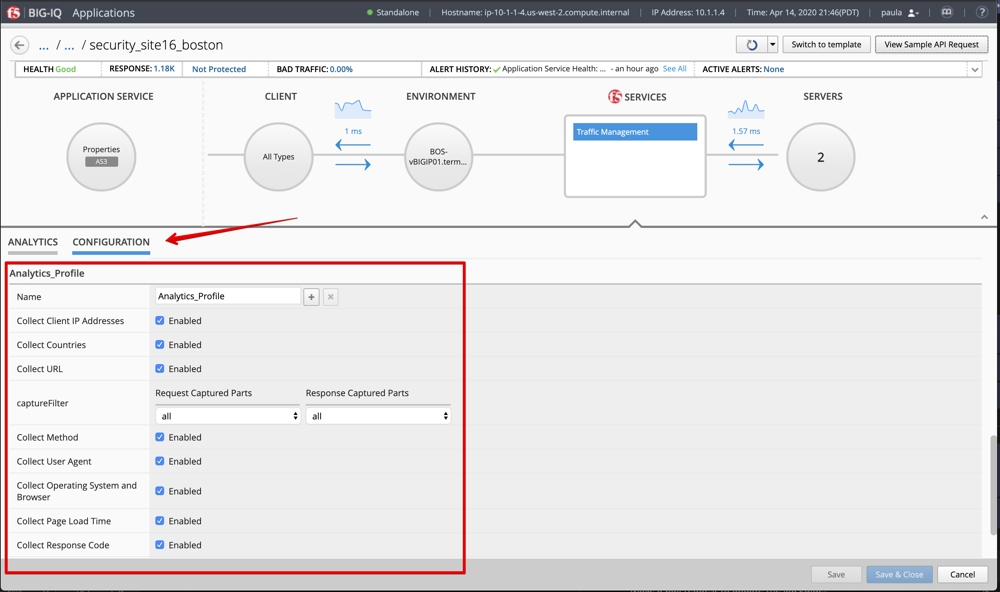
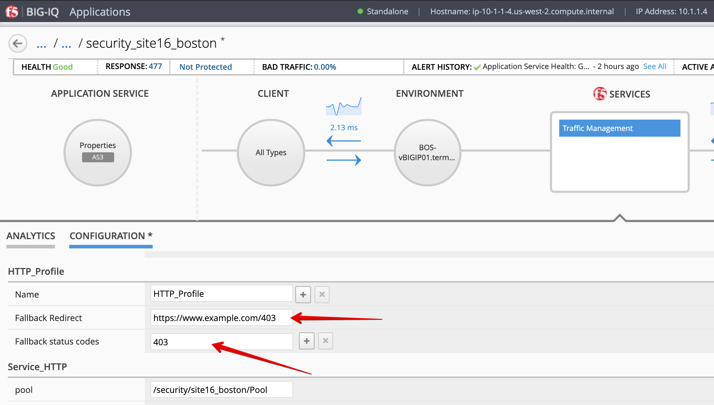
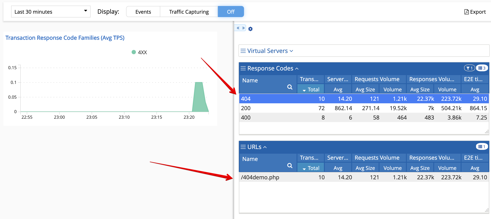

Lab 2.1: Troubleshooting 404 Not Found
--------------------------------------

.. note:: Estimated time to complete: **5 minutes**

.. include:: /accesslab.rst

Tasks
^^^^^
1. Login as **paula** in BIG-IQ.

2. Select the application service ``security_site16_boston`` located under ``airport_security`` application
   and turn on **Enhanced Analytics**. Click on Traffic Management F5 Service and Configuration, 
   scroll down to the Analytics_Profile section and enable all options.

.. warning:: In order to turn on Enhanced Analytics on an AS3 Application Service deployed using an AS3 template,
          The Analytics_Profile AS3 class needs to be defined and properties exposed to the application owner.

The Enhanced Analytics allows you to increase the application data visibility by collecting additional data for all, or specific, 
client IP addresses sending requests to the application.

.. note:: Enhanced Analytics might be already turn on for security_site16_boston

|

.. note:: To turn on/off Enhanced Analytics via the API on an AS3 Application Service, see `Class 1 Module 2 Lab 2.6`_ for more details.
          For Legacy Application Service, see `Class 1 Module 6 Lab 6.2`_ for more details.

.. _Class 1 Module 2 Lab 2.6: ../../class1/module2/lab6.html
.. _Class 1 Module 6 Lab 6.2: ../../class1/module6/lab2.html

2. Due to the fact application service ``security_site16_boston`` has a Fallback Redirect setup on 404 error,
   let's change the Fallback Redirect setting to 403.

|

.. note:: Fallback Redirect might be already set to 403, in this case, skip this step.

3. Back on the Analytics tab, select the Response Code category and expand the right-edge of the analytics 
   pane to get the response code filter. Notice the current traffic returns both 200 and 404 HTTP code.

.. image:: ../pictures/module2/img_module2_lab1_3.png
  :align: center
  :scale: 40%

|

4. Let's generate some 404 error, open a ssh session on the **Ubuntu Jumphost** and launch the following command:

``# /home/f5/f5-demo-app-troubleshooting/404.sh``

5. Back on BIG-IQ dashboard, after few seconds, the new 404 errors are showing on the chart.
   Filter on 404 errors on right panel, this should give you only the URL that is missing as well as the pool member which is missing the content.

The issue here is likely a broken link in the application.