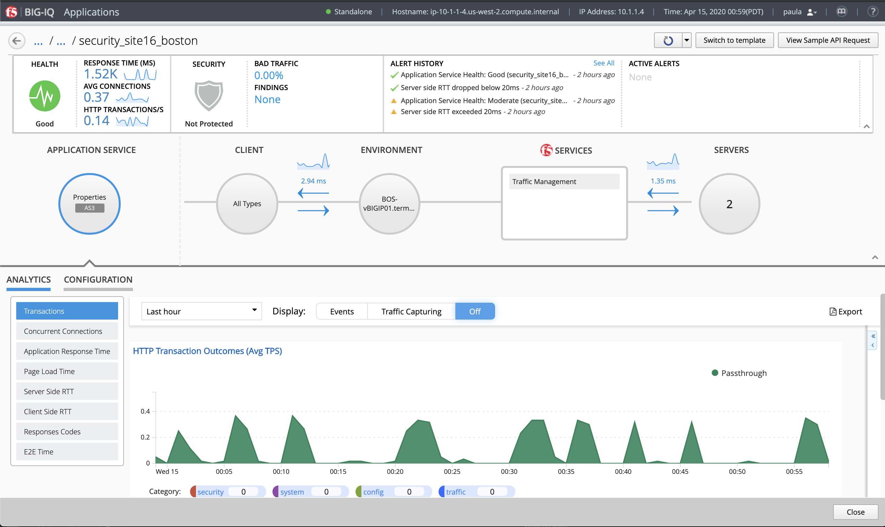
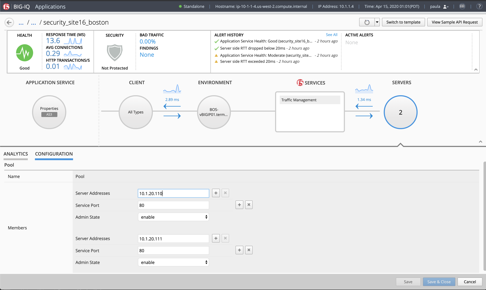
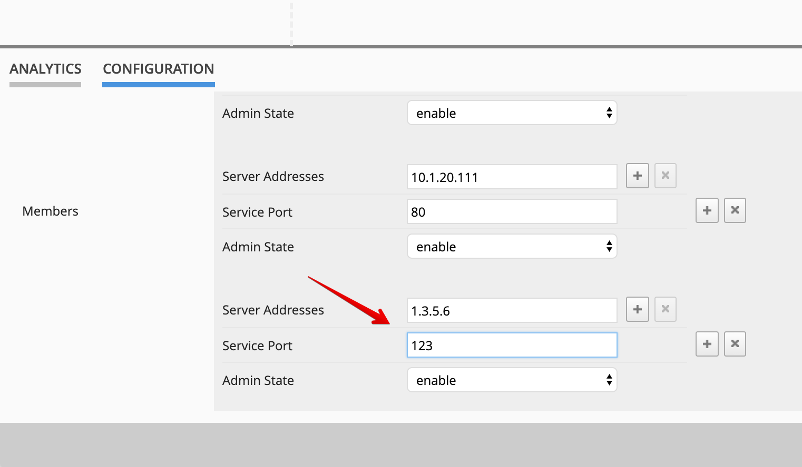
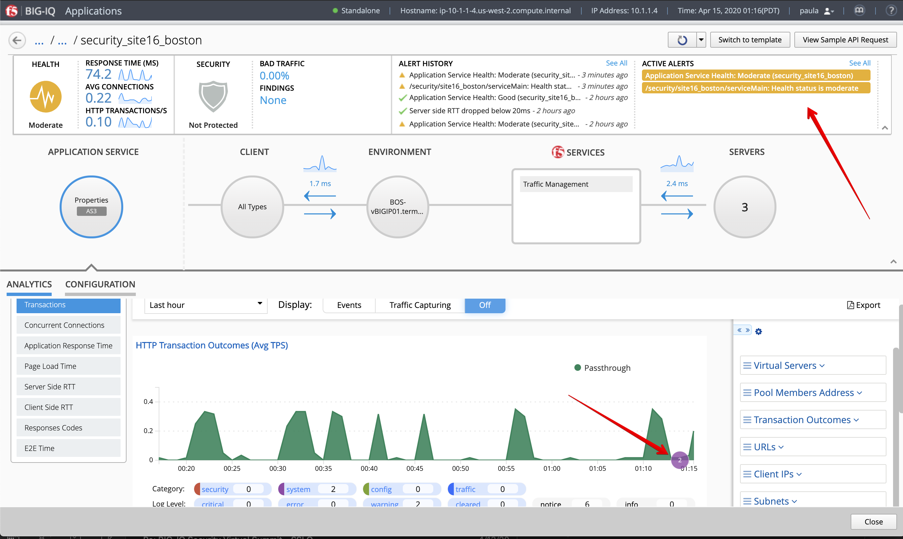
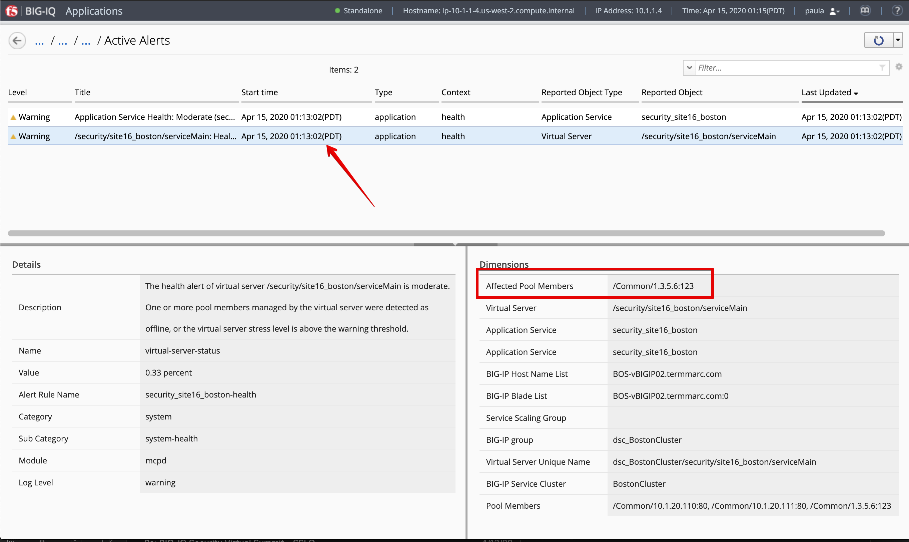

Lab 2.2: Troubleshooting Pool Member
------------------------------------

.. note:: Estimated time to complete: **5 minutes**

.. include:: /accesslab.rst

Tasks
^^^^^
1. Login as **paula** in BIG-IQ.

2. Select the application service ``security_site16_boston`` located under ``airport_security`` application.

|

3. Click on the **SERVERS**, then select the **CONFIGURATION** tab. 2 nodes should be displayed.

|

4. Add a Pool Member.

* Click the + next to Server Addresses and add a wrong node ``1.3.5.6`` for ``123``.

* Click **Save & Close**.

|

You should see a spinner indicating the deployment is on going.

5. An alarm is raised showing the wrong pool member. Notice couple events are showing the alarm on the analytics charts.

|

If you look at the details of the alarms, you will be able to see the pool members server address down.

|

6. Delete the wrong pool member created during step 4. to clear the alarm.
