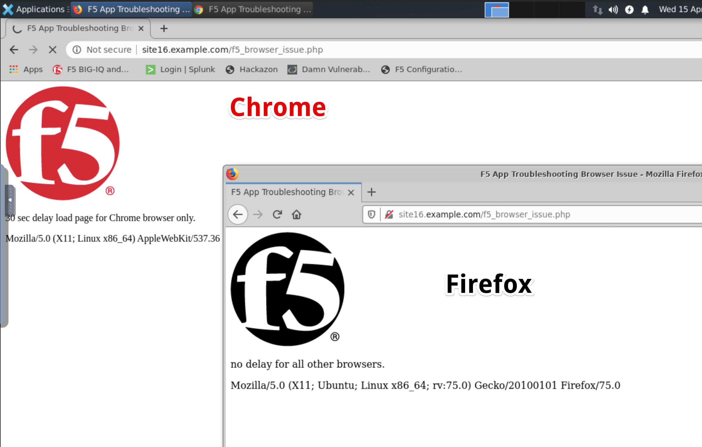
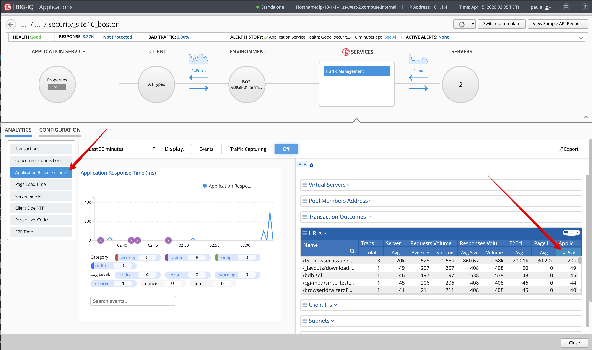
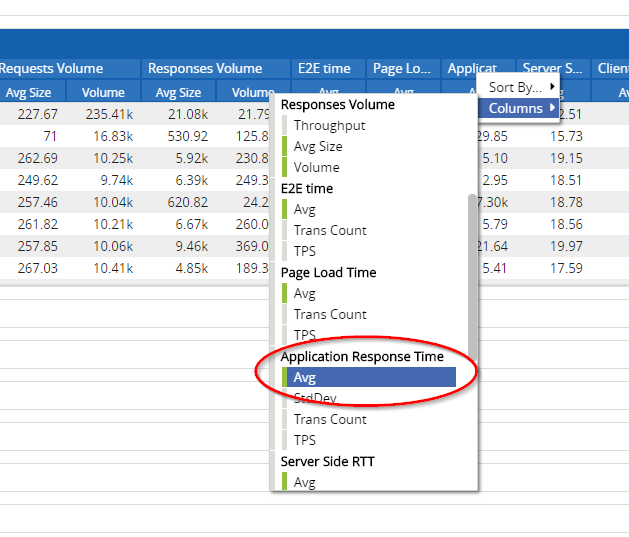
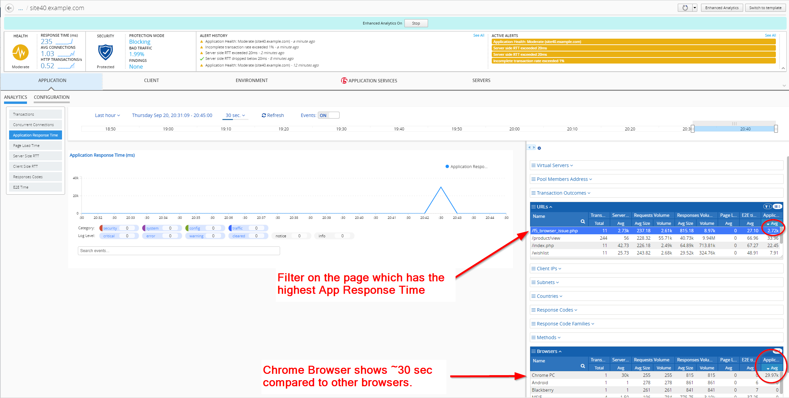

Lab 2.3: Troubleshooting Application Response Time Browser
----------------------------------------------------------
1. Login as **paula** in BIG-IQ.

2. Select application service ``security_site16_boston`` located under ``airport_security`` application.

3. From the lab environment, launch a xRDP/noVNC session to have access to the Ubuntu Desktop. To do this, in your lab environment, click on the *Access* button
of the *Ubuntu Lamp Server* system and select *noVNC* or *xRDP*.

.. note:: Modern laptops with higher resolutions you might want to use 1440x900 and once XRDP is launched Zoom to 200%.

.. image:: ../../pictures/udf_ubuntu.png
    :align: left
    :scale: 60%

|

Open Chrome and Firefox and navigate on the website http\:\/\/site16.example.com/f5_browser_issue.php.

.. note:: Accept the private certificates.

A page f5_browser_issue.php is behaving differenty on Chrome compare to other browsers.

|

4. Back to BIG-IQ Application dashboard, open application ``security_site16_boston`` and display the *Application Response Time* Analytics.

Expand the right-edge of the analytics panel to get the URLs and Browser filters. Order the URLs by App Response Time Average.

|

If the Application Response Time column, click right on the blue portion of the table, select Columns, then select Avg under the Application Response Time:

|

Select the page f5_browser_issue.php, which has the highest value. Now all the values in all the other tables are about the page previously selected.

In the Browsers filter, notice the 30 sec Application Response Time for Chrome browser.

