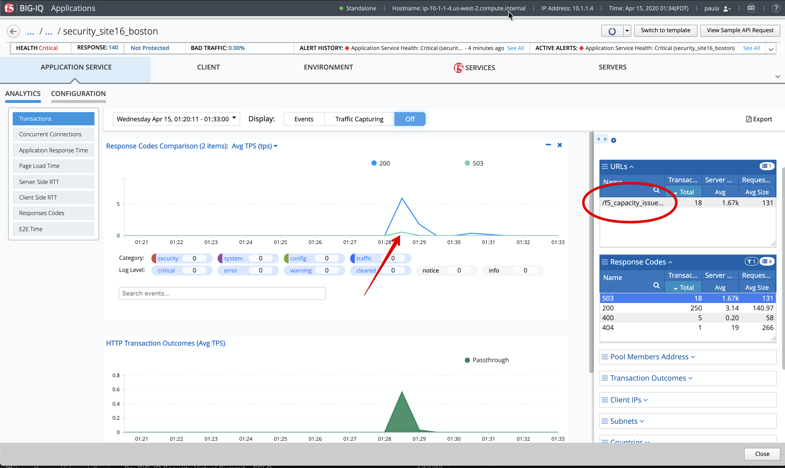

Lab 2.4: Troubleshooting 503 Service Unavailable
------------------------------------------------
Connect as **paula**.

The goal of this lab is to show how BIG-IQ can help to troubleshoot an 503 HTTP error.

1. Select application ``site42.example.com`` and turn on **Enhanced Analytics**, click on the button at the top right of the screen, and click on **Start**.

The Enhanced Analytics allows you to increase the application data visibility by collecting additional data for all, or specific, client IP addresses sending requests to the application.

.. note:: When this option is enabled, a banner appears at the top of the screen and highlights the application health icon in the applications list. Enhanced Analytics might be already turn on for site42.example.com

2. Let's generate additonnal traffic to the application ``site42.example.com``, connect on the *Ubuntu Lamp Server* and launch the following command:

``# /home/f5/f5-demo-app-troubleshooting/503.sh``

3. Back to BIG-IQ Application dashboard, open application ``site42.example.com`` and display the *Transaction* Analytics.

- Click Expand the right-edge of the analytics panel to get the filters.
- Move the *URLs* and the *Response Codes* tables next to each other and expand them both (the tables can be moved up/down).
- In the *Response Codes* table, select the *200* and *503* lines.
- Click right on the *Response Codes* and click on *Add Comparison Chart*.

|

.. image:: ../pictures/module2/img_module2_lab4_1.png
   :align: center
   :scale: 60%

|

- Finally, only select the *503* error in the filters and notice the page *f5_capacity_issue.php* shows up.

It appears from the data showing on BIG-IQ the application may start having issue (error 503) when there are more traffic going through it.

.. image:: ../pictures/module2/img_module2_lab4_3.png
   :align: center
   :scale: 60%

|

Using the data available in BIG-IQ Application dashboard, we can narrow down 503 error and troubleshoot the inability of an application to handle production data capacities.

Looking in a longer time period:

.. image:: ../pictures/module2/img_module2_lab4_4.png
   :align: center
   :scale: 60%

|
