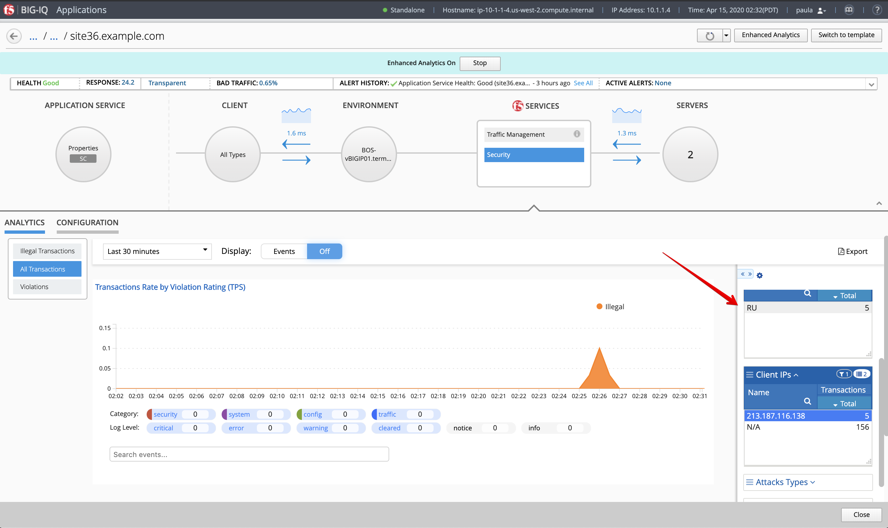

Lab 2.5: Troubleshooting Security (single attack)
-------------------------------------------------

1. Connect on the *Ubuntu Lamp Server* server and launch the following command:

``# /home/f5/f5-demo-app-troubleshooting/iloveyou.sh``

2. Connect as **paula** on the BIG-IQ and select ``site36.example.com`` under application ``IT_apps``.

3. Open application ``sit36.example.com`` and display the *All Transactions* under the Security Analytics.

Expand the right-edge of the analytics pane to get the Client IPs, Countries, Attack Type and Violations filters.

4. Connect as **larry**, look for more details on the violation under Monitoring > EVENTS > Web Application Security > Event Logs > Events

.. image:: ../pictures/module2/img_module2_lab5_2.png
  :align: center
  :scale: 40%

