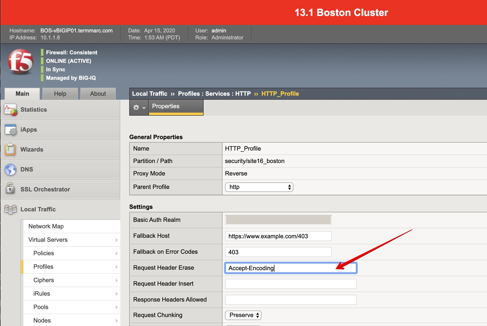

Lab 2.6: Page Load Time
-----------------------

.. include:: /accesslab.rst

Tasks
^^^^^
1. Login as **paula** in BIG-IQ.

2. Open service ``security_site16_boston`` located under ``airport_security`` application.

3. **Page Load Time** is dependent on CSPM (Client side Perf Monitoring javascript injection).

An HTTP response is eligible for CSPM injection under the following conditions:

- The HTTP content is not compressed.
- The HTTP content-type is text/html.
- The HTTP content contains an HTML <head> tag.

Navigation Timing is currently supported by the following browsers:

- Internet Explorer 9 and later
- Mozilla Firefox 4 and later
- Chrome 10 and later

For a response containing the CSPM injection to generate results, the client browser must support the Navigation Timing API (window.performance.timing).
https://support.f5.com/csp/article/K13849

In order to get the page load time, there are 2 things:
- ``Page Load Time`` parameter in the HTTP Analytics profile attached to the virtual server needs to be enabled.
- The ``Request Header Erase`` needs to be set to ``Accept-Encoding`` in the HTTP profile (AS3 property in the HTTP_Profile class is ``whiteOutHeader``)

4. In order to test it quickly, let's manually set in the HTTP profile used in ``security_site16_boston``.

5. Login to ``BOS-vBIGIP01.termmarc.com`` BIG-IP from lab environment. Select the partition ``security``,
then Local Traffic  ››  Profiles : Services : HTTP. Click on ``HTTP_Profile``.

|

.. note:: To enable the feature without changing the HTTP profile directly on BIG-IP.
          Import AS3 template called ``AS3-F5-HTTP-lb-page-load-time-template-big-iq-default`` 
          from https://github.com/f5devcentral/f5-big-iq and use switch template feature.

6. From the lab environment, launch a remote desktop session to have access to the Ubuntu Desktop. 

7. Open Chrome and navigate on the website https\:\/\/site16.example.com. 
   If you open the developer tools in the browser (ctrl+shift+i), 
   you can see the F5 CSPM javascript added to the page.

.. image:: ../pictures/module2/img_module2_lab6_2.png
   :align: center
   :scale: 40%

|

8. Go back on the BIG-IQ, expand the right-edge of the analytics pane and 
   check you can see now the Page Load Time.

.. image:: ../pictures/module2/img_module2_lab6_3.png
   :align: center
   :scale: 40%
