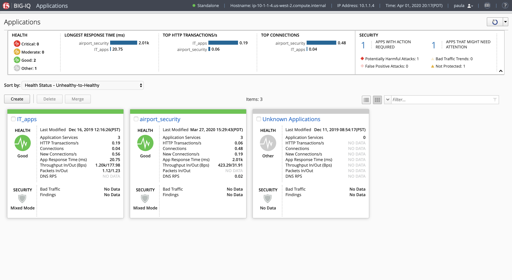
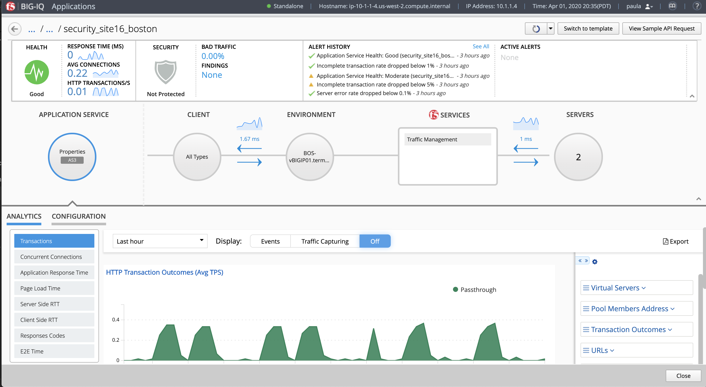
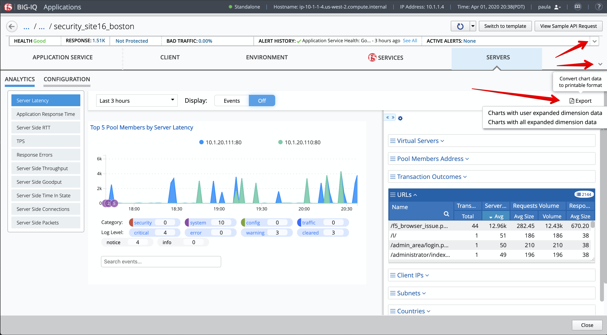
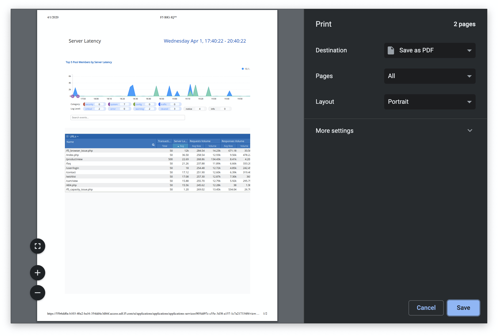

Lab 4.1: Generate Reports in PDF
--------------------------------

.. note:: Estimated time to complete: **5 minutes**

.. include:: /accesslab.rst

Tasks
^^^^^
1. Connect as **paula**.

2. Select one of the application ``airport_security``, then select ``security_site16_boston`` application service.

3. Collapse the top and middle banner, click on the **Server** object on the right of the dashboard.
Select Server Latency. Look for the URL dimension and click on the PDF Export button located above the dimensions.

4. Click on the first option ``Charts with user expended dimension data``

5. After few seconds a `PDF`_ will be generated which you will be able to save on your computer.

.. _PDF: https://raw.githubusercontent.com/f5devcentral/f5-big-iq-lab/develop/lab/f5-demo-app-troubleshooting/examplePDFreportBig-iq.pdf

6. Navigate to a different metric on the dashboard and try to export another PDF analytics report using the other option.
Do you notice the difference?