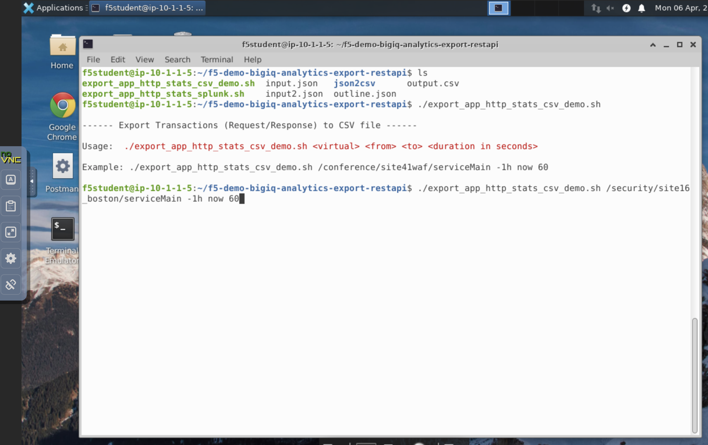
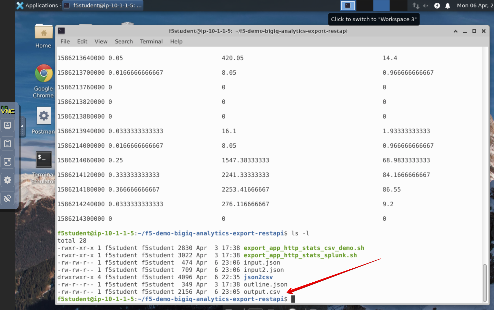
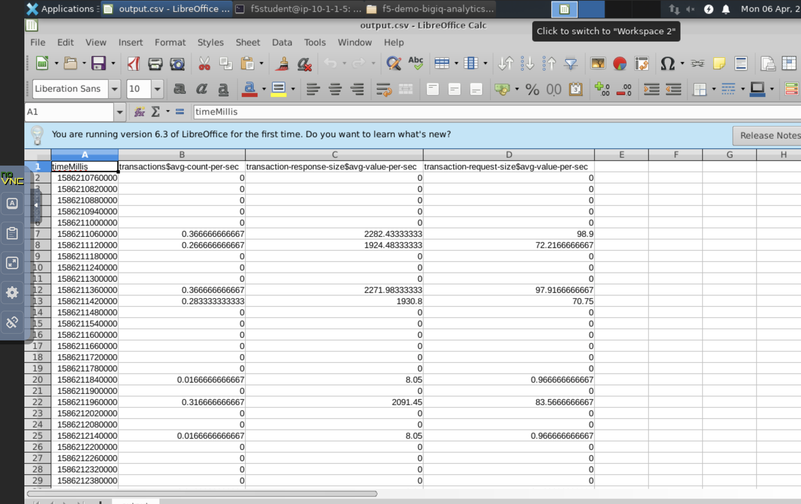
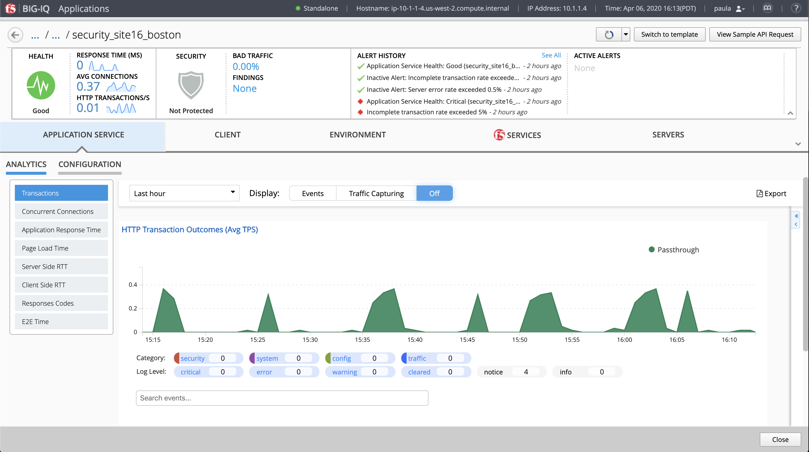

Lab 4.2: Generate Reports in CSV using the API 
----------------------------------------------

1. From the lab environment, launch a xRDP/noVNC session to have access to the Ubuntu Desktop. 
To do this, in your lab environment, click on the *Access* button
of the *Ubuntu Lamp Server* system and select *noVNC* or *xRDP*.

.. note:: Modern laptops with higher resolutions you might want to use 1440x900 and once XRDP is launched Zoom to 200%.

.. image:: ../../pictures/udf_ubuntu.png
    :align: left
    :scale: 40%

|

2. Open a terminal and execute the following script to export the analytics of ``site16_boston`` into a CSV::

    cd f5-demo-bigiq-analytics-export-restapi
    ./export_app_http_stats_csv_demo.sh /security/site16_boston/serviceMain -1h now 60 -1h now 60

The `script`_ is getting the Analytics using BIG-IQ API and exports it to a JSON file.
Then, the JSON output is converted to a CSV file using a json2csv tool.

.. _script: https://github.com/f5devcentral/f5-big-iq-lab/tree/develop/lab/f5-demo-bigiq-analytics-export-restapi

3. Navigate in the ``f5-demo-bigiq-analytics-export-restapi`` folder and open the ``output.csv`` file.

The data exported correspond to the HTTP Transactions for ``site16_boston`` application services.

