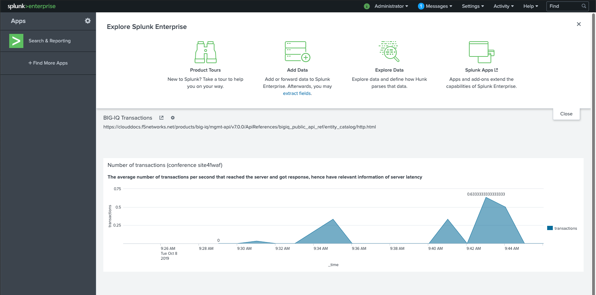
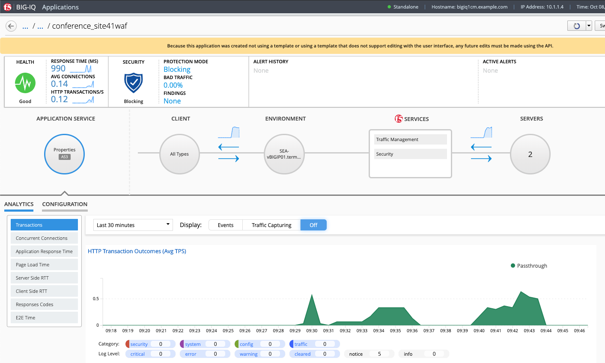

Lab 4.3: BIG-IQ Analytics and Splunk
------------------------------------

**Prerequisites Splunk**

- This demo is using a instance of Splunk running in a `container`_.
- An `HTTP Event Collector`_ listening on port 8088 to receive JSON events has been configured.

.. _container: https://hub.docker.com/r/splunk/splunk/
.. _HTTP Event Collector: https://dev.splunk.com/enterprise/docs/dataapps/httpeventcollector/

**Custom script to export BIG-IQ analytics and send them over to Splunk**

A `script`_ is setup in the crontab (Linux Scheduler) where the Splunk container runs,
This script is getting the Analytics using BIG-IQ API, then sending the JSON result
to Splunk HTTP Event collector every minutes.

.. _script: https://github.com/f5devcentral/f5-big-iq-lab/tree/develop/lab/f5-demo-bigiq-analytics-export-restapi

The events (in JSON format) are received in Splunk and dashboards can be easily created using the search query field.

Below is an example of a search query used to display the HTTP Transactions:

``index = "main" |table _time,result.result{}.transactions$avg-count-per-sec | rename result.result{}.transactions$avg-count-per-sec as transactions | spath``

Click on the *SPLUNK* button on the system *Ubuntu Lamp Server* in UDF.
Use ``admin/purple123`` to authenticate.

*Dashboard in Splunk*

|

*Dashboard in BIG-IQ*

|