Lab 4.4: BIG-IQ Scheduled PDF Report (new 8.0)
----------------------------------------------

.. note:: Estimated time to complete: **10 minutes**

.. include:: /accesslab.rst

Schedule Report Application Service
^^^^^^^^^^^^^^^^^^^^^^^^^^^^^^^^^^^

1. Login as **david** in BIG-IQ.

2. Select the application service ``security_site16_boston`` located under ``airport_security`` application. Click on **Servers**, 
   under Analytics tab, select Application Response Time. Change the Time Settings to 3 hours, then click on **Export & Schedule Report** located above the dimensions.

Click on the option ``Schedule``.

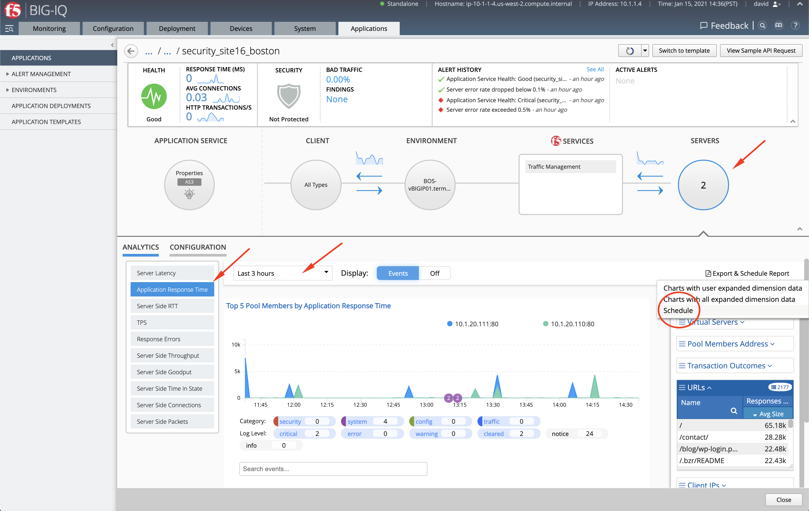

3. The scheduler window opens. Set a name (e.g. ``app-security_site16boston``), your email, the subject of the email (e.g. ``Security 16 Boston Data Center``), the start/end date, frequency and Retention Policy.

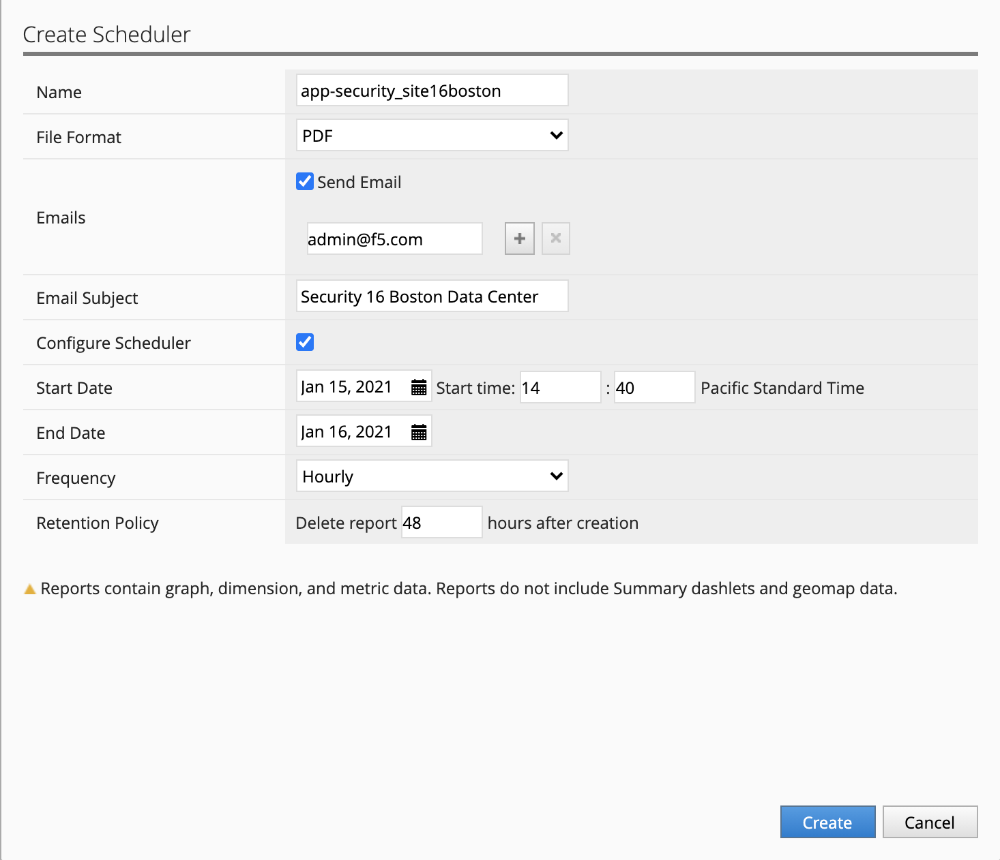

4. Click on **Create** to schedule the report, a *Successfully Created* message should be displayed.

5. Now, let's see where to see the list of scheduled report in the system. Click the grid icon in the left corner of the screen (Finder menu) and type ``schedule`` in the field.

Click on **Reports > Scheduled Reports**.

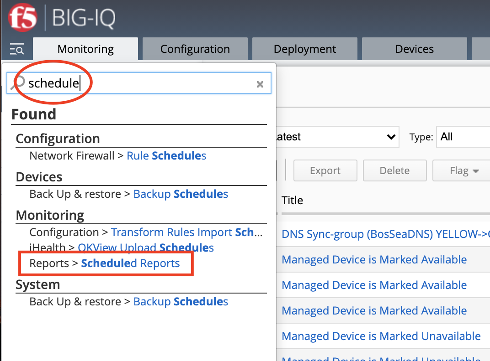

6. From this window, **david** this administrator will be able to see all the schedule in the system. From here, he can either delete or edit an existing report.

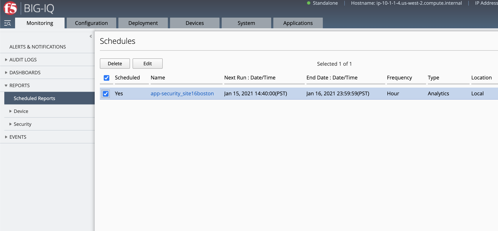

7. Let's select the report previously created. From this window, **david** can either delete a specific report or download it.

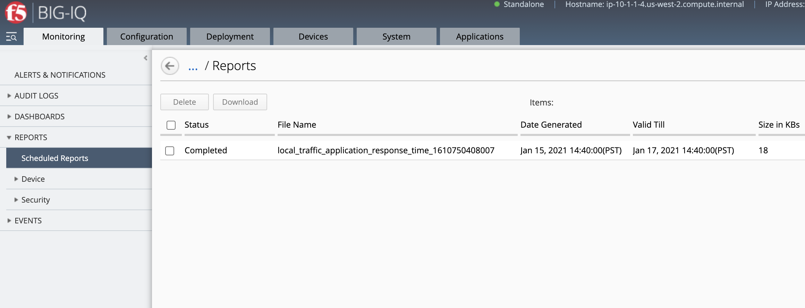

8. Download the report and try to open it up.

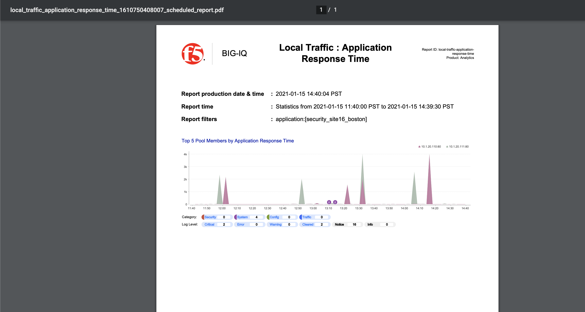

9. Now, check your mailbox, did you receive the report?

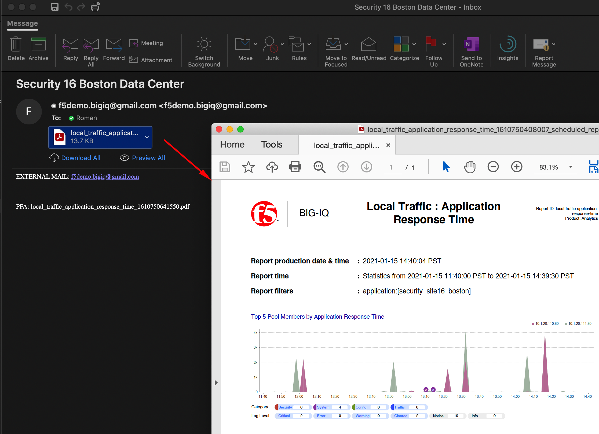

Schedule Report BIG-IP device health
^^^^^^^^^^^^^^^^^^^^^^^^^^^^^^^^^^^^

1. Let's now schedule a report to get daily report on the health of a set of BIG-IP devices.
   Navigate under **Monitoring > Dashboards > Device > Health**. expand the BIG-IP Host names dimension and select the 2 Boston BIG-IPs (*BOS-vBIGIP01/BOS-vBIGIP02*).

   Then click on **Export & Schedule Report** located above the dimensions and click on the option ``Schedule``.

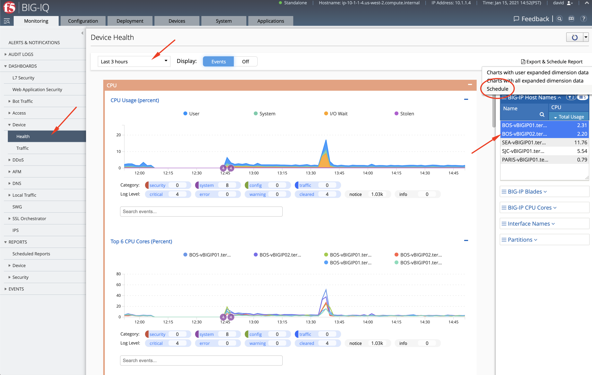

2. The scheduler window opens. Set a name (e.g. ``devices-boston``), your email, the subject of the email (e.g. ``Devices Boston Data Center``), the start/end date, frequency and Retention Policy.

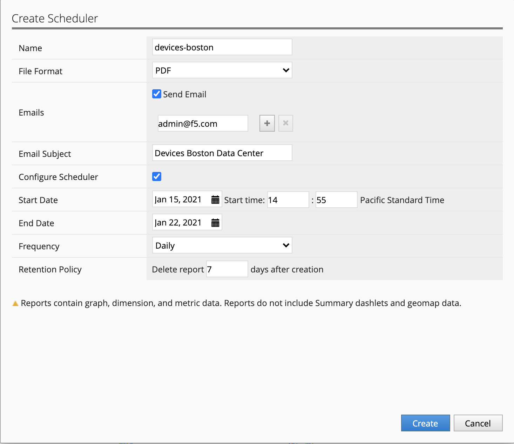

3. Click on **Create** to schedule the report, a *Successfully Created* message should be displayed.

4. Let's check the report generated. Click the Finder menu icon and type ``schedule`` in the field. Click on **Reports > Scheduled Reports**.

.. image:: ../pictures/module4/img_lab4_10.png
  :align: center
  :scale: 40%

5. Select the report previously created.

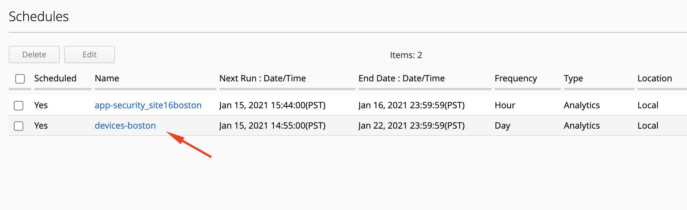

6. Check the report contains Boston's BIG-IP device health information.

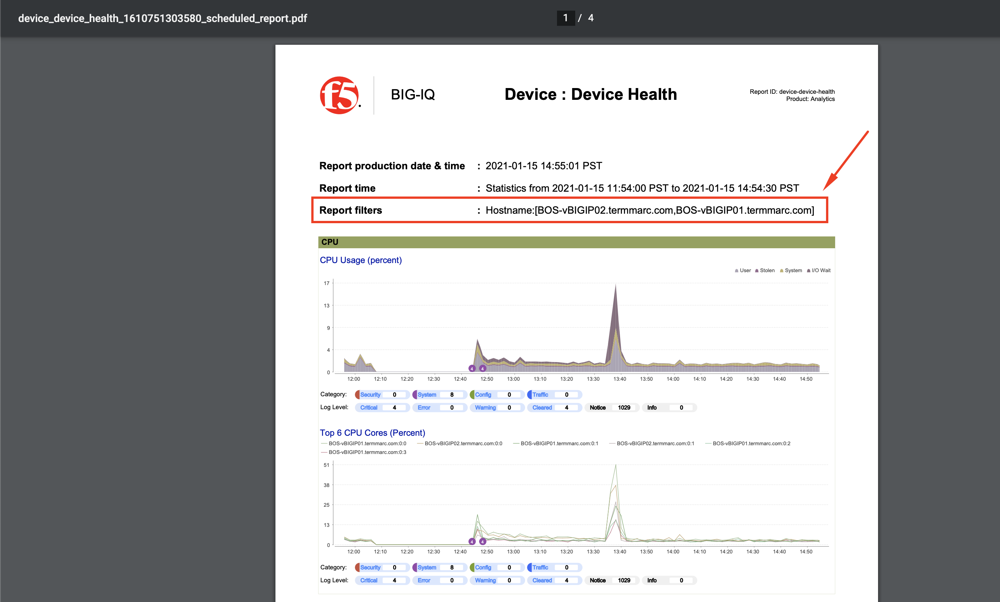
