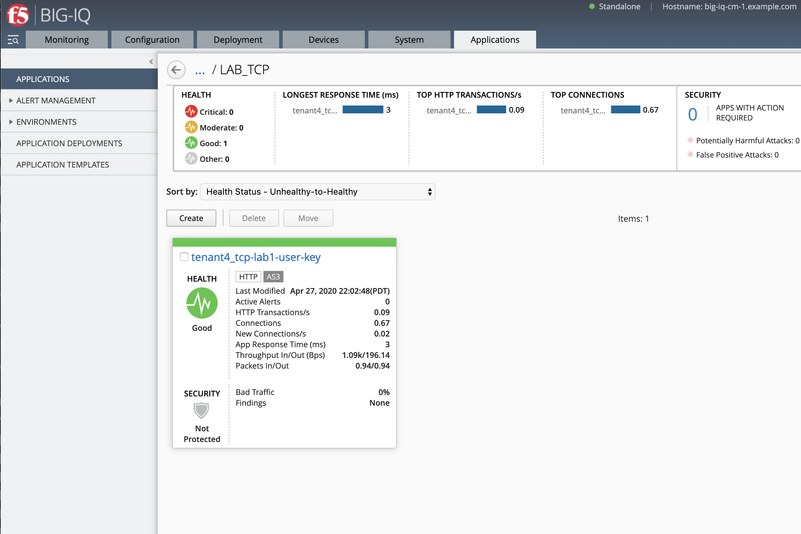
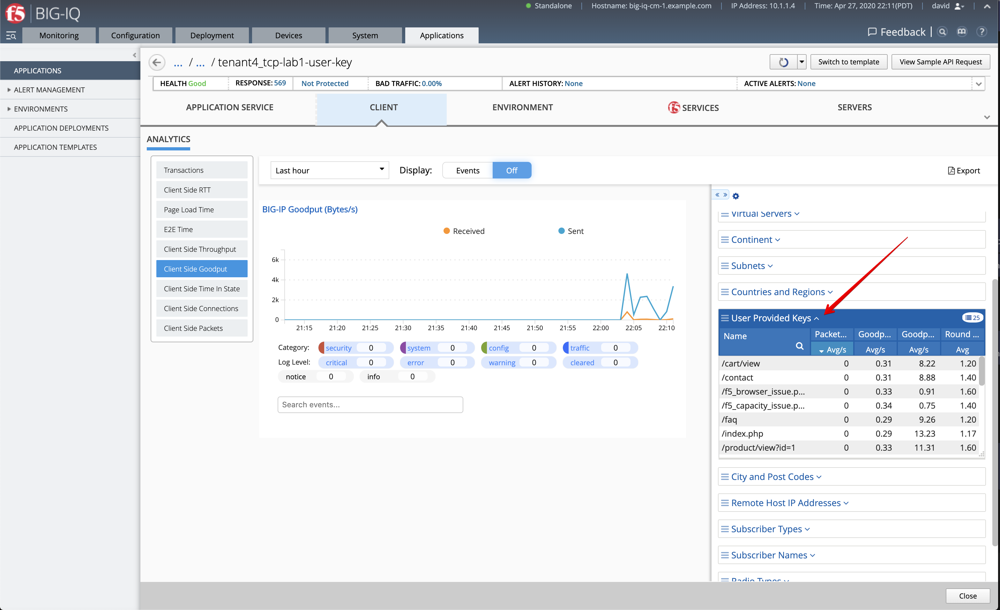

Lab 5.1: TCP Analytics: how to add a user-provided key
------------------------------------------------------

In the BIG-IQ UI, go to Applications > Application Templates. Notice there are two different types of Templates
(AS3 Templates and Service Catalog Templates). AS3 Templates are the recommended templates for deploying new
application services. Service Catalog Templates while still supported, are not recommended for new environments.

In this lab you will utilize some of the new templates that have the TCP analytics profiles built in. Note the
**Import Templates** hyperlink in the top right hand corner of the page. 
This link will take you to the **f5devcentral/f5-big-iq** repository on Github, where F5 will push new templates.  

In this lab, we are going to enable AVR TCP stat reporting (“analytics”) for an application service deployed using AS3 
and assigns user-defined keys. They user-defined keys is defined in an iRule and the TCP Analytics profile is used, 
both attached to the Virtual IP address. More details on `TCP analytics`_.

.. _TCP analytics: https://clouddocs.f5.com/api/irules/TCP__analytics.html

1. Navigate to the Applications tab > APPLICATION, click on **Create**.

.. |_| unicode:: 0xA0 

+---------------------------------------------------------------------------------------------------+
| Application properties:                                                                           |
+---------------------------------------------------------------------------------------------------+
| * Grouping = New Application                                                                      |
| * Application Name = ``LAB_TCP``                                                                  |
| * Description = ``TCP lab``                                                                       |
+---------------------------------------------------------------------------------------------------+
| Select an Application Service Template:                                                           |
+---------------------------------------------------------------------------------------------------+
| * Template Type = Select ``AS3-F5-HTTP-lb-TCP-analytics-key-template-big-iq-default [AS3]``       |
+---------------------------------------------------------------------------------------------------+
| General Properties:                                                                               |
+---------------------------------------------------------------------------------------------------+
| * Application Service Name = ``tcp-lab1-user-key``                                                |
| * Target = ``SEA-vBIGIP01.termmarc.com``                                                          |
| * Tenant = ``tenant4``                                                                            |
+---------------------------------------------------------------------------------------------------+
| Pool                                                                                              |
+---------------------------------------------------------------------------------------------------+
| * Members: ``10.1.20.123``                                                                        |
+---------------------------------------------------------------------------------------------------+
| iRule. Keep default                                                                               |
+---------------------------------------------------------------------------------------------------+
| |_| ``when HTTP_REQUEST {``                                                                       |
| |_| |_| ``# must check subnet again to avoid starting for all``                                   |
| |_| |_| ``# connections``                                                                         |
| |_| |_| ``if [IP::addr [IP::client_addr]/24 equals 10.1.10.0]{``                                  |
| |_| |_| |_| ``# make stats queryable by URI``                                                     |
| |_| |_| |_| ``TCP::analytics key "[HTTP::uri]"``                                                  |
| |_| |_| ``}``                                                                                     |
| |_| ``}``                                                                                         |
+---------------------------------------------------------------------------------------------------+
| Service_HTTP                                                                                      |
+---------------------------------------------------------------------------------------------------+
| * Virtual addresses: ``10.1.10.126``                                                              |
+---------------------------------------------------------------------------------------------------+
| Analytics_Profile. Keep default                                                                   |
+---------------------------------------------------------------------------------------------------+
| Analytics_TCP_Profile                                                                             |
+---------------------------------------------------------------------------------------------------+

.. note:: The template used is available on the `BIG-IQ AS3 Templates submitted by the Community`_.

.. _BIG-IQ AS3 Templates submitted by the Community: https://github.com/f5devcentral/f5-big-iq/tree/7.1.0/f5-appsvcs-templates-big-iq/community

The application service called ``tenant3_tcp-lab1-user-key`` is now created on the BIG-IQ dashboard
under the application called ``LAB_TCP``.

|

2. Select the application service ``tenant3_tcp-lab1-user-key`` located under ``LAB_TCP`` application.

Collapse the top and middle banner. Select CLIENT and *Client Side Goodput* TCP Analytics.
Look for the *User Provided Keys* dimension and expend it. Notice we can see the URLs and filter on it to see the goodput on those URLs.

|

Another good example for a none HTTP application service would be using this feature to track subscriber ID of a TCP application.
