Lab 6.1: BIG-IQ integration with F5 Beacon
------------------------------------------

.. note:: Estimated time to complete: **20 minutes**

F5 Beacon is an F5 Cloud Service which is suited to deliver end-to-end application visibility by leveraging telemetry data from F5 solutions and third-party eco-systems.

F5 Cloud Services is a cloud-native SaaS platform developed in AWS and delivering application availability and security solutions.
Beacon can discover existing and new deployed applications on BIG-IQ and will use this information to draw the application map. Furthermore, BIG-IQ will send analytics data to Beacon.

Tasks
^^^^^
In this lab we are going to:

* Create a Beacon account if you haven’t done so already.
* Create a Beacon ClientID and Secret.
* Setup the connection between BIG-IQ and Beacon.
* Discover and display BIG-IQ applications in Beacon.

1. In the BIG-IQ UDF lab, go to the Components tab and click BIG-IQ CM Access and launch a TMUI session.

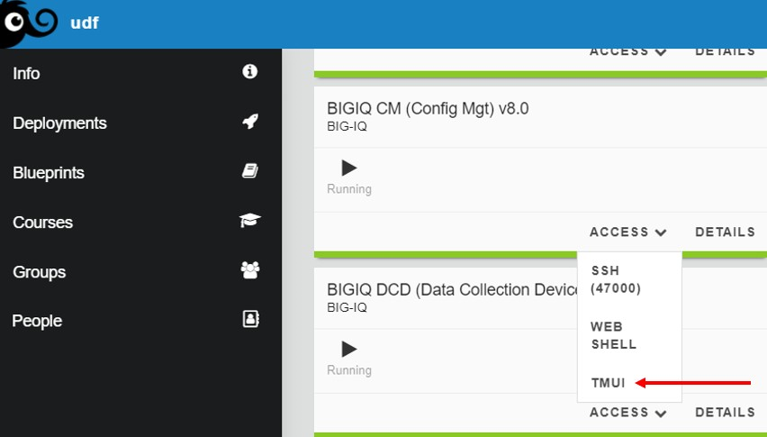

2. In the browser select the Big-IQ CM bookmark and login as David (david/david) and go to the Applications tab and select Applications.

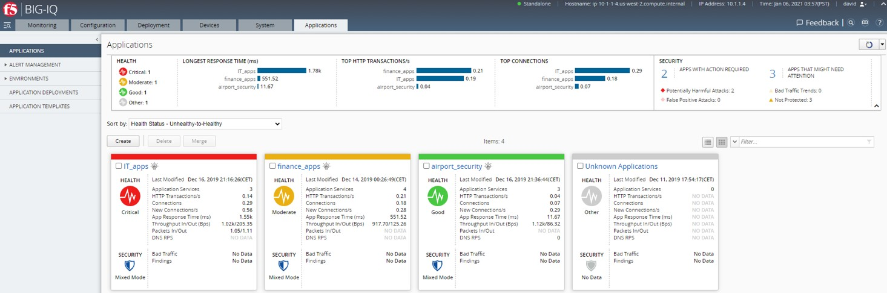

3. Watch each application carefully and notice icon after the Applications name.

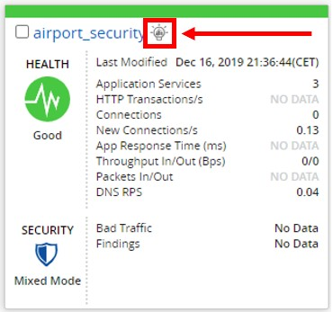

This icon has been added in BIG-IQ v8.0 and indicates the status of Beacon.

Icon status indicators:

+-------+------------------------------------------------------------------------------------+
| Grey  | BIG-IQ has not been connected to Beacon.                                           |
+-------+------------------------------------------------------------------------------------+
| Green | Connection has been setup and communication is floating between BIG-IQ and Beacon. |
+-------+------------------------------------------------------------------------------------+
| Red   | Connection has been setup but no communication between BIG-IQ and Beacon.          |
+-------+------------------------------------------------------------------------------------+

Let’s get to the other side and check F5 Beacon.

4. If you don’t have an F5 Cloud Services account, please go: https://portal.cloudservices.f5.com/register and create one.

Here are the pricing details: https://clouddocs.f5.com/cloud-services/latest/f5-cloud-services-Beacon-Pricing.html#f5-beacon-pricing and be aware that for this lab you will not make any additional costs.

Subscribing to Beacon comes with a **45 day free trial**.

5. Login to F5 Cloud Services and subscribe to Beacon. 

You should see something like underneath.

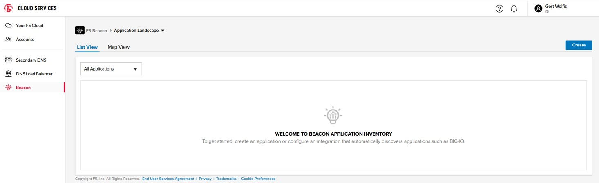

6. Next, Beacon needs to have access keys which will get defined as a ClienID and a ClientSecret.

* In the UDF lab, go to **Components** and at the **Ubuntu Lamp** server select **Access** and select **Visual Studio Code**.
* In **Visual Studio Code** in the left pane select **project > beacon-access-keys.rest**.
* In the **My Variables** section, fill in your **Beacon Username and Password**.

.. image:: ../pictures/module6/img_module6_lab1_5.png
  :align: center
  :scale: 40%

7. To generate the access keys deploy the requests from top to bottom.

1. First generate a Beacon access token by POST-ing **"Beacon Login"**.
2. Now we will gather AccountID and UserID object information via GET **"Beacon User Info"**.
3. We need another object called RoleID and use GET **"Beacon RoleID"**.
4. Finally, Let's use the gathered object info by POST-ing **"Beacon Create ClientID and ClientSecret"**.
5. Use the **Save** in the top right corner to copy ans paste the **Respons body**
6. Click **OK** to give the file the self-generated name and click **Open** in the right lower part in the **pop-up**.
7. Save **client_id, client_secret and account_id** to a place where you can use this information to include in the Beacon.json file.

The last two REST API requests can be used optional.

* The GET **"Show Access Keys"** will deliver the same output as step 5, but will omit the ClientSecret.
* Use DELETE **"Delete Access Keys"** when you used GET **"Show Access Keys"** too early ;-)

8. In the UDF lab, start an SSH session to BIG-IQ CM by using your favorite SSH client.

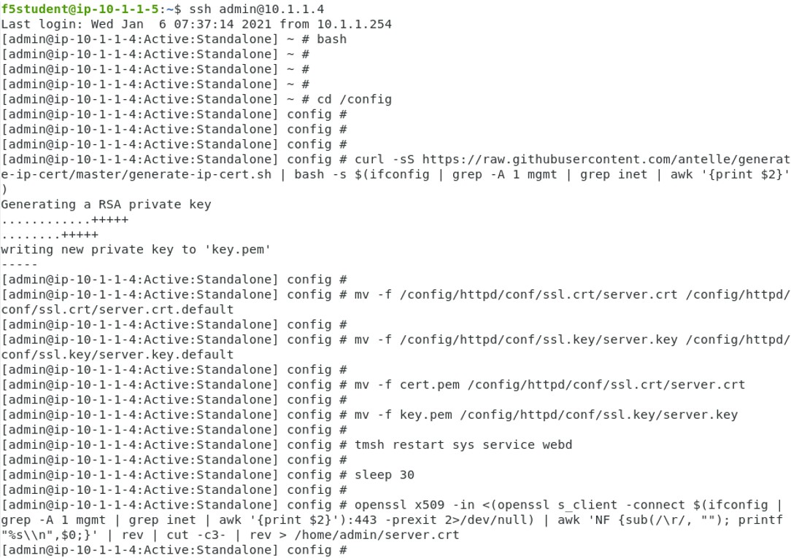

9. First a self-signed certificate needs to be generated with the BIG-IQ IP address in the SAN field. This certificate will get used to setup the communication between BIG-IQ and Beacon.

We will use a script for generating and installing the self-signed certicate on BIG-IQ, but if you want to understand the steps and details, please use this article which is avialble on AskF5: https://support.f5.com/csp/article/K52425065

The **'f5-bigiq-generate-cert-with-SAN'** script can be found here: https://github.com/f5devcentral/f5-big-iq-pm-team/tree/master/f5-bigiq-generate-cert-with-SAN. The usage of the script is explained in the next steps.

Check the curl command:

::
 
 curl -sS https://raw.githubusercontent.com/f5devcentral/f5-big-iq-pm-team/master/f5-bigiq-generate-cert-with-SAN/generate-self-signed-cert | bash -s <BIG-IQ IP address> <Cert validity in days> <RSA key-length>

After the pipe cmd you are asked to fill in the:

* BIG-IQ IP address
* Amount of days the cert will be valid
* The RSA key length, like 2048 or 4096 bit length

**Use** the **curl** command:

::
 
 curl -sS https://raw.githubusercontent.com/f5devcentral/f5-big-iq-pm-team/master/f5-bigiq-generate-cert-with-SAN/generate-self-signed-cert | bash -s 10.1.1.4 365 2048

The below shown output is for your reference.

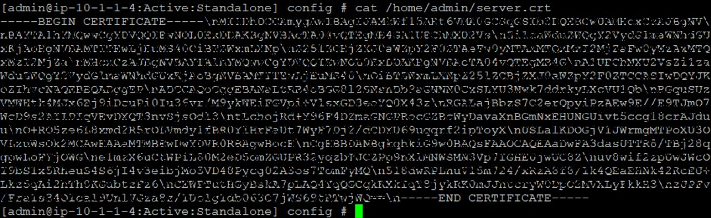

10. Next, we will create a Beacon configuration file by using Vim.

Copy and paste underneath beacon.json file to:

``vim /home/admin/beacon.json``

Type **‘i’** to insert the .json script.

::

 {
  "name": "beacon_service",
  "dataCollectionFrequencyInMinutes": 1,
  "beaconHost": "api.cloudservices.f5.com",
  "beaconUsername": "<changme>",
  "beaconPassword": "<changme>",
  "beaconClientID": "<changme>",
  "beaconClientSecret": "<changme>",
  "beaconPreferredAccountID": "<changme>",
  "beaconCertificate": "-----BEGIN CERTIFICATE-----\nMIIG9TCCBd2gAwIBAgIRAKXpRCySDLUNAAAAAFD/ubIwDQYJKoZIhvcNAQELBQAw\ngboxCzAJBgNVBAYTAlVTMRYwFAYDVQQKEw1FbnRydXN0LCBJbmMuMSgwJgYDVQQL\nEx9TZWUgd3d3LmVudHJ1c3QubmV0L2xlZ2FsLXRlcm1zMTkwNwYDVQQLEzAoYykg\nMjAxMiBFbnRydXN0LCBJbmMuIC0gZm9yIGF1dGhvcml6ZWQgdXNlIG9ubHkxLjAs\nBgNVBAMTJUVudHJ1c3QgQ2VydGlmaWNhdGlvbiBBdXRob3JpdHkgLSBMMUswHhcN\nMjAwMjI4MjIxNzI3WhcNMjEwMjI4MjI0NzI3WjBxMQswCQYDVQQGEwJVUzETMBEG\nA1UECBMKV2FzaGluZ3RvbjEQMA4GA1UEBxMHU2VhdHRsZTEaMBgGA1UEChMRRjUg\nTmV0d29ya3MsIEluYy4xHzAdBgNVBAMMFiouY2xvdWRzZXJ2aWNlcy5mNS5jb20w\nggEiMA0GCSqGSIb3DQEBAQUAA4IBDwAwggEKAoIBAQDMQRf7t/eIOTgaHJwMz3Ws\nUR+aOgUiD25tTcdNvbXAZHhCZgDQH4vGsYraJL6Lh2yChFw+pm+8yXu4MS+GE9QV\nIalFOWzya8Cq6vd2m0uG8ArDzcPEhdZ7YdX5RQf7kWJR15tfQUqwhlB7RExGovaC\nfH0e5qZqpvJbJA6n6u8D4Hv0RepELNndlFr95InJQczC/KZs77aw2pt/mGzPUDWn\nYIs03De7eLqVwI5tWJ8H0gLKPNAT6m9lSc5/VDLlOCZdLe1b5OlyqIXsoPLmfNbh\nSkcNCk2LDtMUYodDB/9+RMnHNyV0H2BjZoPe0TzHhbs35/XnzX8ku7uOzPmA4Ldx\nAgMBAAGjggM8MIIDODBPBgNVHREESDBGghYqLmNsb3Vkc2VydmljZXMuZjUuY29t\nghRjbG91ZHNlcnZpY2VzLmY1LmNvbYILKi5jcy5mNS5jb22CCWNzLmY1LmNvbTCC\nAX0GCisGAQQB1nkCBAIEggFtBIIBaQFnAHUAh3W/51l8+IxDmV+9827/Vo1HVjb/\nSrVgwbTq/16ggw8AAAFwjfu4TAAABAMARjBEAiBoUrQ7WIwDxU04CasrV1wEVPWv\nKdgM5KZy2+g7yQvqRwIgB9/69VAYP56FFjZ6JOtEpILRv3JMozfFsX/coxIIpKsA\ndgBVgdTCFpA2AUrqC5tXPFPwwOQ4eHAlCBcvo6odBxPTDAAAAXCN+7hXAAAEAwBH\nMEUCIG/HonkT55nx54BUKP1+LnzFnOchhaToynoeBj4/gO6bAiEA4gBMR+pLiupU\ngFuONsBViUBbGtfBZtKDqBdPvaqz1dwAdgC72d+8H4pxtZOUI5eqkntHOFeVCqtS\n6BqQlmQ2jh7RhQAAAXCN+7gWAAAEAwBHMEUCID04iAkSELKEe/HX8hE4w7gRNkRN\nBmWWqfge4dBhAI6XAiEA+iWnz1ipSB71nW8P2fsRsZtatw3AK2DcFNX3eabBO1Uw\nDgYDVR0PAQH/BAQDAgWgMB0GA1UdJQQWMBQGCCsGAQUFBwMBBggrBgEFBQcDAjAz\nBgNVHR8ELDAqMCigJqAkhiJodHRwOi8vY3JsLmVudHJ1c3QubmV0L2xldmVsMWsu\nY3JsMEsGA1UdIAREMEIwNgYKYIZIAYb6bAoBBTAoMCYGCCsGAQUFBwIBFhpodHRw\nOi8vd3d3LmVudHJ1c3QubmV0L3JwYTAIBgZngQwBAgIwaAYIKwYBBQUHAQEEXDBa\nMCMGCCsGAQUFBzABhhdodHRwOi8vb2NzcC5lbnRydXN0Lm5ldDAzBggrBgEFBQcw\nAoYnaHR0cDovL2FpYS5lbnRydXN0Lm5ldC9sMWstY2hhaW4yNTYuY2VyMB8GA1Ud\nIwQYMBaAFIKicHTdvFM/z3vU981/p2DGCky/MB0GA1UdDgQWBBTGdKVRZzQ0gboj\n2+v7l13szGXkqDAJBgNVHRMEAjAAMA0GCSqGSIb3DQEBCwUAA4IBAQA5FjChoVKi\nQS0szoLHCqqH2a9FW5Fgai5i462xjao0V59jfMomLfumBwP2JeY987Ubut+Locod\nhl2QeKWrM8v8Xy+k8VwoIyD2U7U2v5W/ipIsNJmEX0qgjvc7jg0Y/kasqGgHxAaQ\naa4qxr112obRF/XCiHC4zAgBMwVJ5XsyBdA6Swxngy9DwLjKq/8P75Ee3OHe1iG0\nlsU7VUiUxMBtNxjgl6rfLLOu7dasVMm1Ug9JTjQkcSYSyZ+nbfTFZYh4+4o2oKkj\nsjlUBaTbHRstx13FLr7ex+2RhrXSrg19F6WtVta50N0uBOxAPGzMh5503l9aZngA\nItEqzWWOMB7b\n-----END CERTIFICATE-----\n-----BEGIN CERTIFICATE-----\nMIIFDjCCA/agAwIBAgIMDulMwwAAAABR03eFMA0GCSqGSIb3DQEBCwUAMIG+MQsw\nCQYDVQQGEwJVUzEWMBQGA1UEChMNRW50cnVzdCwgSW5jLjEoMCYGA1UECxMfU2Vl\nIHd3dy5lbnRydXN0Lm5ldC9sZWdhbC10ZXJtczE5MDcGA1UECxMwKGMpIDIwMDkg\nRW50cnVzdCwgSW5jLiAtIGZvciBhdXRob3JpemVkIHVzZSBvbmx5MTIwMAYDVQQD\nEylFbnRydXN0IFJvb3QgQ2VydGlmaWNhdGlvbiBBdXRob3JpdHkgLSBHMjAeFw0x\nNTEwMDUxOTEzNTZaFw0zMDEyMDUxOTQzNTZaMIG6MQswCQYDVQQGEwJVUzEWMBQG\nA1UEChMNRW50cnVzdCwgSW5jLjEoMCYGA1UECxMfU2VlIHd3dy5lbnRydXN0Lm5l\ndC9sZWdhbC10ZXJtczE5MDcGA1UECxMwKGMpIDIwMTIgRW50cnVzdCwgSW5jLiAt\nIGZvciBhdXRob3JpemVkIHVzZSBvbmx5MS4wLAYDVQQDEyVFbnRydXN0IENlcnRp\nZmljYXRpb24gQXV0aG9yaXR5IC0gTDFLMIIBIjANBgkqhkiG9w0BAQEFAAOCAQ8A\nMIIBCgKCAQEA2j+W0E25L0Tn2zlem1DuXKVh2kFnUwmqAJqOV38pa9vH4SEkqjrQ\njUcj0u1yFvCRIdJdt7hLqIOPt5EyaM/OJZMssn2XyP7BtBe6CZ4DkJN7fEmDImiK\nm95HwzGYei59QAvS7z7Tsoyqj0ip/wDoKVgG97aTWpRzJiatWA7lQrjV6nN5ZGhT\nJbiEz5R6rgZFDKNrTdDGvuoYpDbwkrK6HIiPOlJ/915tgxyd8B/lw9bdpXiSPbBt\nLOrJz5RBGXFEaLpHPATpXbo+8DX3Fbae8i4VHj9HyMg4p3NFXU2wO7GOFyk36t0F\nASK7lDYqjVs1/lMZLwhGwSqzGmIdTivZGwIDAQABo4IBDDCCAQgwDgYDVR0PAQH/\nBAQDAgEGMBIGA1UdEwEB/wQIMAYBAf8CAQAwMwYIKwYBBQUHAQEEJzAlMCMGCCsG\nAQUFBzABhhdodHRwOi8vb2NzcC5lbnRydXN0Lm5ldDAwBgNVHR8EKTAnMCWgI6Ah\nhh9odHRwOi8vY3JsLmVudHJ1c3QubmV0L2cyY2EuY3JsMDsGA1UdIAQ0MDIwMAYE\nVR0gADAoMCYGCCsGAQUFBwIBFhpodHRwOi8vd3d3LmVudHJ1c3QubmV0L3JwYTAd\nBgNVHQ4EFgQUgqJwdN28Uz/Pe9T3zX+nYMYKTL8wHwYDVR0jBBgwFoAUanImetAe\n733nO2lR1GyNn5ASZqswDQYJKoZIhvcNAQELBQADggEBADnVjpiDYcgsY9NwHRkw\ny/YJrMxp1cncN0HyMg/vdMNY9ngnCTQIlZIv19+4o/0OgemknNM/TWgrFTEKFcxS\nBJPok1DD2bHi4Wi3Ogl08TRYCj93mEC45mj/XeTIRsXsgdfJghhcg85x2Ly/rJkC\nk9uUmITSnKa1/ly78EqvIazCP0kkZ9Yujs+szGQVGHLlbHfTUqi53Y2sAEo1GdRv\nc6N172tkw+CNgxKhiucOhk3YtCAbvmqljEtoZuMrx1gL+1YQ1JH7HdMxWBCMRON1\nexCdtTix9qrKgWRs6PLigVWXUX/hwidQosk8WwBD9lu51aX8/wdQQGcHsFXwt35u\nLcw=\n-----END CERTIFICATE-----",
  "beaconDataPlaneHost": "ingestion.ovr.prd.f5aas.com:50443",
  "beaconDataPlaneTokenName": "data_ingest123",
  "beaconDataPlaneCertificate": "-----BEGIN CERTIFICATE-----\nMIIFfjCCBGagAwIBAgIQCLgONUtp8sTKX0mQmRQ7hzANBgkqhkiG9w0BAQsFADBG\nMQswCQYDVQQGEwJVUzEPMA0GA1UEChMGQW1hem9uMRUwEwYDVQQLEwxTZXJ2ZXIg\nQ0EgMUIxDzANBgNVBAMTBkFtYXpvbjAeFw0yMDA2MTkwMDAwMDBaFw0yMTA3MTkx\nMjAwMDBaMCYxJDAiBgNVBAMTG2luZ2VzdGlvbi5vdnIucHJkLmY1YWFzLmNvbTCC\nASIwDQYJKoZIhvcNAQEBBQADggEPADCCAQoCggEBAMIwIkv8XnY9wwHLEKuh0Pvy\nHL0aUJ6i5hI4gA1iJUXab0747MOLgvDEpbFOC5dctpJlOAzDJGLsepTO2rDrdFNQ\nNzO3Kq97uq333MfswIdUfG+BhRskLkMBAPsd8GB3O+vUO8k7UyDheRmMjyE0Mt8p\nPpV6HZv3BM1YowqVIM2SWxQcxi6iS2TZ7X4MEZAtHZZljfW2A/wtu+n+s8aGSB2Y\nch5PJvaxPba7JrmdlSHCK1VIo+SKqPIZHhpHWKmdHzizOCJo+2JrCR0huREFwpRB\nqVPvRiIDh9Wt3VIOkZpet+SyB9cnEqlIxqDkfBSL3nGd2HfBC9nCZPsAHd948CkC\nAwEAAaOCAoYwggKCMB8GA1UdIwQYMBaAFFmkZgZSoHuVkjyjlAcnlnRb+T3QMB0G\nA1UdDgQWBBTIoJJaxhZ0ImuPmpPo8ROFeB+AMzAmBgNVHREEHzAdghtpbmdlc3Rp\nb24ub3ZyLnByZC5mNWFhcy5jb20wDgYDVR0PAQH/BAQDAgWgMB0GA1UdJQQWMBQG\nCCsGAQUFBwMBBggrBgEFBQcDAjA7BgNVHR8ENDAyMDCgLqAshipodHRwOi8vY3Js\nLnNjYTFiLmFtYXpvbnRydXN0LmNvbS9zY2ExYi5jcmwwIAYDVR0gBBkwFzALBglg\nhkgBhv1sAQIwCAYGZ4EMAQIBMHUGCCsGAQUFBwEBBGkwZzAtBggrBgEFBQcwAYYh\naHR0cDovL29jc3Auc2NhMWIuYW1hem9udHJ1c3QuY29tMDYGCCsGAQUFBzAChipo\ndHRwOi8vY3J0LnNjYTFiLmFtYXpvbnRydXN0LmNvbS9zY2ExYi5jcnQwDAYDVR0T\nAQH/BAIwADCCAQMGCisGAQQB1nkCBAIEgfQEgfEA7wB1APZclC/RdzAiFFQYCDCU\nVo7jTRMZM7/fDC8gC8xO8WTjAAABcsoXcgoAAAQDAEYwRAIgXEYdmpiOjLTP3vvH\nRsUZM/9Fm6NfHh9Ln2yXHFCuJZ0CID39c6ymtVtq0kDAd125w6VlPJWhwEJxqQZI\nl8XYrrxPAHYAXNxDkv7mq0VEsV6a1FbmEDf71fpH3KFzlLJe5vbHDsoAAAFyyhdy\nNAAABAMARzBFAiBtWimknBvcIFLKA+8p+4xtTq+zj/2+HEm0B+hmeJCFYwIhAMeE\n6OXdqDPFaHwdCK8jfx6giL5N0fL9IOUrDre9YxphMA0GCSqGSIb3DQEBCwUAA4IB\nAQBftfqbN90M32mPOyLOWhCDGycqwbOOKk/EmUo4ODRwaOCojqI21GJLC9k8diag\n2sYAy9tm6yNe9e+e4yPM/ANlq3WN0SVgPCgp6muu3Kc7eTFcJzgOl7TyL0SyjrW8\noM47wwjQv+XxbI81gp0rsVpwgVYL73Rp6bgs3gGC8BYOI9g6d72CEMrWou52B5D6\nSTmXUu18RvkAUhSo8bKy2miZjjPehxQvmiGS0mb62Fv+76d5PC++EYQ0J2KR5udi\npC4CYkTceEzaWEUjISmkjhn5a8IqWmpYTZniWBtQTu2fT0lBO3oiZ2SpSqsSlKNA\ncKQFcYhfpfS3or2BUSYyO4fP\n-----END CERTIFICATE-----\n-----BEGIN CERTIFICATE-----\nMIIESTCCAzGgAwIBAgITBn+UV4WH6Kx33rJTMlu8mYtWDTANBgkqhkiG9w0BAQsF\nADA5MQswCQYDVQQGEwJVUzEPMA0GA1UEChMGQW1hem9uMRkwFwYDVQQDExBBbWF6\nb24gUm9vdCBDQSAxMB4XDTE1MTAyMjAwMDAwMFoXDTI1MTAxOTAwMDAwMFowRjEL\nMAkGA1UEBhMCVVMxDzANBgNVBAoTBkFtYXpvbjEVMBMGA1UECxMMU2VydmVyIENB\nIDFCMQ8wDQYDVQQDEwZBbWF6b24wggEiMA0GCSqGSIb3DQEBAQUAA4IBDwAwggEK\nAoIBAQDCThZn3c68asg3Wuw6MLAd5tES6BIoSMzoKcG5blPVo+sDORrMd4f2AbnZ\ncMzPa43j4wNxhplty6aUKk4T1qe9BOwKFjwK6zmxxLVYo7bHViXsPlJ6qOMpFge5\nblDP+18x+B26A0piiQOuPkfyDyeR4xQghfj66Yo19V+emU3nazfvpFA+ROz6WoVm\nB5x+F2pV8xeKNR7u6azDdU5YVX1TawprmxRC1+WsAYmz6qP+z8ArDITC2FMVy2fw\n0IjKOtEXc/VfmtTFch5+AfGYMGMqqvJ6LcXiAhqG5TI+Dr0RtM88k+8XUBCeQ8IG\nKuANaL7TiItKZYxK1MMuTJtV9IblAgMBAAGjggE7MIIBNzASBgNVHRMBAf8ECDAG\nAQH/AgEAMA4GA1UdDwEB/wQEAwIBhjAdBgNVHQ4EFgQUWaRmBlKge5WSPKOUByeW\ndFv5PdAwHwYDVR0jBBgwFoAUhBjMhTTsvAyUlC4IWZzHshBOCggwewYIKwYBBQUH\nAQEEbzBtMC8GCCsGAQUFBzABhiNodHRwOi8vb2NzcC5yb290Y2ExLmFtYXpvbnRy\ndXN0LmNvbTA6BggrBgEFBQcwAoYuaHR0cDovL2NydC5yb290Y2ExLmFtYXpvbnRy\ndXN0LmNvbS9yb290Y2ExLmNlcjA/BgNVHR8EODA2MDSgMqAwhi5odHRwOi8vY3Js\nLnJvb3RjYTEuYW1hem9udHJ1c3QuY29tL3Jvb3RjYTEuY3JsMBMGA1UdIAQMMAow\nCAYGZ4EMAQIBMA0GCSqGSIb3DQEBCwUAA4IBAQCFkr41u3nPo4FCHOTjY3NTOVI1\n59Gt/a6ZiqyJEi+752+a1U5y6iAwYfmXss2lJwJFqMp2PphKg5625kXg8kP2CN5t\n6G7bMQcT8C8xDZNtYTd7WPD8UZiRKAJPBXa30/AbwuZe0GaFEQ8ugcYQgSn+IGBI\n8/LwhBNTZTUVEWuCUUBVV18YtbAiPq3yXqMB48Oz+ctBWuZSkbvkNodPLamkB2g1\nupRyzQ7qDn1X8nn8N8V7YJ6y68AtkHcNSRAnpTitxBKjtKPISLMVCx7i4hncxHZS\nyLyKQXhw2W2Xs0qLeC1etA+jTGDK4UfLeC0SF7FSi8o5LL21L8IzApar2pR/\n-----END CERTIFICATE-----\n-----BEGIN CERTIFICATE-----\nMIIEkjCCA3qgAwIBAgITBn+USionzfP6wq4rAfkI7rnExjANBgkqhkiG9w0BAQsF\nADCBmDELMAkGA1UEBhMCVVMxEDAOBgNVBAgTB0FyaXpvbmExEzARBgNVBAcTClNj\nb3R0c2RhbGUxJTAjBgNVBAoTHFN0YXJmaWVsZCBUZWNobm9sb2dpZXMsIEluYy4x\nOzA5BgNVBAMTMlN0YXJmaWVsZCBTZXJ2aWNlcyBSb290IENlcnRpZmljYXRlIEF1\ndGhvcml0eSAtIEcyMB4XDTE1MDUyNTEyMDAwMFoXDTM3MTIzMTAxMDAwMFowOTEL\nMAkGA1UEBhMCVVMxDzANBgNVBAoTBkFtYXpvbjEZMBcGA1UEAxMQQW1hem9uIFJv\nb3QgQ0EgMTCCASIwDQYJKoZIhvcNAQEBBQADggEPADCCAQoCggEBALJ4gHHKeNXj\nca9HgFB0fW7Y14h29Jlo91ghYPl0hAEvrAIthtOgQ3pOsqTQNroBvo3bSMgHFzZM\n9O6II8c+6zf1tRn4SWiw3te5djgdYZ6k/oI2peVKVuRF4fn9tBb6dNqcmzU5L/qw\nIFAGbHrQgLKm+a/sRxmPUDgH3KKHOVj4utWp+UhnMJbulHheb4mjUcAwhmahRWa6\nVOujw5H5SNz/0egwLX0tdHA114gk957EWW67c4cX8jJGKLhD+rcdqsq08p8kDi1L\n93FcXmn/6pUCyziKrlA4b9v7LWIbxcceVOF34GfID5yHI9Y/QCB/IIDEgEw+OyQm\njgSubJrIqg0CAwEAAaOCATEwggEtMA8GA1UdEwEB/wQFMAMBAf8wDgYDVR0PAQH/\nBAQDAgGGMB0GA1UdDgQWBBSEGMyFNOy8DJSULghZnMeyEE4KCDAfBgNVHSMEGDAW\ngBScXwDfqgHXMCs4iKK4bUqc8hGRgzB4BggrBgEFBQcBAQRsMGowLgYIKwYBBQUH\nMAGGImh0dHA6Ly9vY3NwLnJvb3RnMi5hbWF6b250cnVzdC5jb20wOAYIKwYBBQUH\nMAKGLGh0dHA6Ly9jcnQucm9vdGcyLmFtYXpvbnRydXN0LmNvbS9yb290ZzIuY2Vy\nMD0GA1UdHwQ2MDQwMqAwoC6GLGh0dHA6Ly9jcmwucm9vdGcyLmFtYXpvbnRydXN0\nLmNvbS9yb290ZzIuY3JsMBEGA1UdIAQKMAgwBgYEVR0gADANBgkqhkiG9w0BAQsF\nAAOCAQEAYjdCXLwQtT6LLOkMm2xF4gcAevnFWAu5CIw+7bMlPLVvUOTNNWqnkzSW\nMiGpSESrnO09tKpzbeR/FoCJbM8oAxiDR3mjEH4wW6w7sGDgd9QIpuEdfF7Au/ma\neyKdpwAJfqxGF4PcnCZXmTA5YpaP7dreqsXMGz7KQ2hsVxa81Q4gLv7/wmpdLqBK\nbRRYh5TmOTFffHPLkIhqhBGWJ6bt2YFGpn6jcgAKUj6DiAdjd4lpFw85hdKrCEVN\n0FE6/V1dN2RMfjCyVSRCnTawXZwXgWHxyvkQAiSr6w10kY17RSlQOYiypok1JR4U\nakcjMS9cmvqtmg5iUaQqqcT5NJ0hGA==\n-----END CERTIFICATE-----\n-----BEGIN CERTIFICATE-----\nMIIEdTCCA12gAwIBAgIJAKcOSkw0grd/MA0GCSqGSIb3DQEBCwUAMGgxCzAJBgNV\nBAYTAlVTMSUwIwYDVQQKExxTdGFyZmllbGQgVGVjaG5vbG9naWVzLCBJbmMuMTIw\nMAYDVQQLEylTdGFyZmllbGQgQ2xhc3MgMiBDZXJ0aWZpY2F0aW9uIEF1dGhvcml0\neTAeFw0wOTA5MDIwMDAwMDBaFw0zNDA2MjgxNzM5MTZaMIGYMQswCQYDVQQGEwJV\nUzEQMA4GA1UECBMHQXJpem9uYTETMBEGA1UEBxMKU2NvdHRzZGFsZTElMCMGA1UE\nChMcU3RhcmZpZWxkIFRlY2hub2xvZ2llcywgSW5jLjE7MDkGA1UEAxMyU3RhcmZp\nZWxkIFNlcnZpY2VzIFJvb3QgQ2VydGlmaWNhdGUgQXV0aG9yaXR5IC0gRzIwggEi\nMA0GCSqGSIb3DQEBAQUAA4IBDwAwggEKAoIBAQDVDDrEKvlO4vW+GZdfjohTsR8/\ny8+fIBNtKTrID30892t2OGPZNmCom15cAICyL1l/9of5JUOG52kbUpqQ4XHj2C0N\nTm/2yEnZtvMaVq4rtnQU68/7JuMauh2WLmo7WJSJR1b/JaCTcFOD2oR0FMNnngRo\nOt+OQFodSk7PQ5E751bWAHDLUu57fa4657wx+UX2wmDPE1kCK4DMNEffud6QZW0C\nzyyRpqbn3oUYSXxmTqM6bam17jQuug0DuDPfR+uxa40l2ZvOgdFFRjKWcIfeAg5J\nQ4W2bHO7ZOphQazJ1FTfhy/HIrImzJ9ZVGif/L4qL8RVHHVAYBeFAlU5i38FAgMB\nAAGjgfAwge0wDwYDVR0TAQH/BAUwAwEB/zAOBgNVHQ8BAf8EBAMCAYYwHQYDVR0O\nBBYEFJxfAN+qAdcwKziIorhtSpzyEZGDMB8GA1UdIwQYMBaAFL9ft9HO3R+G9FtV\nrNzXEMIOqYjnME8GCCsGAQUFBwEBBEMwQTAcBggrBgEFBQcwAYYQaHR0cDovL28u\nc3MyLnVzLzAhBggrBgEFBQcwAoYVaHR0cDovL3guc3MyLnVzL3guY2VyMCYGA1Ud\nHwQfMB0wG6AZoBeGFWh0dHA6Ly9zLnNzMi51cy9yLmNybDARBgNVHSAECjAIMAYG\nBFUdIAAwDQYJKoZIhvcNAQELBQADggEBACMd44pXyn3pF3lM8R5V/cxTbj5HD9/G\nVfKyBDbtgB9TxF00KGu+x1X8Z+rLP3+QsjPNG1gQggL4+C/1E2DUBc7xgQjB3ad1\nl08YuW3e95ORCLp+QCztweq7dp4zBncdDQh/U90bZKuCJ/Fp1U1ervShw3WnWEQt\n8jxwmKy6abaVd38PMV4s/KCHOkdp8Hlf9BRUpJVeEXgSYCfOn8J3/yNTd126/+pZ\n59vPr5KW7ySaNRB6nJHGDn2Z9j8Z3/VyVOEVqQdZe4O/Ui5GjLIAZHYcSNPYeehu\nVsyuLAOQ1xk4meTKCRlb/weWsKh/NEnfVqn3sF/tM+2MR7cwA130A4w=\n-----END CERTIFICATE-----\n",
  "biqHost": "10.1.1.4",
  "biqUserName": "admin",
  "biqPassword": "purple123",
  "biqAuthProviderName": "local",
  "biqServerCertificate": "<changme>",
  "heartbeatFrequencyInSeconds": 1,
  "alertMissingHeartbeatCountAfter": 5,
  "alertThresholdMissingHeartbeatRateInPercent": 5,
  "logLevel": "INFO",
  "httpProxyServer": "",
  "httpsProxyServer": ""
 }

In this beacon.json, fill in the following fields by replacing **<changme>**:

- Beacon username
- Beacon password
- Beacon ClientID
- Beacon SecretID
- BIG-IQ username
- BIG-IQ password
- BIG-IQ server certificate *(will be generated in upcoming steps, omit for now)*

Press **Esc** to get to the vim mainmenu.
Type **:wq** to save and close beacon.json.

11. Put a copy of generated server.crt into **/home/admin/** by copy and pasting underneath **openSSL** cmd.

::

 openssl x509 -in <(openssl s_client -connect $(ifconfig | grep -A 1 mgmt | grep inet | awk '{print $2}'):443 -prexit 2>/dev/null) | awk 'NF {sub(/\r/, ""); printf "%s\\n",$0;}' | rev | cut -c3- | rev > /home/admin/server.crt

Display the BIG-IQ server certificate by typing:

``cat /home/admin/server.crt``

12. The BIG-IQ server certificate needs to be included in the beacon.json and therefore copy the output from the server.crt

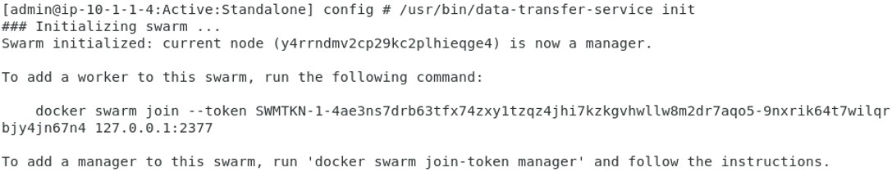

13. Now open beacon.json to modify it.

``vim /home/admin/beacon.json``

Find the ‘bigServerCertificate’ by scrolling down to the bottom, remove ‘<changeme>’ and paste the actual certificate between the punctuations “”.

14. Now we need to set the communication in motion by executing to commands which will first initiate the data transfer service to beacon and then the service will get started, making use of the just defined beacon.json config file.

``/usr/bin/data-transfer-service init``

``/usr/bin/data-transfer-service start /home/admin/beacon.json``

The first cmd will initiate a Docker Swarm token.

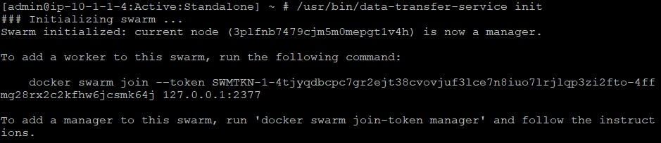

Where the second command will start the docker service.

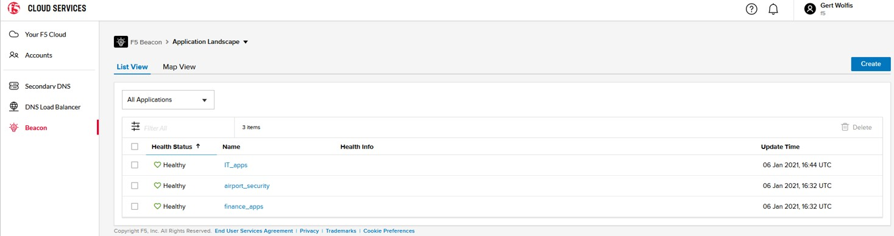

To watch the Beacon service log, follow the ‘latest’ location as mentioned in the last line of the shown output.

``cd /var/log/docker/data-transfer-service:latest``

``ls``

Your log file will be named differently.

``tail -f <your_beacon_service_name>.log``

You will see that DTS service started successfully and that data about BIG-IQ defined applications is being pushed to Beacon.
This included log is for your reference.

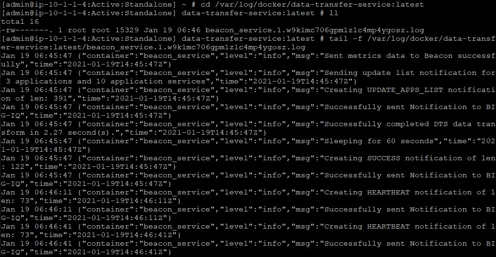
 
15. Login to **BIG-IQ > Applications > Applications** and check the Beacon Icon.

.. image:: ../pictures/module6/img_module6_lab1_12.png
  :align: center
  :scale: 40%
 
They should be **‘Green’**. One thing to mention is that Applications defined under ‘Unknown Applications’ will not get discovered or send data to Beacon.

16. Login to F5 Beacon to check the configuration.
 

You should see the three applications we started with in BIG-IQ, those are now published in Beacon.

17. Click on the application **finance_apps** and check the Application Map. F5 Beacon inherits the same structure of applications as BIG-IQ presents them.

18. Select **appsvc-backendconference_site41ftp** and scroll through the **Properties** and notice from which source the application got generated. Go through the **Metrics** and **Events**.

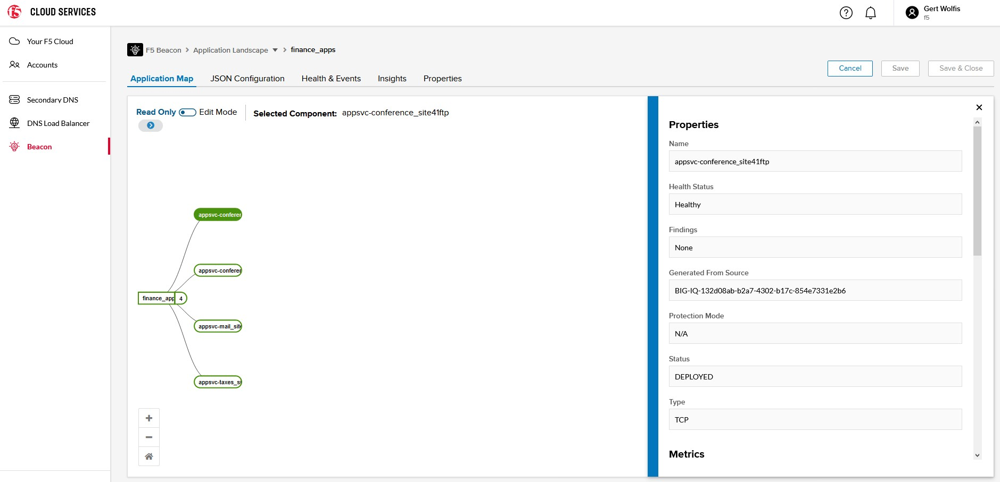

Configuring F5 Beacon is beyond the scope of this lab, but when you want to explore more about Beacon, I highly encourage to start here: https://clouddocs.f5.com/cloud-services/latest/f5-cloud-services-Beacon-About.html 

This ends this lab.
