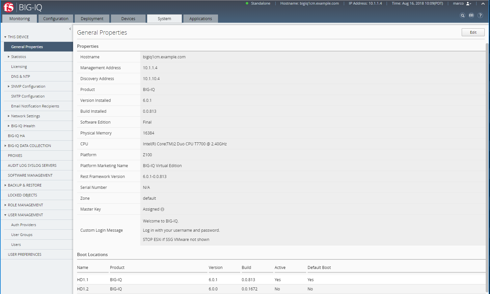
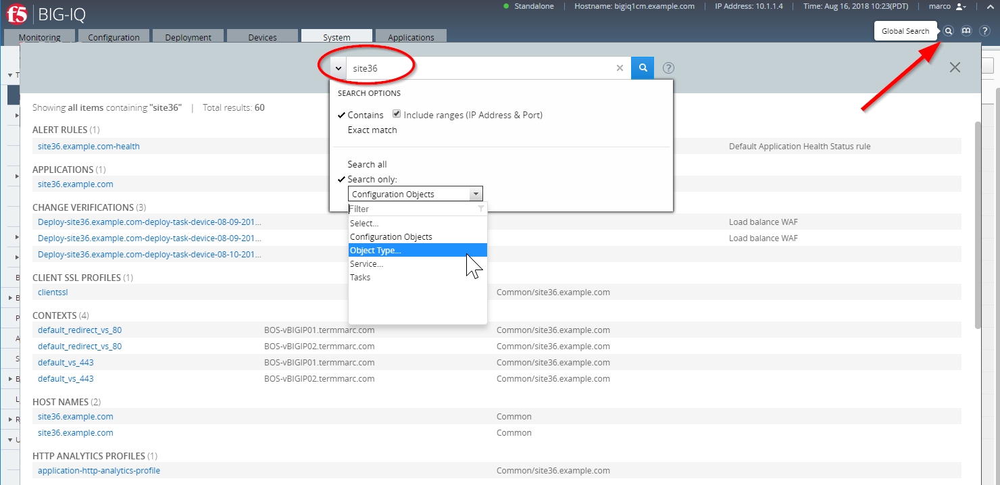
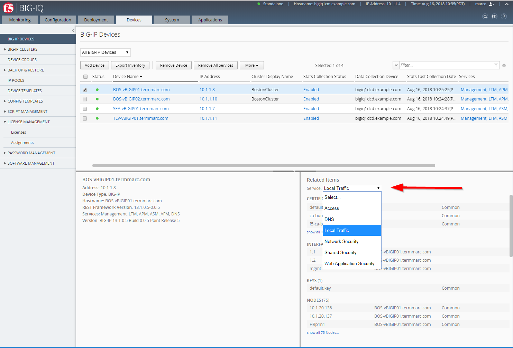

Class 4: BIG-IQ Platform
========================

In this class, we will focus on the BIG-IQ CM and DCD plaforms. Let's have a look at the ``System Tab`` in BIG-IQ.

.. toctree::
   :maxdepth: 1
   :glob:

   module*/module*

------------

**THIS DEVICE**

This area contains the configuration information for this BIG-IQ system, including statistics, licensing, DNS, NTP, SNMP, SMTP,
network configuration, custom login banner and iHealth integrations.

|

**BIG-IQ HA**

This is where BIG-IQ high availability is configured.  BIG-IQ supports an active-standby pairing of BIG-IQ console devices.

**BIG-IQ DATA COLLECTION**

This is where BIG-IQ Data Collection Devices (DCDs) are managed and configured. A high-level reporting on the health and performance of the DCDs is presented there. 

**PROXIES**

This is where HTTP proxies can be configured to allow the BIG-IQ to talk through a proxy for items that require connection to external services like licensing,
iHealth, ASM signatures, FPS signatures, etc.

**AUDIT LOG SYSLOG SERVERS**

This is where you configure syslog servers to send the audit log entries to.

**SOFTWARE MANAGEMENT**

This is where you manage the upgrades of the BIG-IQ itself.

**BACKUP & RESTORE**

This is where you manage the backup and restore of the BIG-IQ console and Data Collection Devices.

**LOCKED OBJECTS**

This is where you can view objects that are locked in the system. Objects are locked when a user has them open for editing.
Users with admin or manager privileges can remove the lock and discard the change, if someone else needs to edit the change.

**ROLE MANAGEMENT**

BIG-IQ has a set of built-in roles for each of the module areas.  Each module area has the following roles:

* View – Users with this role have a read-only view of all of the objects in that module area.
* Edit – Users with this role can edit the configuration that is staged on the BIG-IQ for objects in that module area.
* Deploy – Users with this role can deploy changes that have been staged on the BIG-IQ for the module area, but they can’t change the actual staged configuration.
* Manager – Users with this role can manage all parts of the configuration for a module area.

The custom role types allow the admin to create additional roles types. The admin can set exactly what actions are permitted on which object types.
The resource group functionality allows the admin to dictate what objects can be acted on by a user or group.
The custom role type and resource group can be combined to create a custom role.  Roles can be created with two different modes:

* Relaxed Mode - Users can view all objects related to the service(s) they have access to, but can modify only those they have explicit permission to. This is the default.
* Strict Mode - User can view or modify only the objects they have explicit permission to.

**USER MANAGEMENT**

This area allows for management of local users and groups, as well as integration with 3rd party authentication providers (RADIUS, LDAP, or TACACS+). 

See `Class 1 Module 1`_ for description of the different personas.

.. _Class 1 Module 1: ../class01/module1/lab1.html

**USER PREFERENCES**

This area allows the user to specify preferences, including UI idle timeout, default page to be displayed on login, and Network Security editing preferences.

**Additional UI Features**

* Context Sensitive Online Help

Click the ``?`` in the upper right hand corner of the UI to get help specific to the page that you are on.

.. image:: ./pictures/img_module1_2.png
  :align: center
  :scale: 50%

|

* Global Search
 
Click the magnifying glass icon in the upper right of the UI to open the global search window. Enter the search term you are looking for.
By default, it will search all of the configuration known to BIG-IQ, but you can scope the search by clicking the down arrow to the left of the search box.
You can click name of the object that is returned by the search to go to the detail page for that object.

|

* Grid sort and filter
 
At the upper right of any of the pages that display a grid of objects there is a box that allows you to filter the data shown in the grid. 
It searches all the columns by default, but can be scoped to a particular column. You can do a contains or exact match search.

.. image:: ./pictures/img_module1_4.png
  :align: center
  :scale: 50%

|
 
* Object preview and Related Items search

Selecting a row in a grid, by selecting somewhere on the row other than the name of the object brings up an area at the bottom of the UI that
shows a preview of the object on the left and the ability to search for items related to this object on the right. Click the Show button to find the related items.
 
Related items are populated on the right.  You can click the name of the related object to go to the page for that 

|