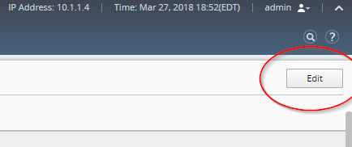

Lab 1.1: Custom login banner for GUI login screen
-------------------------------------------------

This feature provides the ability for the customer to specify a message to be displayed on the BIG-IQ login page.

1. Open BIG-IQ, go to System > This Device > General Properties

2. Click on Edit on the top right corner

|

3. Add the custom login below, check the box Show on Login Screen

::

    UNAUTHORIZED ACCESS TO THIS DEVICE IS PROHIBITED
    You must have explicit, authorized permission to access or configure this device.
    Unauthorized attempts and actions to access or use this system may result in civil and/or criminal penalties. All activities performed on this device are logged and monitored.

.. image:: ../pictures/module1/img_module1_lab1_2.png
  :align: center
  :scale: 50%

|
  
4. Save and Close

5. Repeast step 1-4 on the DCD

6. Logout and re-login

.. image:: ../pictures/module1/img_module1_lab1_3.png
  :align: center
  :scale: 50%

|