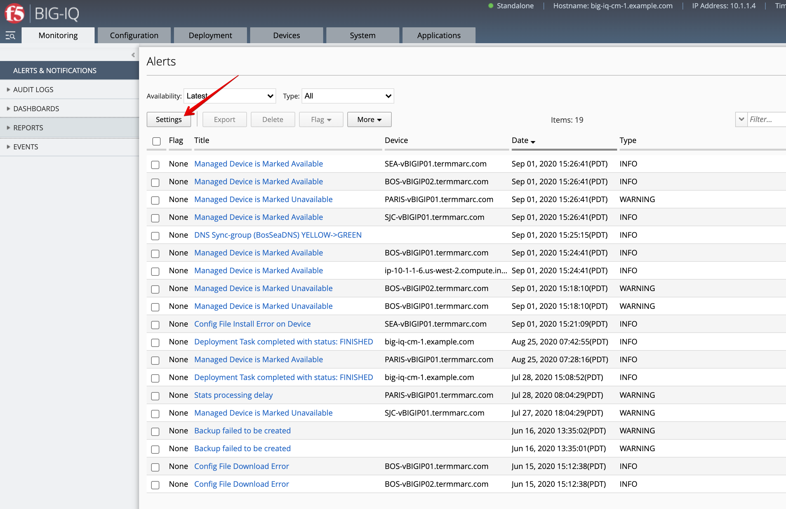
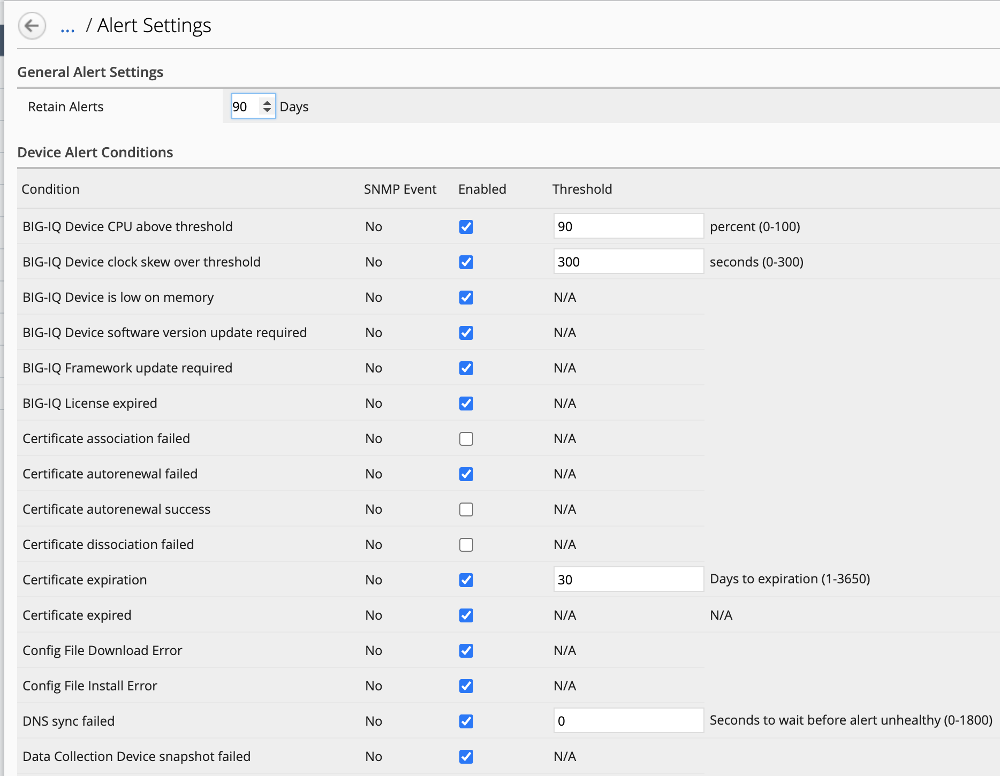
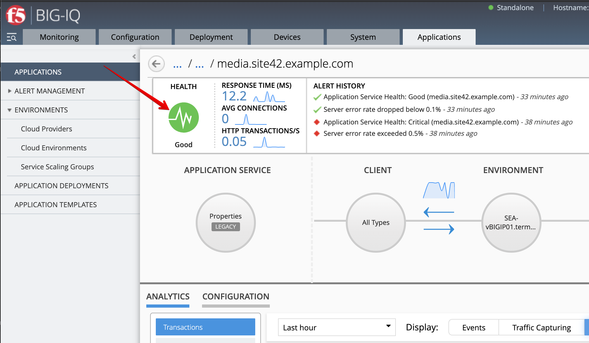
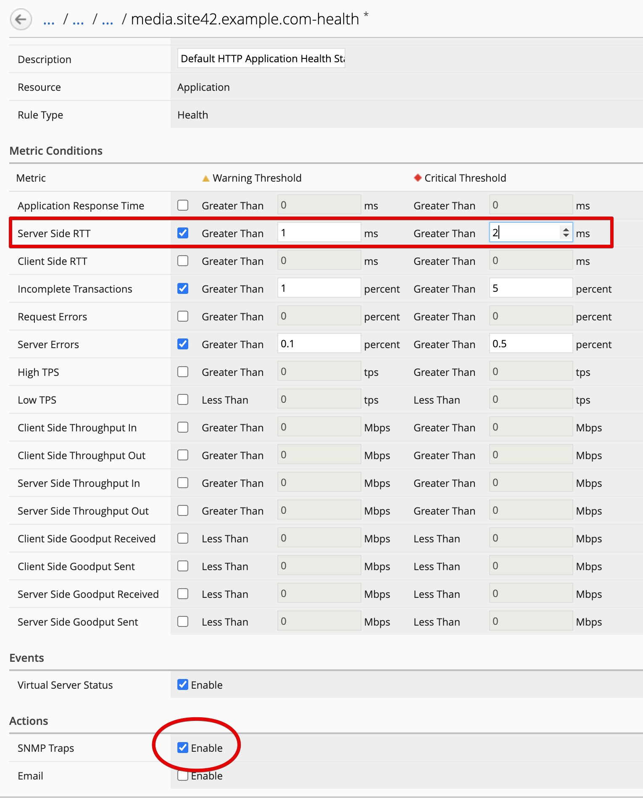
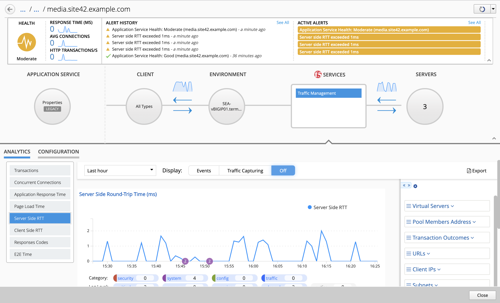
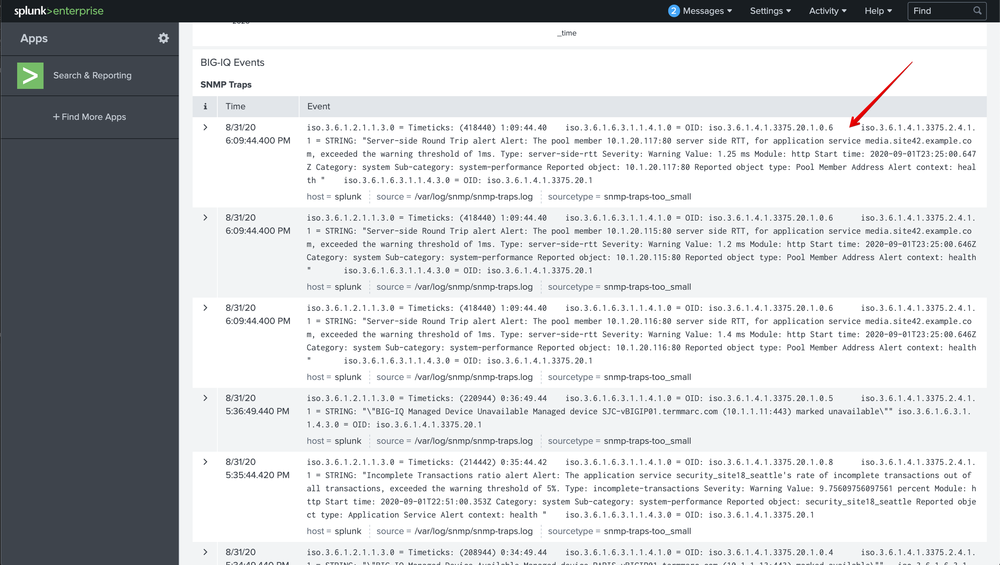

Lab 1.2: Configuring SNMP for sending traps/alerts to Splunk
------------------------------------------------------------
.. note:: Estimated time to complete: **5 minutes**

This feature provides the ability for the customer to specify a message to be displayed on the BIG-IQ login page.

.. include:: /accesslab.rst

Tasks
^^^^^
**Prerequisites Splunk**

- This demo is using a instance of Splunk running in a `container`_.
- Refer `Send SNMP events to your Splunk deployment`_ and `Monitor files and directories with the CLI`_

.. _container: https://hub.docker.com/r/splunk/splunk/
.. _Send SNMP events to your Splunk deployment: https://docs.splunk.com/Documentation/Splunk/latest/Data/SendSNMPeventstoSplunk#How_to_index_SNMP_traps
.. _Monitor files and directories with the CLI: https://docs.splunk.com/Documentation/Splunk/latest/Data/MonitorfilesanddirectoriesusingtheCLI

1. Connect via ``SSH`` or ``Web Shell`` to the system *Ubuntu Lamp Server*. *(if you use the Web Shell, login as f5student first: su - f5student)*.

2. Execute the following commands to start the SNMP trap Listener::

    ./splunk/startSNMPtrapListener.sh

3. Open BIG-IQ, go to **System > This Device > SNMP Configuration > SNMP Traps**. Click **Create**.

- Name: ``snmptrad``
- Version: ``V2C``
- Community: ``public``
- Destination: ``10.1.1.5``
- Port: ``162``

.. image:: ../pictures/module1/img_module1_lab2_1.png
  :align: center
  :scale: 60%

4. The Devices and System alerts are located under **Monitoring > Alerts & Notifications**. It will display all triggered alerts.

5. Click on **Settings** to see the type of alerts available.

6. From you lab deployment, look for **SJC-vBIGIP01.termmarc.com** device, click on *Details* and stop the device.

Wait for few seconds, you should coming a new alert showing the device unavailable in the Alerts list.

7. Now, let's have a look at the Applications Alerts. Go to **Applications > Applications**, click on the *IT_apps* Application, 
   then on **media.site42.example.com** Application Service.

On the top right of the application dashboard, click on the Health button.

8. Change the *Server Site RTT* warning and critical thresholds to ``1ms`` and ``2ms``. Under *Actions*, enable ``SNMP Trap``.

7. Back on the Application Service dashboard, notice some new alerts are being created about Server Site RTT.

9. Now, let's open Splunk to see if any SNMP traps were received.
   From you lab deployment, click on the *SPLUNK* button on the system *Ubuntu Lamp Server*.
   Use ``admin/purple123`` to authenticate.

