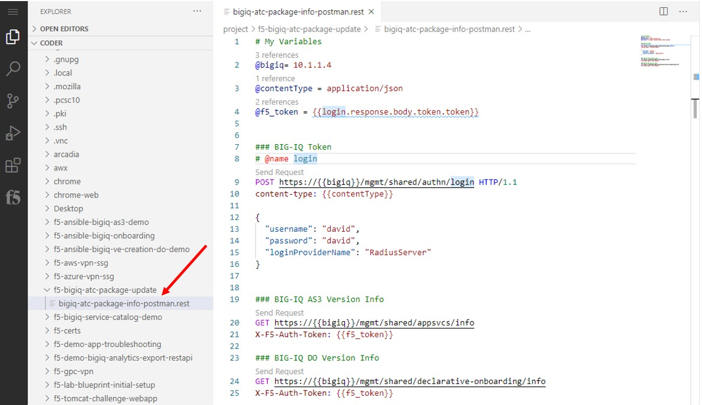
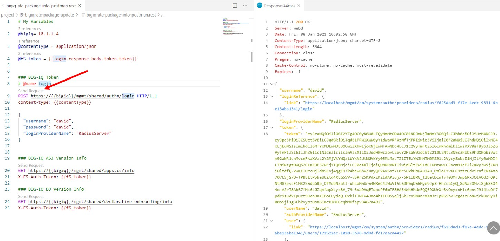
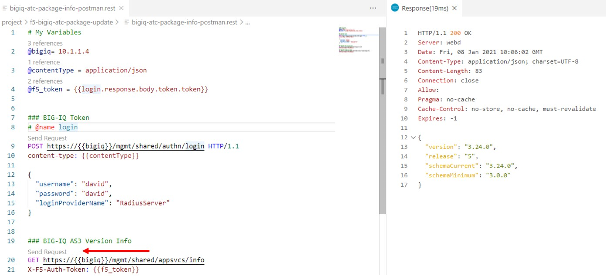
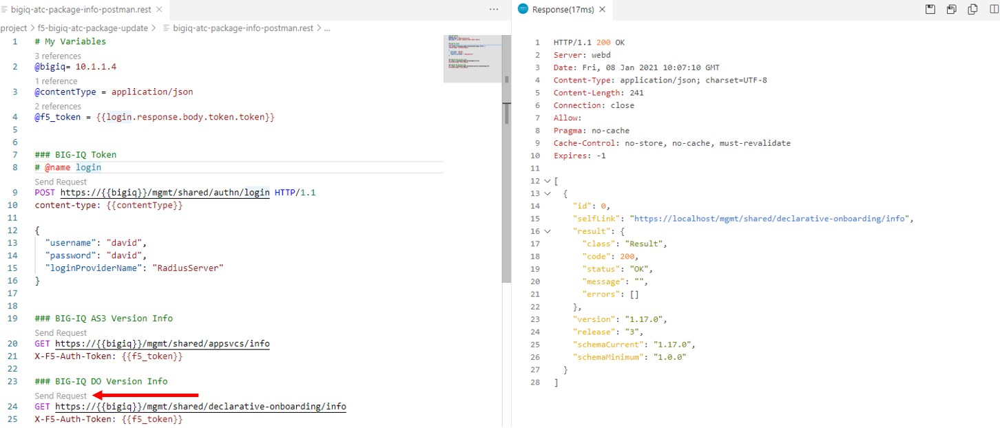
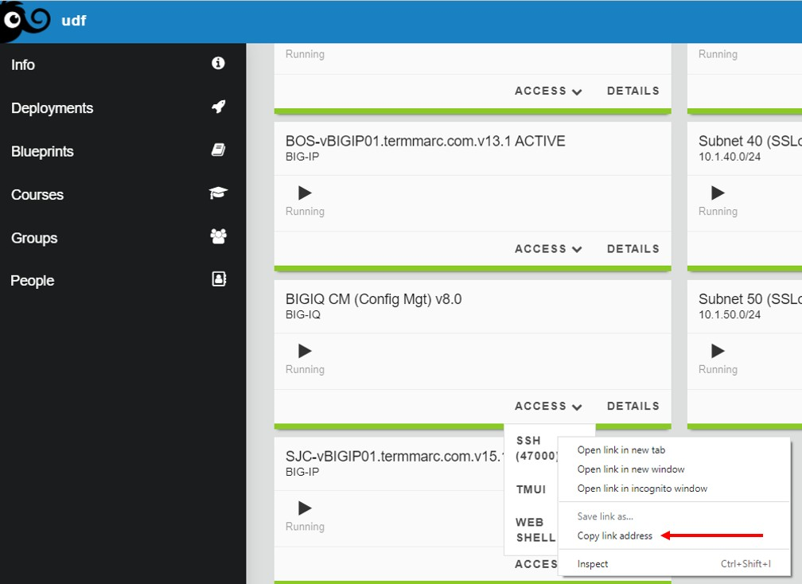
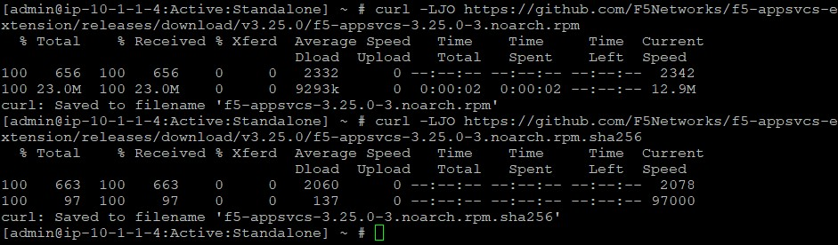
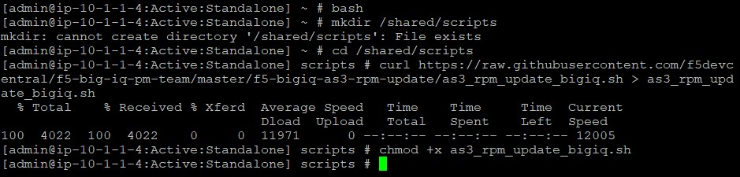
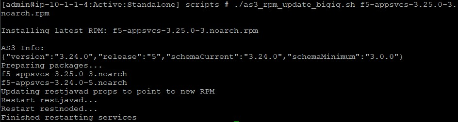
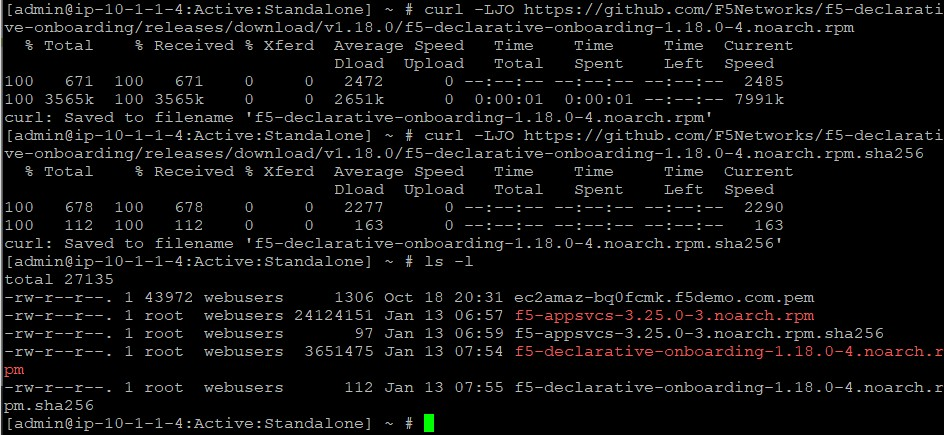
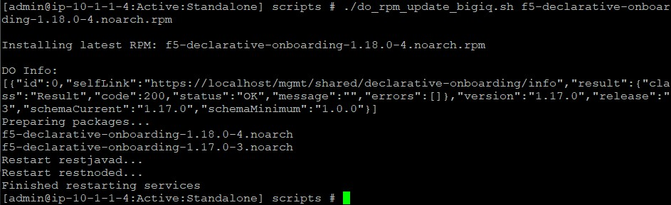

Lab 8.6: Upgrade BIG-IQ F5 Automated Toolchain .rpm packages
------------------------------------------------------------

.. note:: Estimated time to complete: **20 minutes**

BIG-IQ includes F5 Automation Toolchain functions starting from v6.1. First, AS3 got added and made it possible that application services could be defined as templates and targeted via BIG-IQ to a managed BIG-IP using REST-API.
DO or Declarative Onboarding followed with the release of BIG-IQ v7.0, being a supported package on BIG-IQ and with each new release of BIG-IQ, these .rpm’s will get updated to the latest available release at the point of going RTW (Released To the Web).

At this point both AS3 and DO are supported F5 automation toolchain packages for BIG-IQ.
An administrator is allowed to upgrade the F5 automation toolchain packages on BIG-IQ and enabling the ability to use the latest features available.

Tasks
^^^^^

Tasks for this lab are:

* Check BIG-IQ compatibility with AS3 and DO
* Display the running AS3 and DO version on BIG-IQ
* Upgrading a package

1. In the BIG-IQ UDF lab, go to the **Components** section and find Ubuntu Lamp. Select **Access** and click **Visual Studio Code**.

**Note:** When you are not familar with the UDF lab environment using VSC, please use the **Get Started** page which can be found here:  https://clouddocs.f5.com/training/community/big-iq-cloud-edition/html/startup.html

Enter the password (purple123).

We will use a Visual Studio Code Extension as a REST Client to get info from the current installed BIG-IQ F5 automation toolchain packages.

3. In VSC, go to Explorer in the Left pane and select **project > bigiq-atc-package-info-postman.rest** and explore the body.

4. First we need to authenticate against the BIG-IQ by generating a token. In the REST body click **'Send Request'** of the BIG-IQ Token and watch the response.

5. Select **BIG-IQ AS3 Version Info** and check the GET URI.

The URI is asking AS3 package info from BIG-IQ
Now press **‘Send Request’**.

The response should return a version number meaning that the AS3 .rpm package is installed and revealing the version.

6. Select **BIG-IQ DO Version Info** and also here the URI is prepped to ask info about the DO installed .rpm package on BIG-IQ.

Press **'Send Request'**.

The current DO version installed on BIG-IQ is v1.17.

7. Check the latest AS3 and DO releases by browsing to their respected release pages on Github.

AS3: https://github.com/F5Networks/f5-appsvcs-extension/releases 

DO: https://github.com/F5Networks/f5-declarative-onboarding/releases 

.. note:: When the BIG-IQ installed version is simular to the latest version on Github, just continue this exercise and assume they are newer ;-).

Notice that both packages are not the latest and should be upgraded to contain the latest features and bug fixes.
Before doing so we first need to check the compatibility of our BIG-IQ version and the available packages for DO and AS3.

8. Browse to this F5 knowledge base article: https://support.f5.com/csp/article/K54909607 and check the compatibility by looking at the **‘BIG-IQ Centralized Management compatibility with AS3 and DO’** section and related table.

The KB article contains all the required steps to upgrade the DO and AS3 rpm's, but instead of following this article, we will use BIG-IQ F5 PM developed scripts. Links to these scripts are included in the KB article or you can just follow the next steps.

9. From the UDF lab page, go to the Components tab and find BIG-IQ CM, select **Access**, right-click SSH and copy the SSH link location to use within your favorite SSH client.

10. Login with SSH into BIG-IQ as user admin.

Upgrading BIG-IQ AS3 .rpm
^^^^^^^^^^^^^^^^^^^^^^^^^

11. First we will download the AS3 .rpm on BIG-IQ. 

The new AS3 .rpm needs to be uploaded in **/home/admin**

Use the AS3 latest releases on Github to download the latest AS3 package directly onto BIG-IQ.

::

 curl -LJO https://github.com/F5Networks/f5-appsvcs-extension/releases/download/**<latest>/<latest>.rpm**
 curl -LJO https://github.com/F5Networks/f5-appsvcs-extension/releases/download/**<latest>/<latest>.sha256**

.. note:: Replace **<latest>** with the latest AS3 version. at the time of writing this lab the latest is v3.25.0. Please be aware that your 'latest' version might be different.

Verify that the AS3 .rpm is in /home/admin by using **ls -l**

12. Use a browser and go to https://github.com/f5devcentral/f5-big-iq-pm-team/tree/master/f5-bigiq-as3-rpm-update

Follow the instructions in the README by downloading the script into the created directory **/shared/scripts**

The steps are published below for your refrence:

::

 bash
 mkdir /shared/scripts
 cd /shared/scripts
 curl https://raw.githubusercontent.com/f5devcentral/f5-big-iq-pm-team/master/f5-bigiq-as3-rpm-update/as3_rpm_update_bigiq.sh > as3_rpm_update_bigiq.sh
 chmod +x as3_rpm_update_bigiq.sh

13. Upgrade AS3 on BIG-IQ by installing the package.

* From the previous step notice that you are in **/shared/scripts**, you can check this by using **pwd**. Otherwise switch directories with entering **cd /shared/scripts**.
* Use the Shell script to update the current AS3 version with the latest.

``./as3_rpm_update_bigiq.sh <<your-latest-AS3-Version>>.rpm``

14. Let’s check if the package got installed. This can be done by repeating a previous step where we checked the appsvcs info via Postman. But instead, let’s check it locally on the BIG-IQ.

``curl http://localhost:8105/shared/appsvcs/info``

Upgrading DO on BIG-IQ
^^^^^^^^^^^^^^^^^^^^^^
Actually, this is repeating the previous steps we have seen from the AS3 upgrade.

15. Download the latest DO .rpm package.

* Use the DO URL from the previous step to copy the link location
* Before downloading be sure to be in directory **/home/admin**.

::

 curl -LJO https://github.com/F5Networks/f5-declarative-onboarding/releases/download/<latest>/<latest>.rpm
 curl -LJO https://github.com/F5Networks/f5-declarative-onboarding/releases/download/<latest>/<latest>.sha256

.. note:: Also here you need to download the **<latest>** DO .rpm package and if this happens to be the same as already available on BIG-IQ, just download accordingly and follow the steps.

16. Use your browser to go to the DO update tool: https://github.com/f5devcentral/f5-big-iq-pm-team/tree/master/f5-bigiq-do-rpm-update

The F5 support article K54909607 also refers to the BIG-IQ F5 PM provided script for upgrading DO.

Follow the README instructions and you will find them also here for your reference.

::

 bash
 mkdir /shared/scripts
 cd /shared/scripts
 curl https://raw.githubusercontent.com/f5devcentral/f5-big-iq-pm-team/master/f5-bigiq-do-rpm-update/do_rpm_update_bigiq.sh > do_rpm_update_bigiq.sh
 chmod +x do_rpm_update_bigiq.sh

.. image:: ../pictures/module1/img_module1_lab3-10.png
  :align: center
  :scale: 40%

17. Upgrade the DO package by using the downloaded shell script.

* The previous step got you in the **/shared/scripts/** directory, you can check this by using **pwd**.
* Use the shell script to update the BIG-iQ DO package.

``./do_rpm_update_bigiq.sh f5-declarative-onboarding-1.18.0-4.noarch.rpm``

20. Check if the package got updated. On the BIG-IQ type:

``curl http://localhost:8105/shared/declarative-onboarding/info``

Note: When using BIG-IQ in an HA pair, you start updating the packages at the standby unit and repeat the procedure on the active BIG-IQ.
