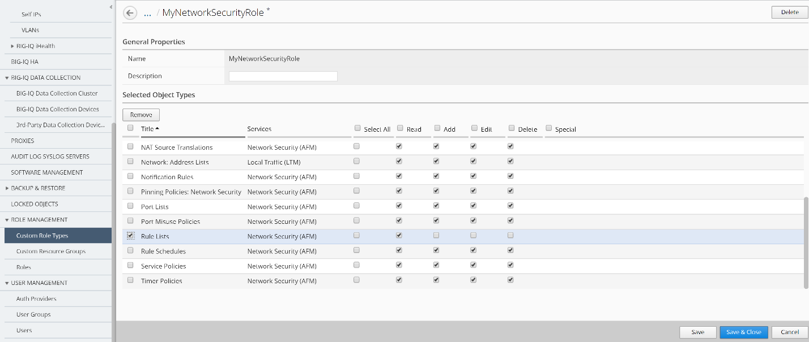

Lab 2.1: Create a custom role type to give permissions to BIG-IP object types
-----------------------------------------------------------------------------
.. include:: /accesslab.rst

Tasks
^^^^^
Creating a custom role type is the first step to providing custom role-based access to users.

|image2|

Steps for Module 1:
^^^^^^^^^^^^^^^^^^^

1. At the top of the screen, click System.

2. On the left, click ROLE MANAGEMENT > Role Types.

3. Near the top of the screen, click the Add button.

4. In the Name field, type a name to identify this new role type.

   | Name: **MyNetworkSecurityRole**
   | Select Service: **Network Security (AFM)**

5. Scroll through the Object Type list and select the check box next to
   each Object Type you want to provide access to. For this lab, we will
   check the box to the left of the Object Type header to select ALL
   object types.

6. Click on Add Selected to add the selected services to the Selected
   Object Types area at the above.

7. Select the check box next to Select All beneath the permissions you
   want to grant for this role type.

|image3|

1. Before saving the custom role type, we are going to customize the
   Permissions for this new custom role type.

   **Uncheck** the checkbox next to Add, Edit and Delete on the
   following rows:

   Address Lists

   Rule Lists

|image4|

|image5|

   Now you have a custom role type that has some custom privileges for
   some of the Network Security objects such as Rule Lists and Address
   Lists.

2. Click the Save & Close button at the bottom of the screen.

    Next, you need to create a resource group and associate it with this
    newly created custom role type.

.. |image2| image:: media/image2.png
   :width: 6.25000in
   :height: 0.70833in
.. |image3| image:: media/image3.png
   :width: 6.48750in
   :height: 3.00000in
.. |image4| image:: media/image4.png
   :width: 6.49583in
   :height: 2.77083in

