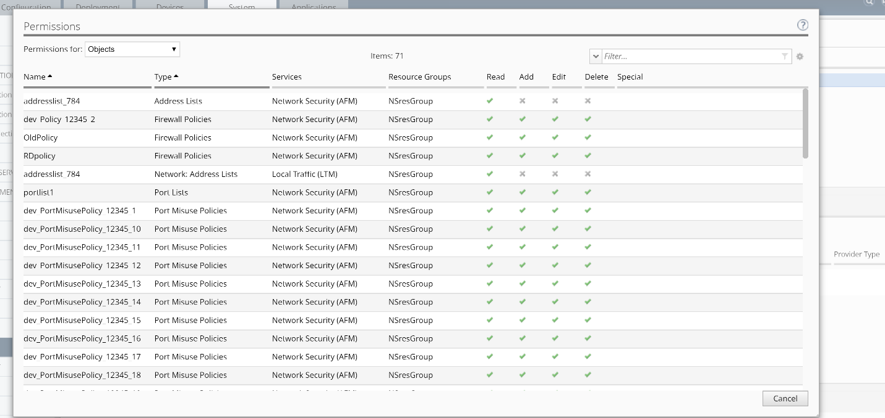

Lab 2.3: Add new custom role
----------------------------

.. note:: Estimated time to complete: **5 minutes**

.. include:: /accesslab.rst

Tasks
^^^^^
In addition to the built-in roles that ship with BIG-IQ, you can create a custom role with specific privileges to particular areas of BIG-IQ and BIG-IP devices.

|image8|

1. On the left, click ROLE MANAGEMENT > Roles.

2. Under CUSTOM ROLES > **Service Roles**, click the Add button.

3. In the Name field, type a name to identify this new role. From
   the Role Type list, select the kind of role you want to add.

    Role Name: **NSManager**

    Description: **Network Security Manager**

    Role Type: **MyNetworkSecurityRole**

You might have to resize the bottom half of the screen to see all of the
following options.

1. For the Role Mode setting,

   -  **Relaxed Mode** – If you select this option, the role can view
      and manage all objects you've given explicit permission to, and it
      can see (but won't be able to manage) related objects for
      associated services.

   -  Strict Mode – If you select this option, this role can view and
      manage only the specific objects you’ve given explicit permission
      to.

Leave this in Relaxed Mode so you don't unintentionally limit an
associated user's ability to see related objects.

1. Select the Resource Groups from the Available area and add them to
   the right Selected area.

   Resource Groups: **NsresGroup**

|image9|

2. To view the type of user access granted for the custom resource group
   associated with this role, click the View Permissions button.

|image10|

    Pay attention to the Type, Services and Resource Groups columns and
    note the previously customized permissions for Address Lists and
    Rule Lists.

1. Cancel the screen and click the Save & Close button at the bottom of
   the screen.

    Next, you will be able to add a user to this custom role to give the
    user specific permissions to a resource group.

.. |image8| image:: media/image8.png
   :width: 6.25000in
   :height: 0.72083in
.. |image9| image:: media/image9.png
   :width: 6.48750in
   :height: 2.99167in
