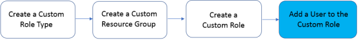

Lab 2.4: Add a user to a custom role
------------------------------------

Add a user to a custom role to give them specific permissions to a resource group.

|image11|

1. On the left navigation area, click USER MANAGEMENT > Users.

2. Click the Add button.

3. From the Auth Provider list, select the authentication method you want to use for this user. For this lab, we will leave the default selection **local (Local)** unchanged.

Important: A user must belong to a group or have an assigned role, or authentication will fail.

1. In the User Name field, type the user name for this new user. In the Full Name field, type a name to identify this user.

   | Name: **nsadmin**
   | Full Name: **Network Security Manager**

2. In the Password and Confirm Password fields, type the password for this new locally-authenticated user.

    Password: **nsadmin**
    Confirm Password: **nsadmin**

1. Scroll down the screen and select NSManager from the Available box of the Roles list and move it to the right in Selected box.

    Roles: **NSManager**

1. You aren't required to associate a user group at this point; you can do that later if you want.

.. note::
	 User’s access to certain parts of the BIG-IQ user interface depends on which role they are assigned.

|image12|

1. Click the Save & Close button.

These users now have the privileges associated with the role(s) you selected.

Next, we will test the access privileges for the new user with the custom role.

.. |image12| image:: media/image12.png
   :width: 6.49167in
   :height: 3.22917in
