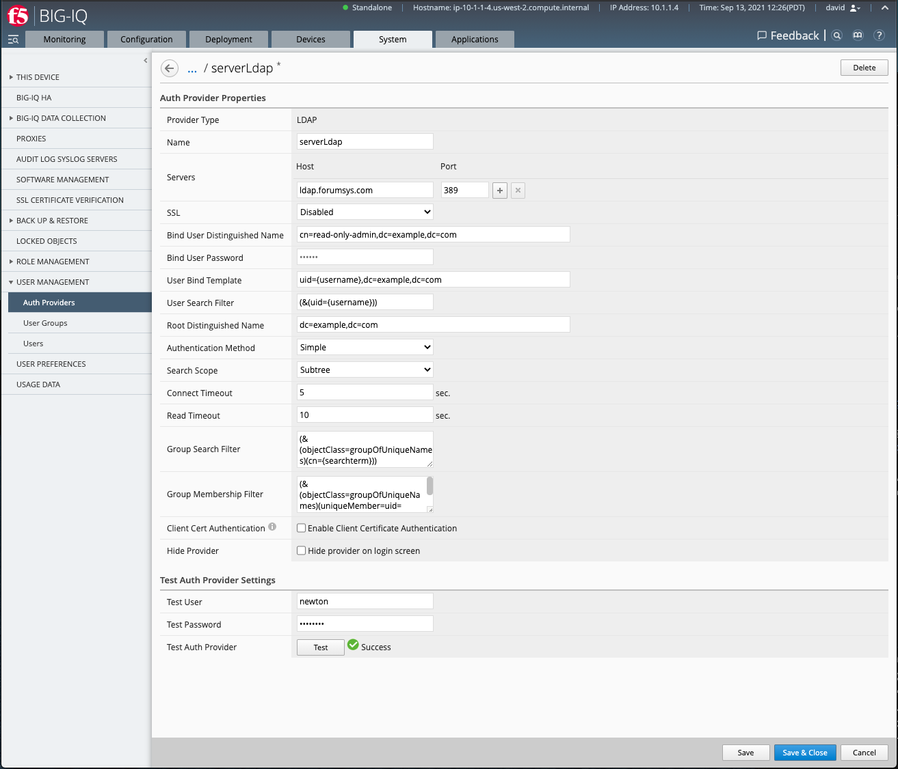
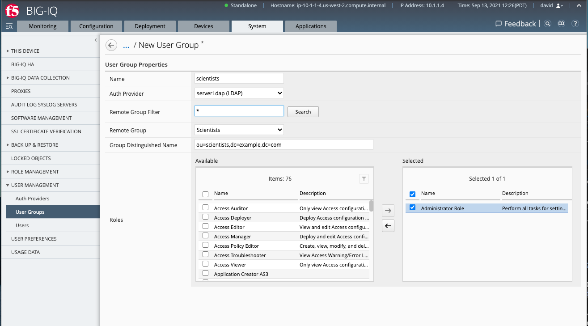
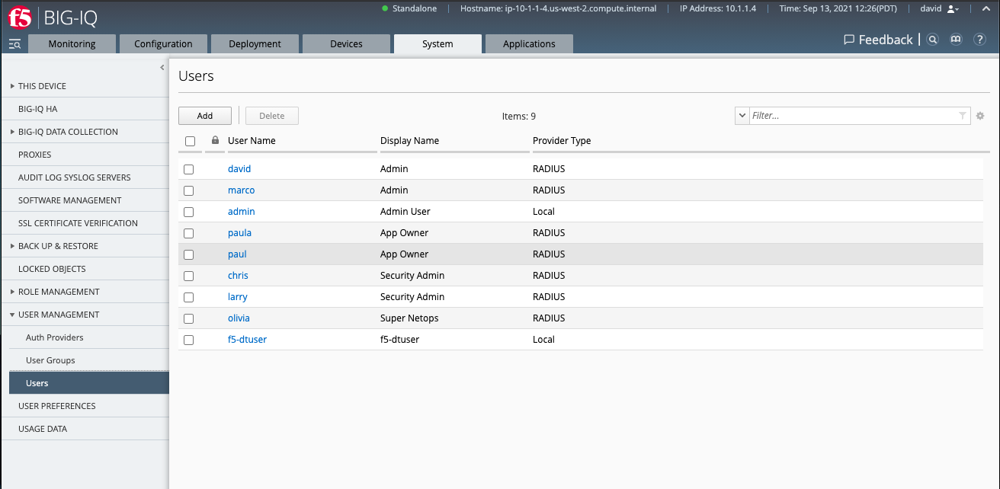
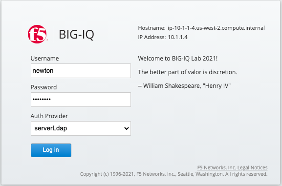
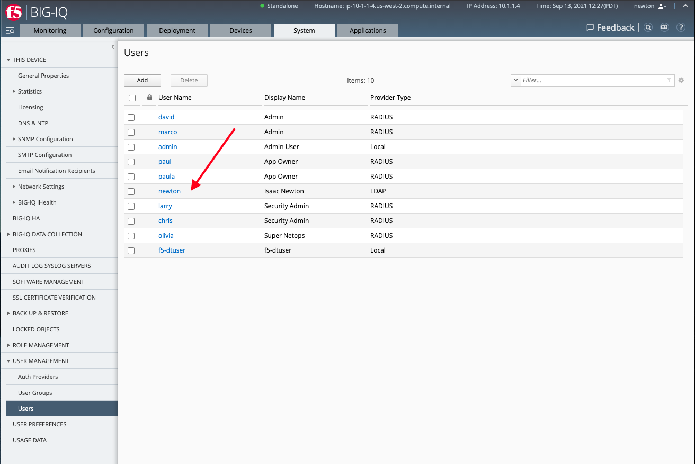

Lab 2.6: Configure LDAP with BIG-IQ using user groups
-----------------------------------------------------

.. note:: Estimated time to complete: **10 minutes**

In this lab, we are going to configure LDAP on the BIG-IQ and create a user group, assign it to an existing role, then login with a user part of this group on the LDAP server.

.. include:: /accesslab.rst

Tasks
^^^^^

1. Login to BIG-IQ as **david** .

2. Navigate to System > User Management > Auth provider. Click on **Add** to Create a new Authentication Provider:

Fill out the necessary fields following below table.

+--------+------------------------------------------------------------------------------------------------------------------------------+
| LDAP   | - name: ``serverLdap``                                                                                                       |
|        | - ip:port: ``ldap.forumsys.com:389``                                                                                         |
|        | - SSL: ``Disabled``                                                                                                          |
|        | - Bind User Distinguished Name: ``cn=read-only-admin,dc=example,dc=com``                                                     |
|        | - Bind User Password: ``password``                                                                                           |
|        | - User Bind Template: ``uid={username},dc=example,dc=com``                                                                   |
|        | - Root Distinguished Name: ``dc=example,dc=com``                                                                             |
|        | - Group Search Filter: ``(&(objectClass=groupOfUniqueNames)(cn={searchterm}))``                                              |
|        | - Group Membership Filter: ``(&(objectClass=groupOfUniqueNames)(uniqueMember=uid={username},dc=example,dc=com))``            |
|        | - Users: https://www.forumsys.com/tutorials/integration-how-to/ldap/online-ldap-test-server                                  |
+--------+------------------------------------------------------------------------------------------------------------------------------+

At the bottom of the page, test the LDAP configuration with this user:

- Test User: ``newton``
- Test Password: ``password``

Click on **Test**. The result should show success.

Save the configuration. When seeing the *SSL Warning* message, click on **Continue**. 

3. Navigate to System > User Management > User Groups, click **Add**.

Select the previously created auth provider, enter ``*`` in the remove group filter and click on **Search**. 

Select the group called ``scientists`` and assign the *Administrator Role* to this user group. Save.

4. Before trying our new LDAP User Group, let's quickly check the current list of users, navigate under System > User Management > Users.

Notice there are no LDAP users.

5. Logout from **david** user, login using the **newton**, selecting **serverLdap** in the Auth Provider list. Password is *password*.

6. You are now successfully authenticated as **newton**, navigate under System > User Management > Users to our newton user was automatically created on the BIG-IQ as belonging to the user group **scientists**.

