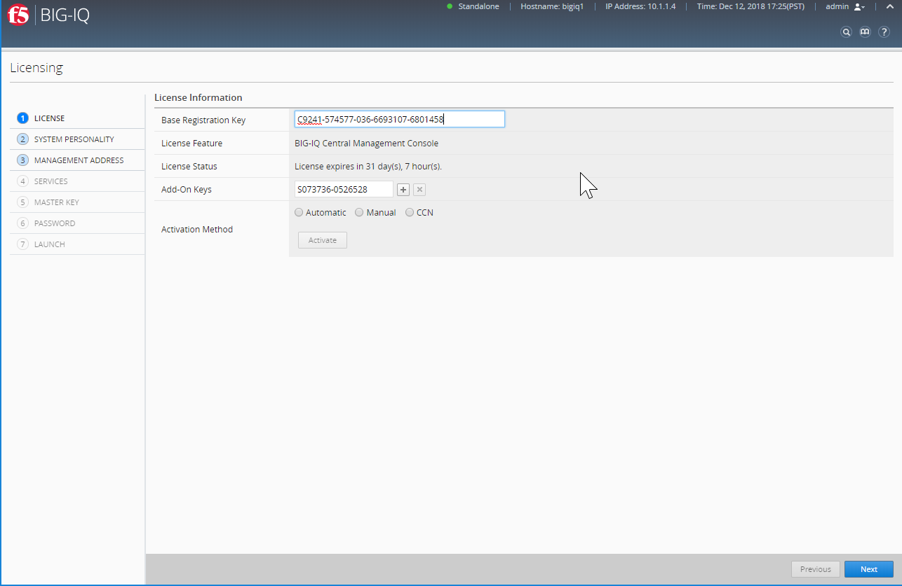
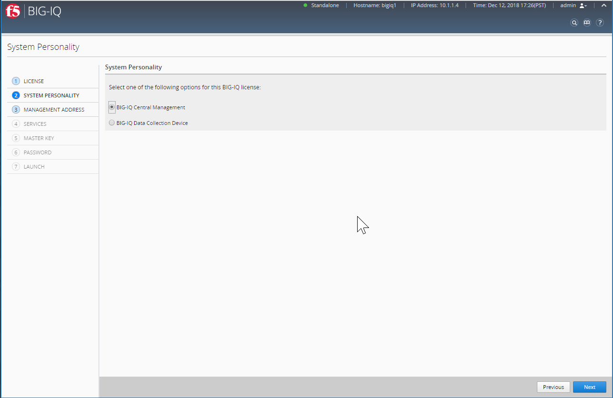
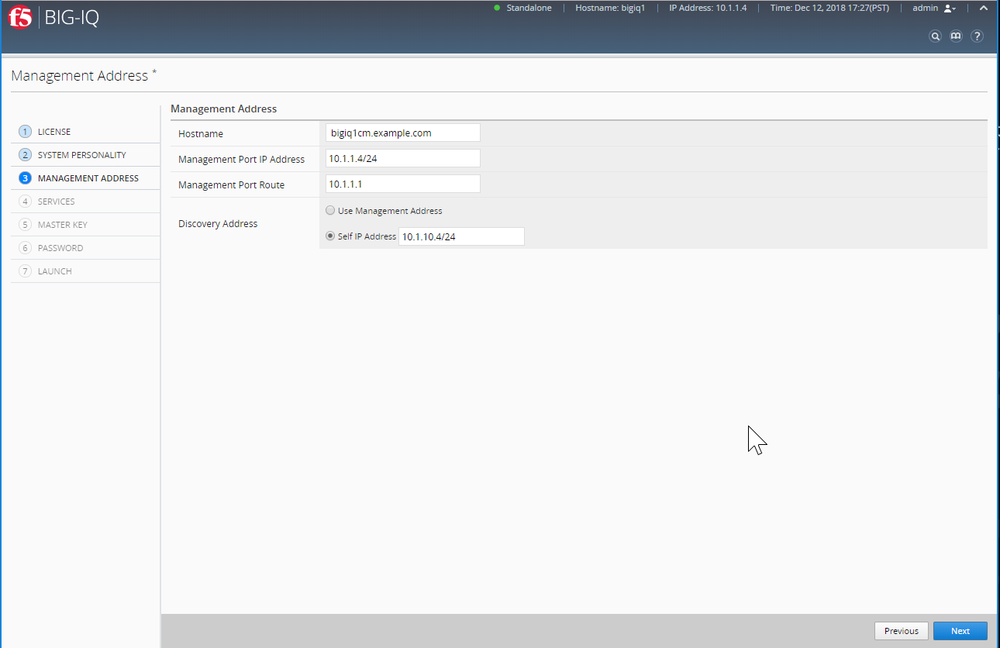
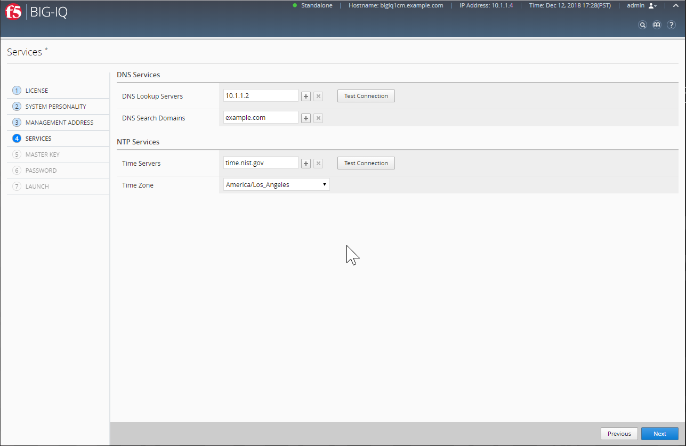
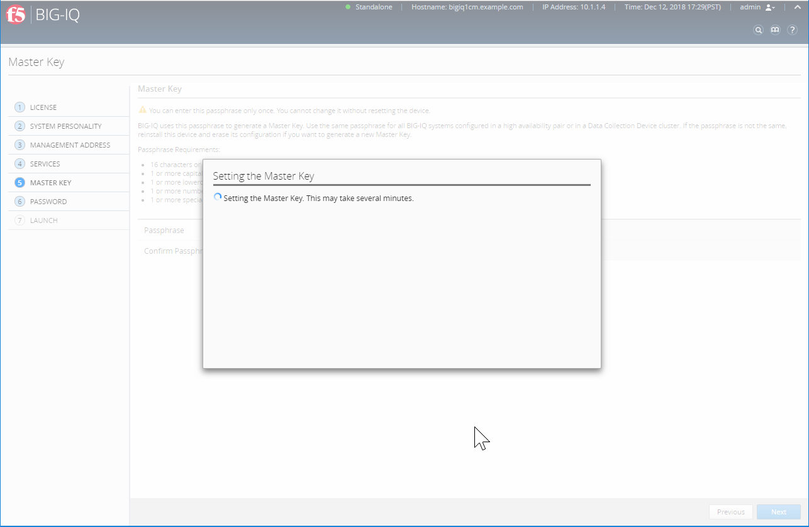
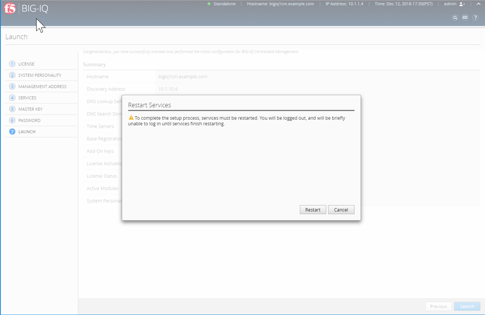

Lab 3.1: BIG-IQ Configuration Management (CM)
---------------------------------------------

.. note:: Estimated time to complete: **15 minutes**

.. include:: /accesslab.rst

Tasks
^^^^^

.. warning:: This lab has steps to reset the BIG-IQ CM and DCD to its factory configuration. Plan accordinly if you need to run other classes/labs (this one should be the last one).

1. Reset both BIG-IQ CM and DCD Execute the bash script

    ::

        cd /home/f5/f5-ansible-bigiq-onboarding
        ./cmd_bigiq_onboard_reset.sh

    The script will do in this order:

    1. Delete existing applications (BIG-IQ and AS3)
    2. Execute the ``clear-rest-storage -d`` command on both BIG-IQ CM and DCD

2. Login to BIG-IQ UI with the default passwords (admin/admin) and go through the setup wizard:

Use ``bigiq1cm.example.com`` for hostname, ``10.1.10.4/24`` for self-ip, ``time.nist.gov`` for NTP server and ``Thisisthemasterkey#1234`` for master key.

|

|

|

|

.. image:: ../pictures/module3/img_module3_lab1_5.png
  :align: center
  :scale: 60%

|

|

.. image:: ../pictures/module3/img_module3_lab1_7.png
  :align: center
  :scale: 60%

|

.. image:: ../pictures/module3/img_module3_lab1_8.png
  :align: center
  :scale: 60%

|

|

