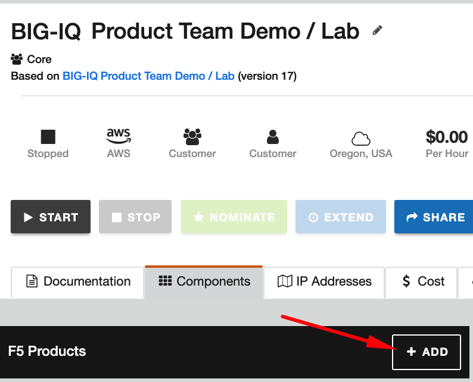
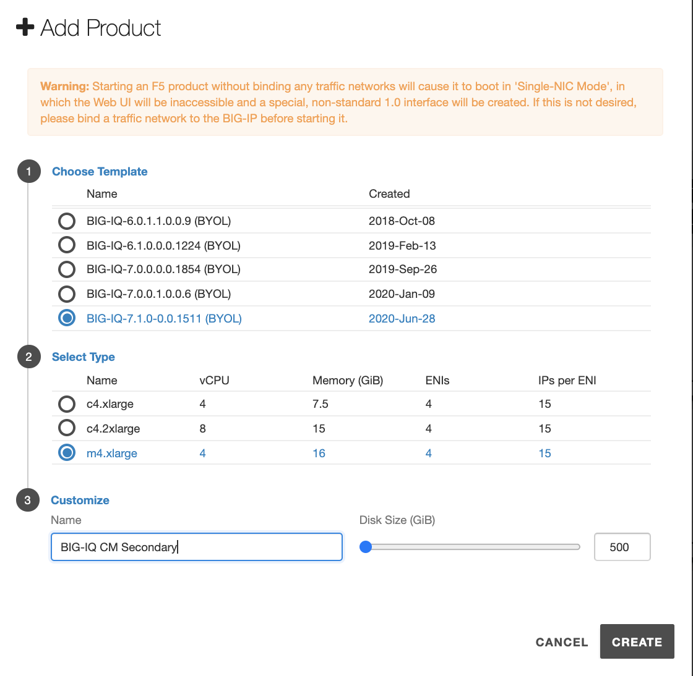
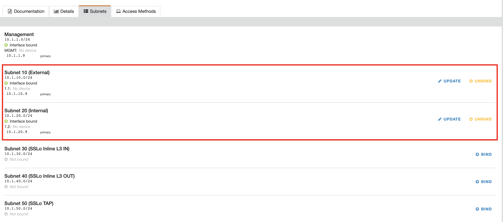
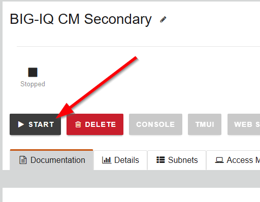
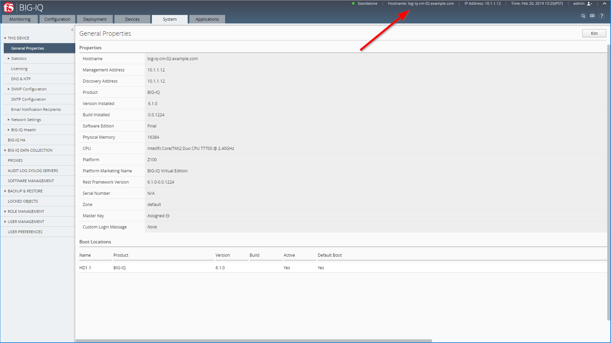
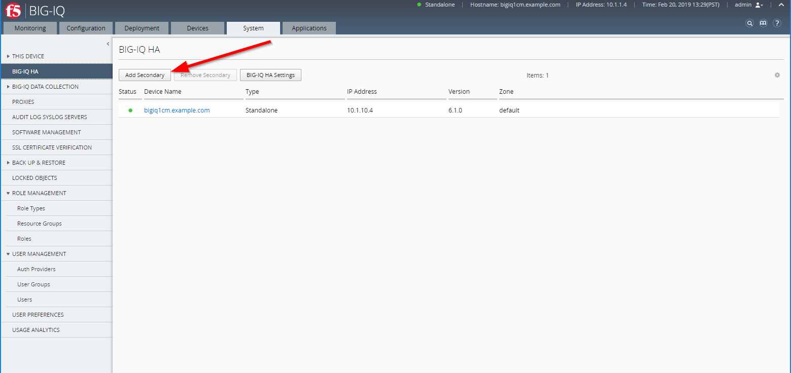
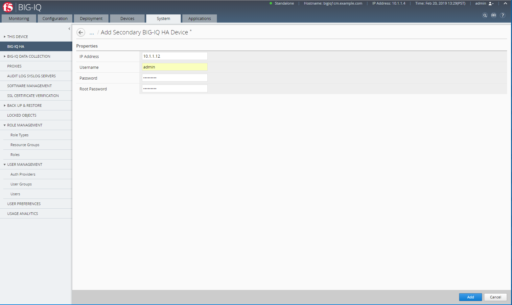
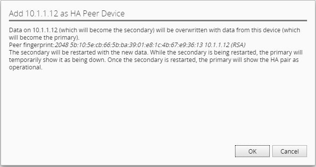

Lab 4.1: Configure High Availability for BIG-IQ: Manual Failover
----------------------------------------------------------------

.. note:: Estimated time to complete: **15 minutes**

.. include:: /accesslab.rst

Tasks
^^^^^
**Add a peer BIG-IQ system for a high availability configuration**

Before you can set up F5 BIG-IQ Centralized Management in a high availability (HA) pair, you must have two licensed BIG-IQ systems.

For the high-availability pair to synchronize properly, each system must be running the same BIG-IQ version, 
and the clocks on each system must be synchronized to within 60 seconds. To make sure the clocks are in sync, 
take a look at the NTP settings on each system before you add a peer.

Configuring BIG-IQ in a high availability (HA) pair means that you can still manage your BIG-IP devices even if one BIG-IQ systems fails.

**Lab:**

1. Let's first add a BIG-IQ CM image in the blueprint.

in lab environment, on the ``F5 Products`` column, click on **ADD**

|

Select **approriate release of BIG-IQ** (*same as the existing active BIG-IQ part of the blueprint*).

Set the following values for CPU/Memory/Disk:

- vCPUs: 4
- Memory: 16 GiB
- Disk Size: 500 GiB

Call it ``BIG-IQ CM Secondary``.

Click on **CREATE**.

|

After few minutes, the VM is created in the lab environment. Click on the new VM, go to the Subnets tab and bind additional interfaces (External and Internal).
Use the same last digit of the management interface for the additional interfaces.

|

Finally, start the new BIG-IQ.

|

Then, start the new BIG-IQ CM VM.

2. Once the VM is started, open a web shell or ssh to the new BIG-IQ CM VM, reset the admin password, enable bash shell and enable root account.

.. code::

    modify auth user admin password admin
    modify auth user admin shell bash
    modify /sys db systemauth.disablerootlogin value false
    save sys config

3. Connect via ``SSH`` or ``Web Shell`` to the system *Ubuntu Lamp Server*. *(if you use the Web Shell, login as f5student first: su - f5student)*.

4. Edit the hosts file and make sure **ONLY** the ``big-iq-cm-2.example.com`` is not commented with a ``#``.

.. warning:: Double check the IP addresses of the new secondary BIG-IQ and update it if necessary. In below example 10.1.1.9 and 10.1.10.9 are used.

.. code::

    cd /home/f5/f5-ansible-bigiq-onboarding 
    vi hosts

.. code::

    [f5_bigiq_cm]
    #big-iq-cm-1.example.com ansible_host=10.1.1.4 discoveryip=10.1.10.4/24 ...
    big-iq-cm-2.example.com ansible_host=10.1.1.9 discoveryip=10.1.10.9/24 ...

To confirm, execute

.. code::

    grep -v "#" hosts 

You should see only ``big-iq-cm-2.example.com`` and the IPs addresses needs to be set correctly.

.. code::

    [f5_bigiq_cm]
    big-iq-cm-2.example.com ansible_host=10.1.1.9 discoveryip=10.1.10.9/24 bigiq_onboard_node_type=cm haprimary=False bigiq_onboard_license_key=A-B-C-D

.. note:: `How to Use the vi Editor`_
.. _How to Use the vi Editor: https://www.cs.colostate.edu/helpdocs/vi.html

5. Once the new VE is full up and running, execute the following script to onboard this new secondary BIG-IQ CM.

    ::

        cd /home/f5/f5-ansible-bigiq-onboarding
        docker build -t f5-ansible-runner .
        ./ansible_helper ansible-playbook /ansible/bigiq_onboard.yml -i /ansible/hosts

6. Verify the new secondary BIG-IQ CM has been correclty configured (check hostname, self IP, VLAN, NTP, DNS, license)

|

.. warning:: If you are doing lab 2, stop here and go back to `Lab 4.2`_

.. _Lab 4.2: ./lab2.html

7. Open active BIG-IQ, go to System > BIG-IQ HA and Click the Add Secondary button.

.. warning:: Make sure you are adding the self-ip and not the management IP: **10.1.10.9**.

*Properties*
 * IP Address =	``10.1.10.9``
 * Username = ``admin``
 * Password = ``purple123``
 * Root Password = ``purple123``

|

8. Type the properties for the BIG-IQ system that you are adding and click the Add button at the bottom of the screen.

- In the IP Address field, type the IP address for the secondary BIG-IQ system.
- In the Username and Password fields, type the administrator's user name and password for the new BIG-IQ system.
- In the Root Password field, type the root password for the new BIG-IQ system.

|

Then, click OK.

|

The BIG-IQ system synchronize. Once they are finished, both appear as ready (green).
