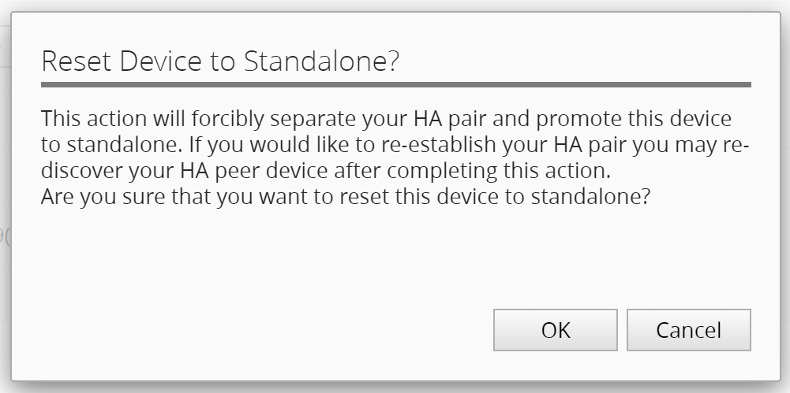
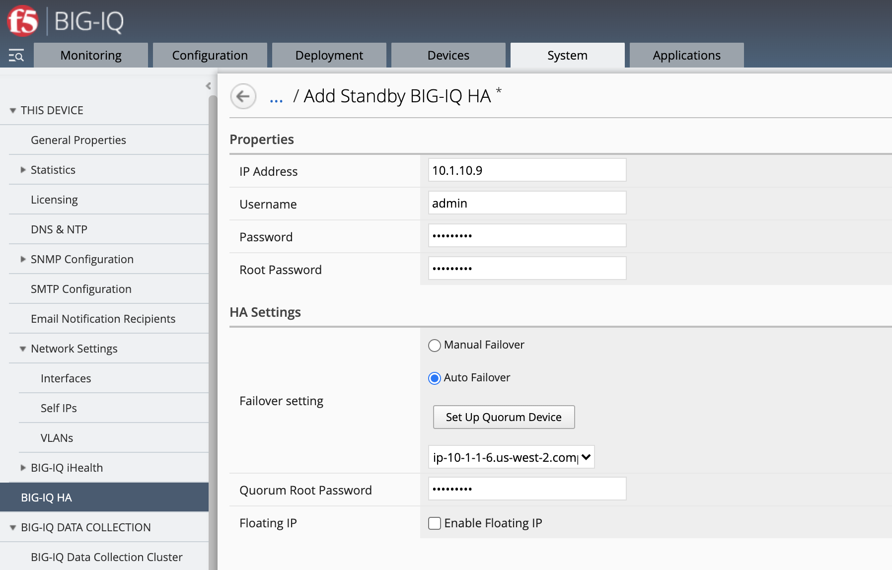
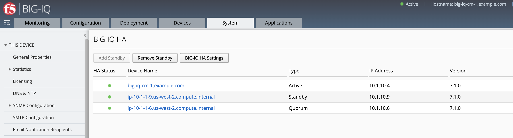
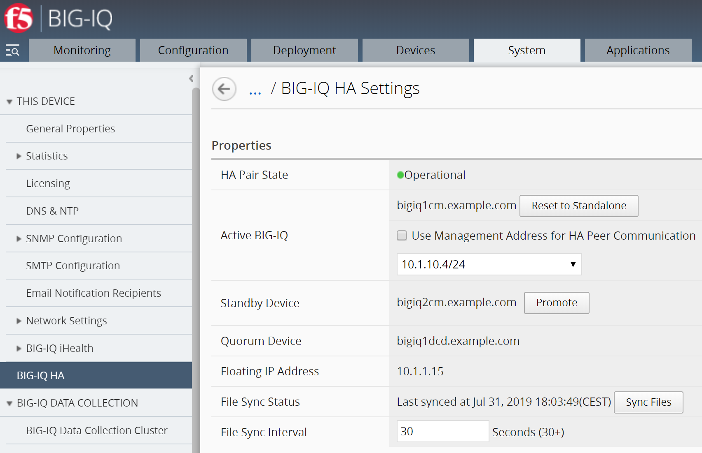

Lab 4.2: Configure High Availability for BIG-IQ: Auto Failover
--------------------------------------------------------------

.. note:: Estimated time to complete: **15 minutes**

**Overview**

With BIG-IQ v7.0 and above, BIG-IQ CM High Availability can be automated for VMware. Election of the primary BIG-IQ Central Manager goes via a quorum-based technology which enforces consistent fail-over. In case of a fail-over, quorum will make that the secondary BIG-IQ central manager will be able to automatically take over, without an administrator doing the election or promotion from standby to master manually.
As said, full-automated fail-over is only available for VMware. For public cloud providers, like: AWS and Azure, currently only the manual fail-over is supported.

Official documentation about BIG-IQ High Availability Auto Failover Configuration can be found on the `BIG-IQ Knowledge Center`_.

.. _`BIG-IQ Knowledge Center`: https://techdocs.f5.com/en-us/bigiq-7-0-0/creating-a-big-iq-high-availability-auto-fail-over-config.html
.. include:: /accesslab.rst

Tasks
^^^^^
1. Login to BIG-IQ 1 as user **david**  and go to **System > BIG-IQ HA > BIG-IQ HA Settings**. 

2. If no HA is setup, go to step 5.

.. note:: If you haven’t setup a **SECOND** BIG-IQ Central Manager, please go to `Lab 4.1`_ and follow the steps from **1 to 6**.

.. _Lab 4.1: ./lab1.html

3. If you have been through the previous lab 4.1 and had setup manual failover, you need to break this HA setup. In BIG-IQ HA Settings click **Reset to Standalone**.

 .. image:: ../pictures/module4/lab-2-1.png
  :align: center
  
BIG-IQ HA Settings does not have a quorum device configured and this a way to recognize that the used failover is the manual failover.

Reset to Standalone? Click **OK**.

This will take some time (~ 3 minutes) and log you out from BIG-IQ.

4. Once the login window returns for BIG-IQ 1 CM, login as user **david** and go to System > BIG-IQ HA.
   Will notice that only one BIG-IQ system is present, and no HA is configured.

5. Click ``Add System`` and fill in the following:

.. warning:: Double check the IP addresses of the new secondary BIG-IQ and update it if necessary. In below example 10.1.1.9 and 10.1.10.9 are used.

*Properties*
 * IP Address =	10.1.10.9
 * Username = admin
 * Password = purple123
 * Root Password = purple123
	
*HA Settings*
 * Failover setting = Auto Failover
 * Select: bigiq1dcd.example.com (pull-down)
 * Quorum Root Password = purple123

.. note:: we are not setting up a floating IP as it requires the 2 CM to be in the same broadcast domain to allow GARP LAN protocol (which is not the case in this lab)

6. Click **Add** and **OK**.

Creating the Automate failover setup with the quorum device takes about 5 minutes.
Once the process is completed the pop-up window will tell you and you can close the window. 

  
At BIG-IQ HA you will find three devices configured:
 - bigiq1cm.example.com
 - bigiq2cm.example.com
 - bigiq1dcd.example.com

The second BIG-IQ central manager acts as the standby device and the only DCD available in the lab acts as the quorum device.
This does not mean it will take CM takes when one fails, but instead it delivers the tiebreak 
when the active CM fails and failover takes place from active to standby, which than will become the active CM.

7. Click **BIG-IQ HA Settings**.

8. Login with **David**  and go **System > BIG-IQ HA > BIG-IQ HA Settings** and promote the Standby Device. The pop-up will ask: *Promote Standby Device to Active?* Click **OK**.

9.Repeat step 7.

Before finishing this lab, there is one task to do. If you are done testing BIG-IQ HA, stop BIG-IQ CM Secondary to avoid additional costs. 
You might want to switch the active BIG-IQ before stopping the secondary… (or stop BIG-IQ primary in lab environment and skip the next steps)

10.	Go to BIG-IQ CM Secondary ``https://10.1.1.9`` and then: **Systems > BIG-IQ HA > BIG-IQ HA Settings**.

11.	Promote the standby device bigiq1cm.example.com, at the pop-up click **OK**.

12.	Stop BIG-IQ CM Secondary in lab environment.

