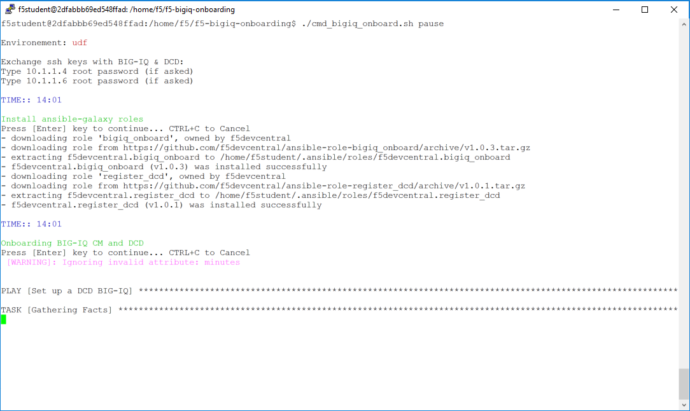

Lab 5.1: Onboard BIG-IQ using Ansible Galaxy
--------------------------------------------

.. warning:: This lab has steps to reset the BIG-IQ CM and DCD to its factory configuration. Plan accordingly if you need to run other classes/labs.

F5 provides Ansible Galaxy roles to onboard BIG-IQ Centralized Management (CM) and BIG-IQ Data Collection Device (DCD).

This automation scenario is composed of 4 parts:

* Erase the current BIG-IQ CM and DCD configuration to default.

* Onboard BIG-IQ CM and DCD

    - `bigiq_onboard`_ **ansible Role**: Performs a basic series of on-boarding steps to bootstrap a BIG-IQ system to the point that it can accept configuration.

    - `register_dcd`_  **ansible Role**: Performs a series of steps needed to register a BIG-IQ provisioned as a Data Collection Device (DCD) to a BIG-IQ provisioned as a Configuration Management (CM) device.

* Add BIG-IPs to the BIG-IQ

    - `bigiq_device_discovery`_  **ansible module**: Leverage BIG-IQ APIs to Discover and Import BIG-IP in BIG-IQ **(BIG-IQ 6.1 and above)**.
    
    - `bulkDiscovery.pl`_  **perl script**: Leverage BIG-IQ APIs to Discover and Import BIG-IP in BIG-IQ **(BIG-IQ 5.4, 6.0.x)**.

* Create Application Services

    - `Ansible using AS3`_ **playbook**: Use BIG-IQ Ansible and AS3 to deploy application services (see class 1, module 5, lab 7) **(BIG-IQ 6.1 and above)**.

    - `Ansible using Service Catalog`_ **playbook**: Use BIG-IQ Ansible Modules to deploy application services (see class 1, module 3, lab 1) **(BIG-IQ 6.0.x)**.

.. _bigiq_onboard: https://galaxy.ansible.com/f5devcentral/bigiq_onboard
.. _register_dcd: https://galaxy.ansible.com/f5devcentral/register_dcd
.. _bulkDiscovery.pl: https://downloads.f5.com/esd/eula.sv?sw=BIG-IQ&pro=big-iq_CM&ver=6.0.1&container=v6.0.1.1&path=&file=&B1=I+Accept
.. _bigiq_device_discovery: https://clouddocs.f5.com/products/orchestration/ansible/devel/modules/bigiq_device_discovery_module.html
.. _Ansible using Service Catalog: ../../class01/module3/module3.html
.. _Ansible using AS3: ../../class01/module5/module5.html

**Lab:**

1. Connect via ``SSH`` to the system *Ubuntu Lamp Server*.

2. Request 2 BIG-IQ Evaluation licenses and set them in the inventory files in ``bigiq_onboard_license_key`` variable.

    ::

        # cd /home/f5/f5-ansible-bigiq-onboarding 
        # vi inventory/group_vars/udf-bigiq-dcd-01.yml
        # vi inventory/group_vars/udf-bigiq-cm-01.yml

3. Reset both BIG-IQ CM and DCD.

    ::

        # cd /home/f5/f5-ansible-bigiq-onboarding
        # ./cmd_bigiq_onboard_reset.sh nopause

    The script will do in this order:
    
    1. Delete existing applications (BIG-IQ and AS3)
    2. Execute the ``clear-rest-storage -d`` command on both BIG-IQ CM and DCD
    3. Reboot

4. Wait both BIG-IQ CM and DCD come back up.

5. Execute the script

    ::

        # cd /home/f5/f5-ansible-bigiq-onboarding
        # ./cmd_bigiq_onboard.sh nopause

| 

|

The script will perform in this order:

    1. Exchange the ssh keys between the ubuntu and the BIG-IQ CM and DCD (check Credentials under Documentation tab in UDF).
    2. Install ansible-galaxy roles
    3. Onboarding BIG-IQ CM and DCD:

        - Using bigiq_onboard role: setup hostname, role, dns, ntp, self-ip, master key, passwords (DCD first, then CM)
        - Using register_dcd role: add DCD to CM, activate necessary services (asm, afm, ...)
        
    4. Add & discover BIG-IPs to BIG-IQ CM using the bulkDiscovery.pl or Ansible module bigiq_device_discovery.
    5. Create Applications using Ansible playbook (AS3 or none AS3).

Ignore the following errors:

    ``TASK [f5devcentral.bigiq_onboard : Test authentication - old credentials] ***********************************************************
    fatal: [udf-bigiq-dcd-01]: FAILED! => {"cache_control": "no-store, no-cache, must-revalidate", "changed": false, "connection": "close", "content": "{\"code\":401,\"message\":\"Authentication failed.\",\"originalRequestBody\":\"{\\\"username\\\":\\\"admin\\\",\\\"generation\\\":0,\\\"lastUpdateMicros\\\":0}\",\"restOperationId\":1067315,\"errorStack\":[],\"kind\":\":resterrorresponse\"}", "content_length": "206", "content_type": "application/json; charset=UTF-8", "date": "Mon, 15 Oct 2018 21:15:41 GMT", "expires": "-1", "json": {"code": 401, "errorStack": [], "kind": ":resterrorresponse", "message": "Authentication failed.", "originalRequestBody": "{\"username\":\"admin\",\"generation\":0,\"lastUpdateMicros\":0}", "restOperationId": 1067315}, "msg": "Status code was 401 and not [200]: HTTP Error 401: Unauthorized", "pragma": "no-cache", "redirected": false, "server": "webd", "status": 401, "url": "https://10.1.1.6:443/mgmt/shared/authn/login"}
    ...ignoring``

5. At the end of the lab, the BIG-IQ CM and DCD should be configured with BIG-IP being managed and few application services deployed.

.. image:: ../pictures/module5/img_module5_lab1_2.png
  :align: center
  :scale: 50%

|