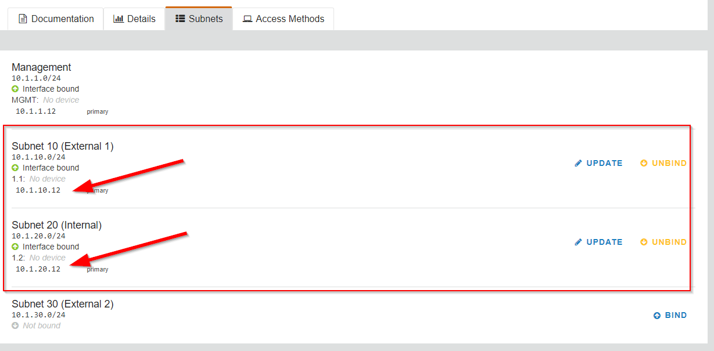
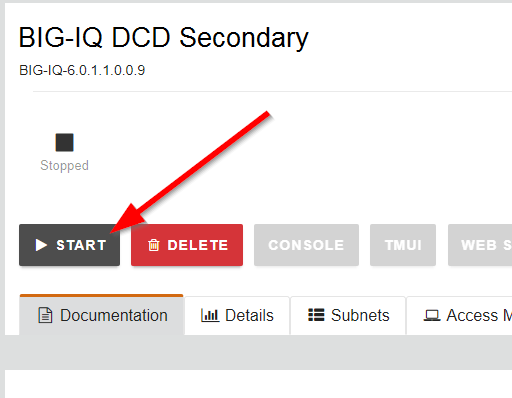
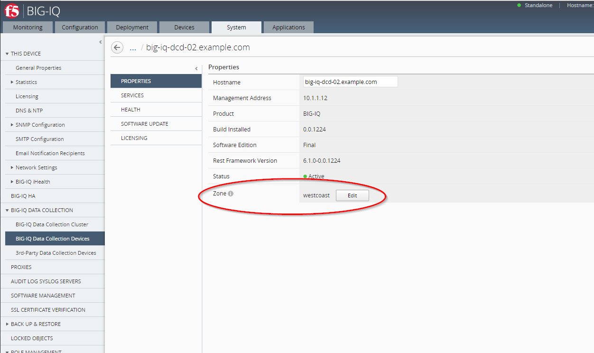
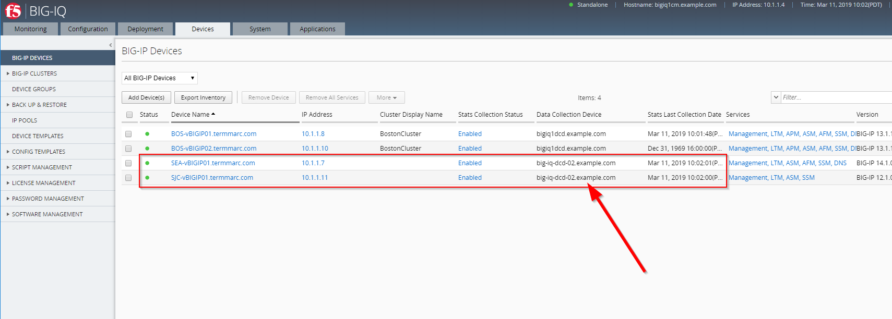

Module 6: BIG-IQ Zone Management
================================

Since BIG-IQ 6.1, you can have **zones** for the Data Collection Devices, DCDs.
The zoning allows you to put BIG-IP devices and DCDs in close proximity to each other while the BIG-IQ management console is in another location.
The biggest reason for doing this is to avoid any issues relating to latency between the BIG-IP and DCDs.

All DCD’s CM’s form a single ES cluster, the Zone part is for BIG-IP’s to try to connect to a local DCD.
Replication within the ES cluster does not follow Zones.

.. note:: There can still be latency issues when using BIG-IQ management console to view statistical data as the queries
          for that data are done in real-time, which means they must traverse the network for both the query and the results.

Configure a new DCD and setup 2 different zones
^^^^^^^^^^^^^^^^^^^^^^^^^^^^^^^^^^^^^^^^^^^^^^^

Using the lab environment, the goal is to configure the BIG-IQ management console and DCD1 in the ``default`` zone.
The DCD2 at the other location will be in zone ``westcoast``. The BIG-IPs will be assign to the approriate zone depending on their location.

.. image:: ../pictures/module6/img_module6_lab1_diagram.png
  :align: center
  :scale: 50%

|

1. Let's first add a BIG-IQ DCD image in the blueprint.

- in lab environment:

In the ``F5 Products`` column, click on **ADD**

.. image:: ../pictures/module6/img_module6_lab1_1a.png
  :align: center
  :scale: 60%

|

Select approriate release of BIG-IQ (same as the existing active BIG-IQ part of the blueprint) and set the following values for CPU/Memory/Disk:

    - vCPUs: 4
    - Memory: 16 GiB
    - Disk Size: 500 GiB

Click on **CREATE**.

.. image:: ../pictures/module6/img_module6_lab1_1b.png
  :align: center
  :scale: 60%

|

After few minutes, the VM is created in lab environment. Click on the new VM, go to the Subnets tab and bind additional interfaces (External and Internal).

|

Finally, start the new BIG-IQ.

|

Then, start the new BIG-IQ DCD VM.

2. Connect via ``SSH`` to the system *Ubuntu Lamp Server*.

3. Edit the hosts file and make sure only the ``big-iq-dcd-2.example.com`` is not commented with a ``#``.

    .. code-block:: yaml
    :linenos:
    :emphasize-lines: 10

        # cd /home/f5/f5-ansible-bigiq-onboarding 
        # vi hosts
    
        [f5_bigiq_cm]
        #big-iq-cm-1.example.com ansible_host=10.1.1.4 ...
        #big-iq-cm-2.example.com ansible_host=10.1.1.15 ...

        [f5_bigiq_dcd]
        #big-iq-dcd-1.example.com ansible_host=10.1.1.6 ...
        big-iq-dcd-2.example.com ansible_host=10.1.1.15 ...

.. warning:: Double check the IP address of the new secondary BIG-IQ and update it if necessary

4. Once the new VE is full up and running, execute the following script to onboard this new secondary BIG-IQ CM.

    ::

        # cd /home/f5/f5-ansible-bigiq-onboarding
        # sudo docker build -t f5-big-iq-onboarding .
        # ./ansible_helper ansible-playbook /ansible/bigiq_onboard.yml -i /ansible/hosts

5. Verify the new secondary BIG-IQ DCD has been correctly added to the BIG-IQ Data Colletion Devices list.

.. image:: ../pictures/module6/img_module6_lab1_3.png
  :align: center
  :scale: 60%

|

6. Currently, there is only 1 zone defined called ``default``. We will create a new zone called ``westcoast``, keeping the ``default`` zone for the East coast.

.. note:: In order to avoid error messages complaining about the lack of a default zone, you must have one DCD at minimum have the default zone.

7. Let's define the new zone ``westcoast`` on the new BIG-IQ DCD 02 added earlier. Login on the BIG-IQ CM server, go to the **System** tab, 
   under **BIG-IQ DATA COLLECTION** > **BIG-IQ Data Collection Devices**, select the new BIG-IQ DCD 02. In **Properties**, and click **Edit**, select the Zone box, click **Create New**.

   Enter the name ``westcoast`` as the name of the new Zone.

.. image:: ../pictures/module6/img_module6_lab1_4.png
  :align: center
  :scale: 60%

|

It might takes few minutes for the new zone to be set.

|

8. Change the Zone of the ``SEA-vBIGIP01.termmarc.com`` and ``SJC-vBIGIP01.termmarc.com`` BIG-IP to ``westcoast``.

Select the BIG-IP device from the **Devices** menu, and select **STATISTICS COLLECTION**. 

Once selected, select ``westcoast`` from the Zone drop down menu.

It might takes few minutes for the new zone to be set.

.. image:: ../pictures/module6/img_module6_lab1_6.png
  :align: center
  :scale: 60%

|

9. Check on the Device tab the statistic collection is happening as expected.

|

