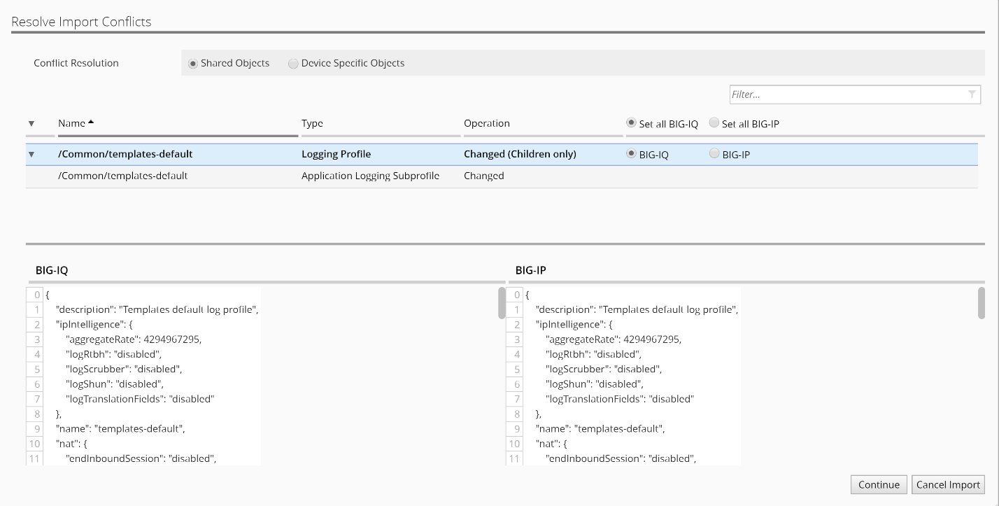

Lab 1.2: Import Services on the new device
-------------------------------------------

.. include:: /accesslab.rst

Tasks
~~~~~

On the Device Inventory screen, click the link in the Services column for BOS-vBIGIP01. (you may need to scroll right to see the services column)

In the Local Traffic (LTM) Section, select the check box for “Create a snapshot of the current configuration before importing” and click the Import button.

|image4|

In the Application Security (ASM) Section, select the check box for “Create a snapshot of the current configuration before importing” and click the Import button.

|image5|

There may be a window that pops up and ask you to Resolve Import
Conflicts, click Accept to resolve.

A conflict is when an object that is already in the BIG-IQ working
config has the same name, but different contents as an object that
exists on the BIG-IP that is being imported. The user must select
whether to keep the object from BIGIP or BIGIQ configuration. Storage
will be updated accordingly. Review the differences that have been
discovered as part of this import by clicking on each row in the
difference view.

Leave all default to “BIG-IQ” to keep the version of the objects that
are already in BIG-IQ.

|image6|

Click the continue button.

A window reminds us that the BIG-IP will be modified to use the BIG-IQ
objects during the next deployment. Click the Resolve button to
continue.

|image7|

In the Advanced Firewall (AFM) Section, select the check box for “Create a snapshot of the current configuration before importing” and click the Import button.

|image8|

Again, you will experience the conflict resolution screens. Choose to
keep the objects that are already on the BIG-IQ.

In the BIG-IP (DNS) Section, click the Import button.

|image9|

Click the back arrow button at the top of the section to return to the inventory.

|image10|

Once you have completed all of the import tasks for BOS-vBIGIP02, click the arrow in the upper left of the Services panel to return to the device inventory screen.

|image11|

.. |image4| image:: media/image4.png
   :width: 1.60397in
   :height: 0.21872in
.. |image5| image:: media/image5.png
   :width: 6.50000in
   :height: 1.04444in
.. |image6| image:: media/image6.png
   :width: 6.50000in
   :height: 0.73333in

.. |image8| image:: media/image8.png
   :width: 5.17917in
   :height: 2.06667in
.. |image9| image:: media/image9.png
   :width: 6.50000in
   :height: 0.71667in
.. |image10| image:: media/image10.png
   :width: 6.50000in
   :height: 0.55903in
.. |image11| image:: media/image11.png
   :width: 2.26013in
   :height: 0.93738in
.. |image12| image:: media/image12.png
   :width: 2.26013in
   :height: 0.93738in
