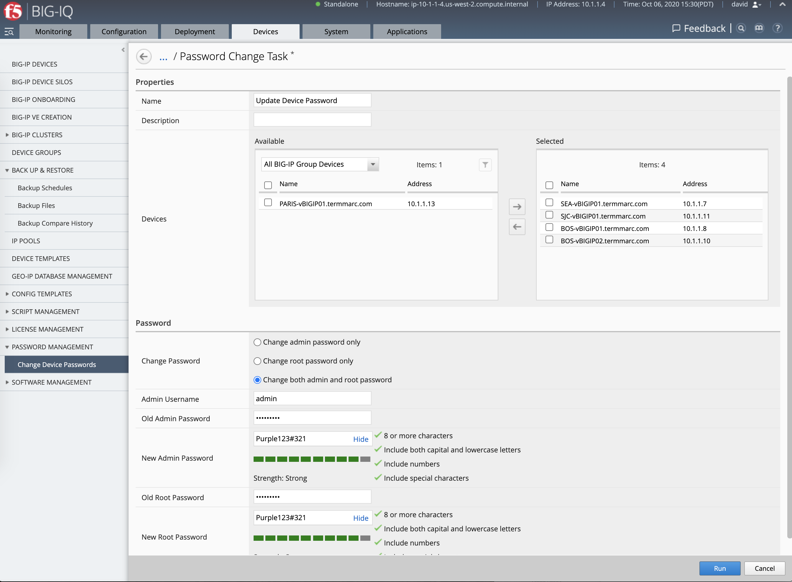

Lab 1.5: Manage the local root and admin passwords on the managed devices
-------------------------------------------------------------------------

.. note:: Estimated time to complete: **5 minutes**

.. include:: /accesslab.rst

Tasks
^^^^^

1. Login as **david** in BIG-IQ and navigate to **Devices > Password Management > Change Device Passwords**.

Change both admin and root password to:

- Old Admin Password: ``purple123``
- New Admin Password: ``Purple123#321``
- Old Root Password: ``purple123``
- New Root Password: ``Purple123#321``

