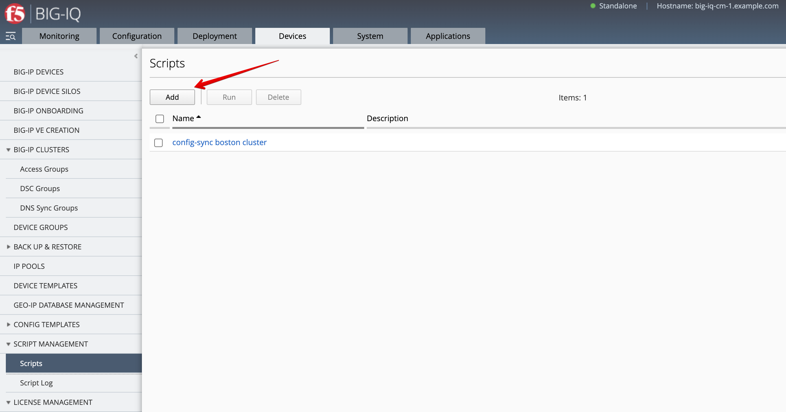
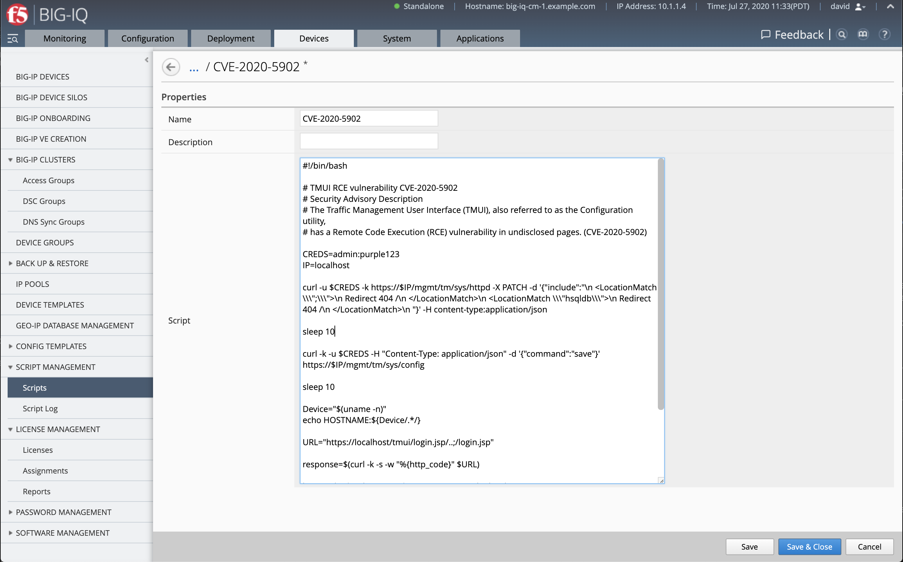
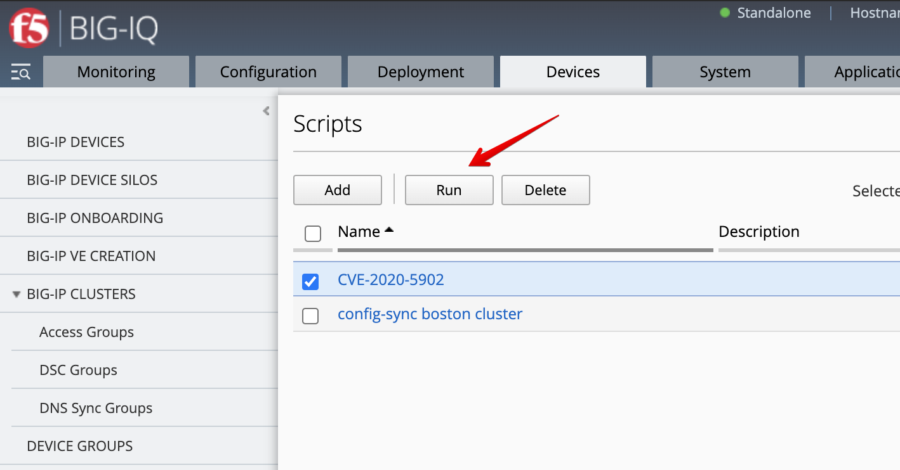
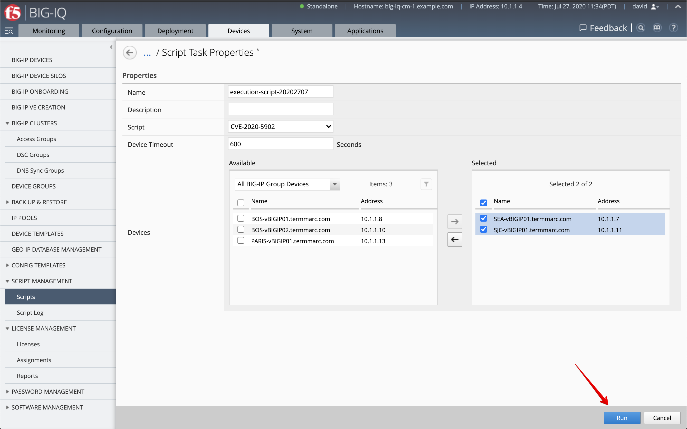
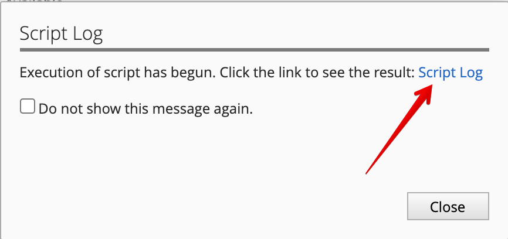
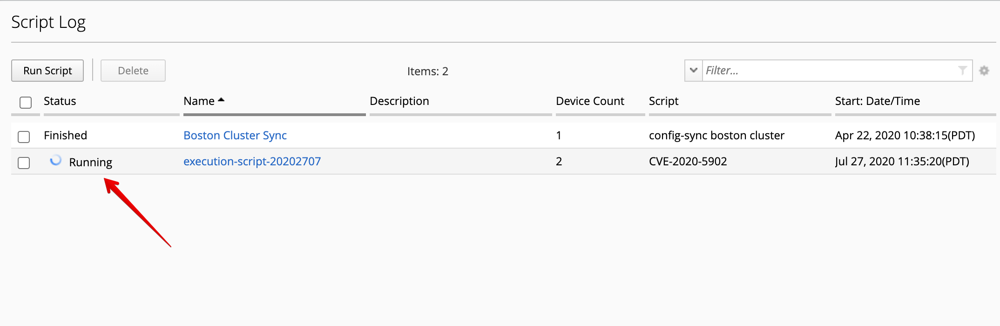
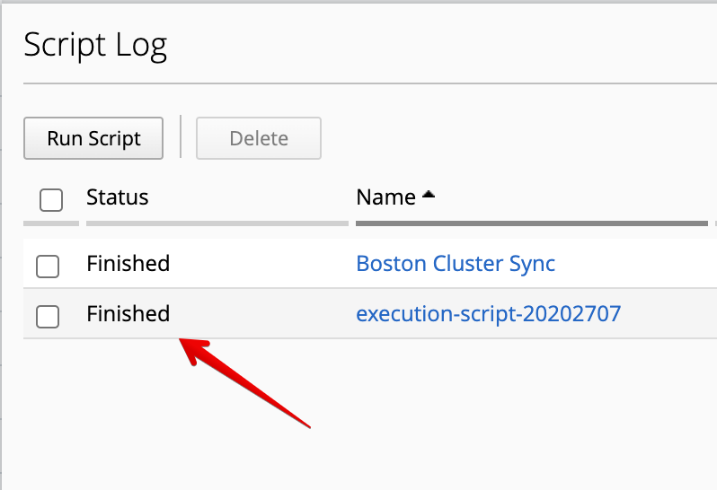
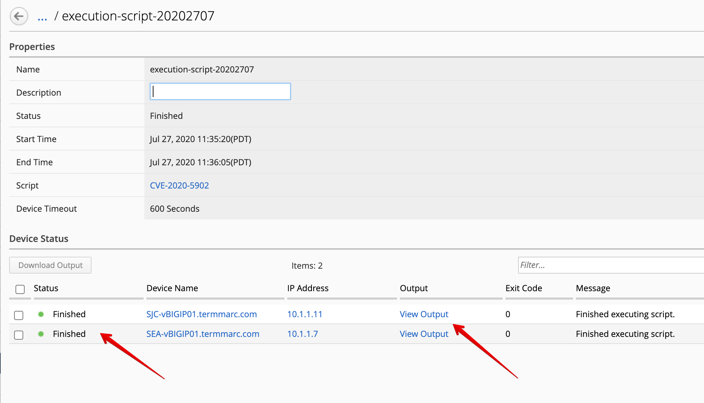
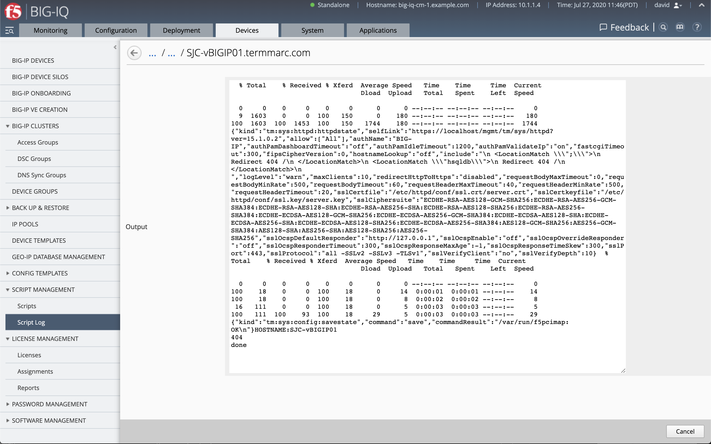

Lab 1.6: Run Bash Scripts on Devices that BIG-IQ Manages
--------------------------------------------------------
This lab will show you how to create and deploy/run scripts on a managed device from BIG-IQ.

This feature can be used for various purposes, including deploying or modifying BIG-IP configuration that is not natively manageable by the BIG-IQ
or running a standard device startup/provisioning script prior to import into BIG-IQ. Scripts can be bash or TMSH commands.

Official documentation about BIG-IQ Script Management can be found on the `F5 Knowledge Center`_.

.. _F5 Knowledge Center: https://techdocs.f5.com/en-us/bigiq-7-1-0/managing-big-ip-devices-from-big-iq/script-management.html

.. raw:: html

    <iframe width="560" height="315" src="https://www.youtube.com/embed/PmaOq1bK4YU" frameborder="0" allow="accelerometer; autoplay; encrypted-media; gyroscope; picture-in-picture" allowfullscreen></iframe>

|

.. include:: /accesslab.rst

Tasks
~~~~~

1. Login to BIG-IQ as **david**.

2. Navigate to the DEVICE tab, Script Management, Scripts. Click on Add.

3. Type a name (e.g. ``CVE-2020-5902``), copy the |location_link| and replace the credentials with ``CREDS=admin:purple123`` instead of ``CREDS=<username><password>``.

.. |location_link| raw:: html

   <a href="https://raw.githubusercontent.com/usrlocalbins/Big-IQ-scripts/master/CVE-Bash%20Script" target="_blank">TMUI RCE vulnerability CVE-2020-5902 bash script</a>

**Save & Close**.

4. After the script is saved, select it and click on **Run**.

5. The script task properties opens, type a name (e.g. ``execution-script-20202707``), and select the SEA-vBIGIP01.termmarc.com and SJC-vBIGIP01.termmarc.com BIG-IPs.

6. Click on **Run**. The following window opens. Click on *Script Logs*.

7. The link takes you to the script logs window where you can see the task running...

8. When the task if completed, the status will show *Finished*.

9. You can see the details of the task by clicking on it.

10. View Output will also show you the output of the script for each devices.

