Module 10: Distribute User-provided GeoIP DB update package to BIG-IPs (new 7.1)
================================================================================

**[New 7.1.0]**

1. Follow the steps to download the geolocation database described in the following article `K22650515`_.

.. _K22650515: https://support.f5.com/csp/article/K22650515

2. You should have now 2 ip-geolocation files, 1 zip and 1 MD5.

3. Login to BIG-IQ as **david** by opening a browser and go to: ``https://10.1.1.4``

4. Go to Devices > Geo-IP Database Management > Database Files.

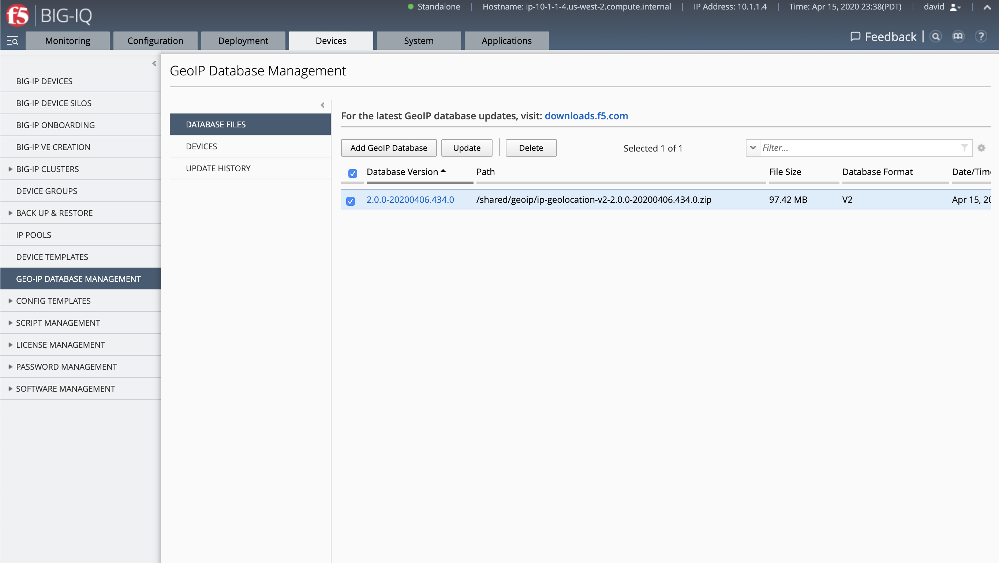

5. Delete any existing Geo Database file(s) if any.

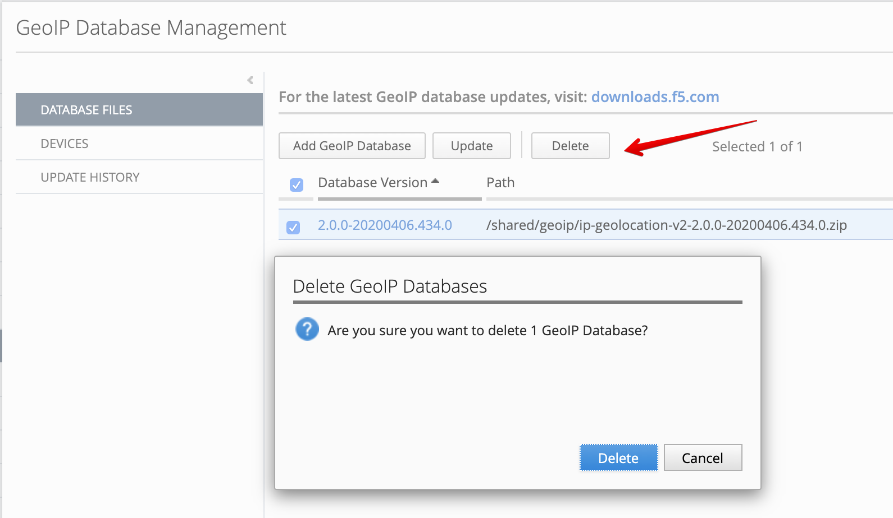

6. Upload the files downloaded earlier.

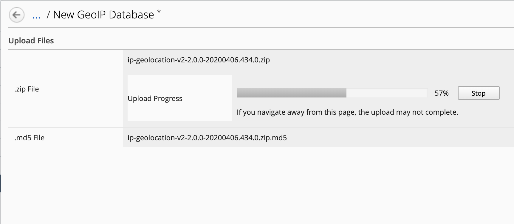

**Save & Close**.

7. Now, let's check the location of the following IP address ``192.1.0.11`` before updating the GeoIP DB on the BIG-IP.

Go to Devices > Script Management > Script. Create a new script.

- Name: ``geoip_lookup``
- Script: ``geoip_lookup 192.1.0.11``

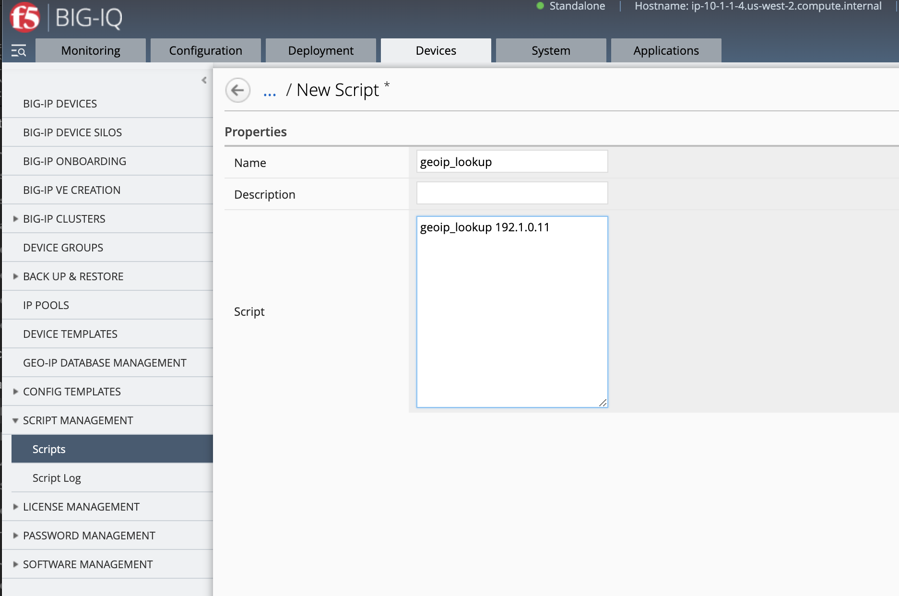

**Save & Close**.

.. note:: `K15042`_: Looking up IP geolocation data using the geoip_lookup command

.. _K15042: https://support.f5.com/csp/article/K15042

8. Select the script created and click on **Run**. Set a name, select ``SJC-vBIGIP01.termmarc.com`` BIG-IP,
   then click on **Run**.

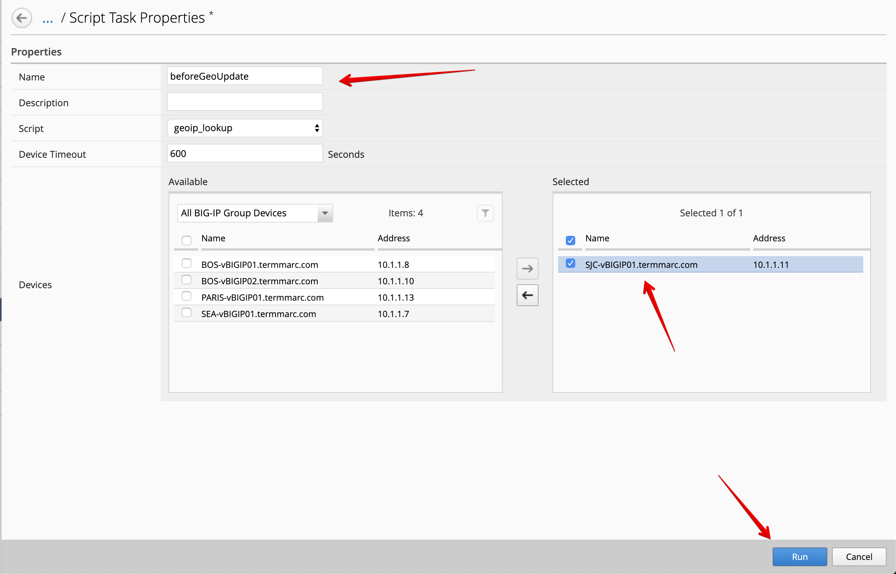

A window will open, *Click the link to see the result: Script Log*.

9. Once the script execution is completed, click on **View Output**.

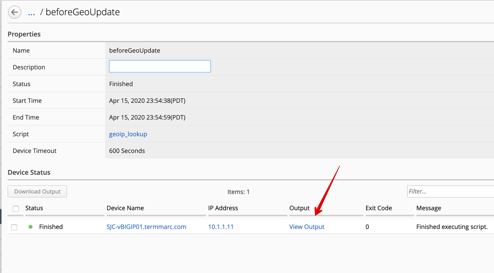

10. The IP address ``192.1.0.11`` shows a location in Massachusetts in the United States.

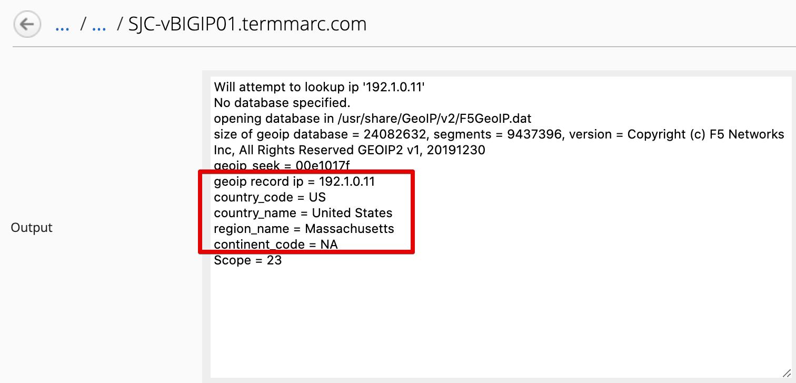

11. Back to the Geo-IP Database Management, under Devices, select ``SJC-vBIGIP01.termmarc.com`` BIG-IP and click on **Update**.

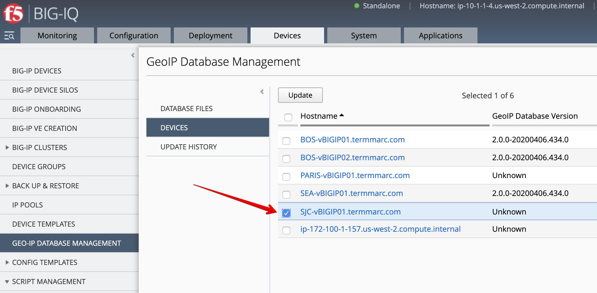

Verify the correct BIG-IP is selected, then click on **Save & Close**.

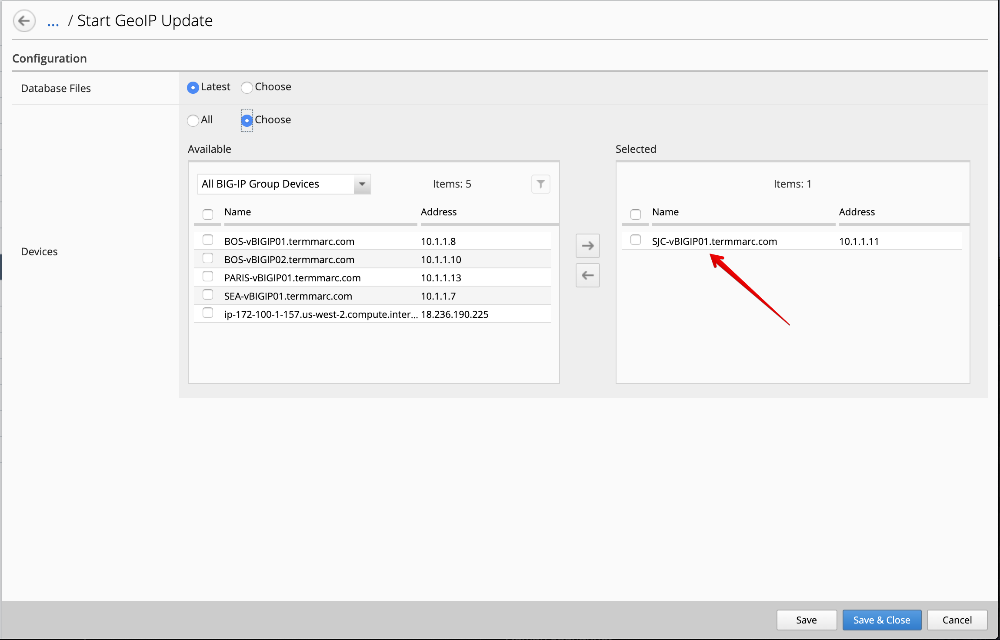

A window will open, *Click the link to see the result: Updates History*.

12. Wait until the transfer is done.

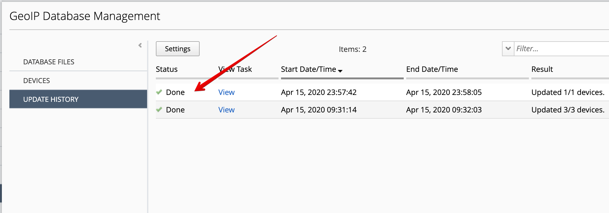

13. Back in the Script Management window, select again the script ``geoip_lookup``, 
    run it against ``SJC-vBIGIP01.termmarc.com`` and verify the output.

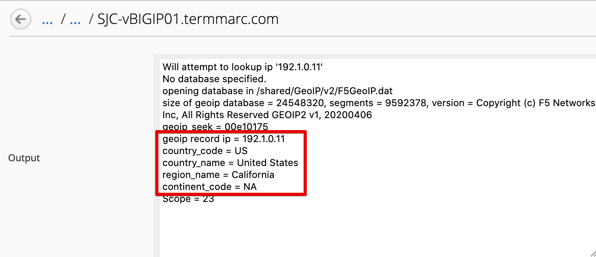

Is the location of the IP address still on the East Coast of the Unites States?