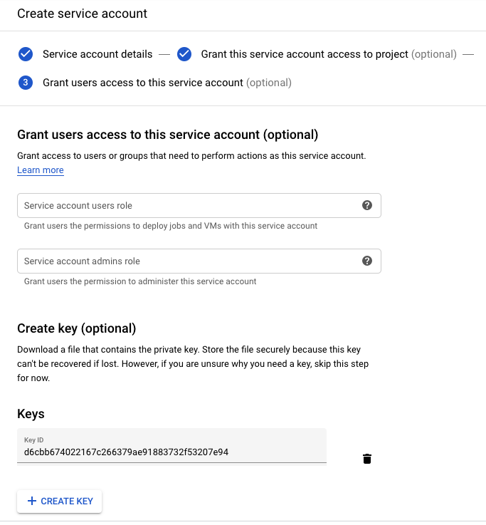
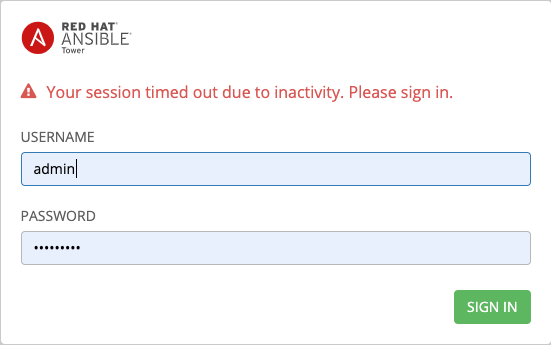
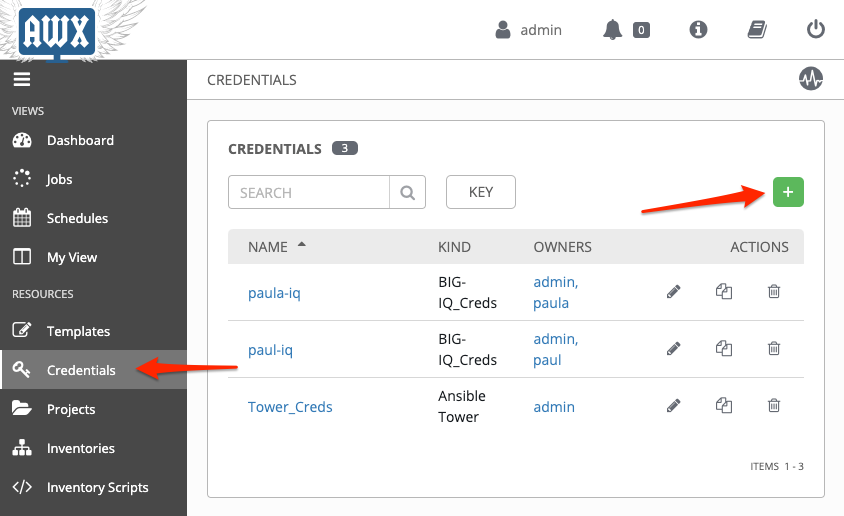

Lab 11.1: Prepare GCP account credentials
-----------------------------------------

.. note:: Estimated time to complete: **5 minutes**

.. include:: /accesslab.rst

Tasks
^^^^^

`Google service accounts`_ are used for authentication to Google, and are associated with service account keys (public/private RSA key pairs). 

.. _Google service accounts: https://cloud.google.com/iam/docs/service-accounts

.. Note:: If you already have a service account and credentials file, you can skip to the step below. 

1. Login or federate to the GCP console. Click the Navigation menu in the top left corner > select **IAM & Admin** > **Service Accounts** > click **CREATE SERVICE ACCOUNT**.

Enter a service account name (friendly display name), an optional description and then click **CREATE**.

.. image:: pictures/lab-1-1.png
  :scale: 60%
  :align: center

2. In the **Service account permissions (optional)** page, search for and select the **Compute Admin** role > click **CONTINUE**.

.. image:: pictures/lab-1-2.png
  :scale: 60%
  :align: center

3. In the **Grant users access to this service account (optional)** page, leave the two fields blank and click **CREATE KEY**. Select **JSON** as the key type, then click **CREATE**. The credentials file will be automatically downloaded to your computer. 

.. Note:: When you create a key, your new public/private key pair is generated and downloaded to your machine; it serves as the only copy of the private key. You are responsible for storing the private key securely. 

4. Load the credentials in Ansible Tower. Click on the *AWX (Ansible Tower)* button on the system *Ubuntu Lamp Server* in the lab environment. Use ``admin/purple123`` to authenticate.

5. Navigate to the **Credentials** page and click + to create a new credential. Type in a name and then click the magnifying glass to search for the **Google Compute Engine** credential type. Click the magnifying glass in the **SERVICE ACCOUNT JSON FILE** field to upload your service account json file and confirm that the **SERVICE ACCOUNT EMAIL ADDRESS** and **PROJECT** fields are populated. Click **SAVE**. 

.. image:: pictures/lab-1-6.png
  :scale: 60%
  :align: center

This completes the prepare GCP account credentials lab. 