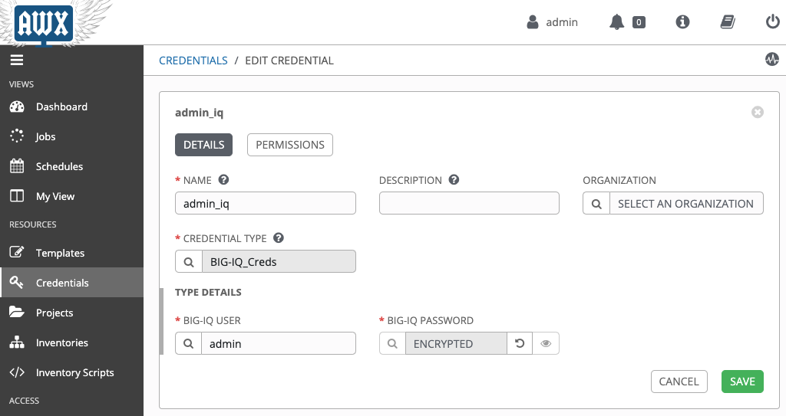
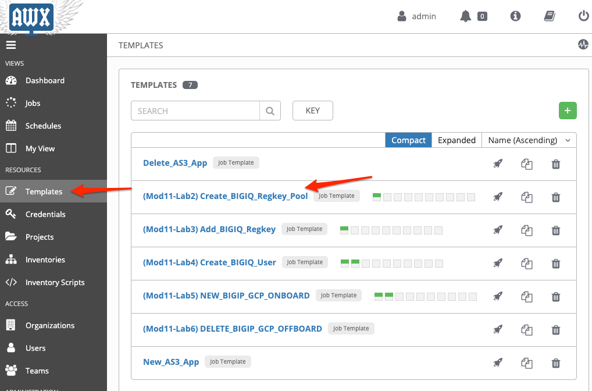
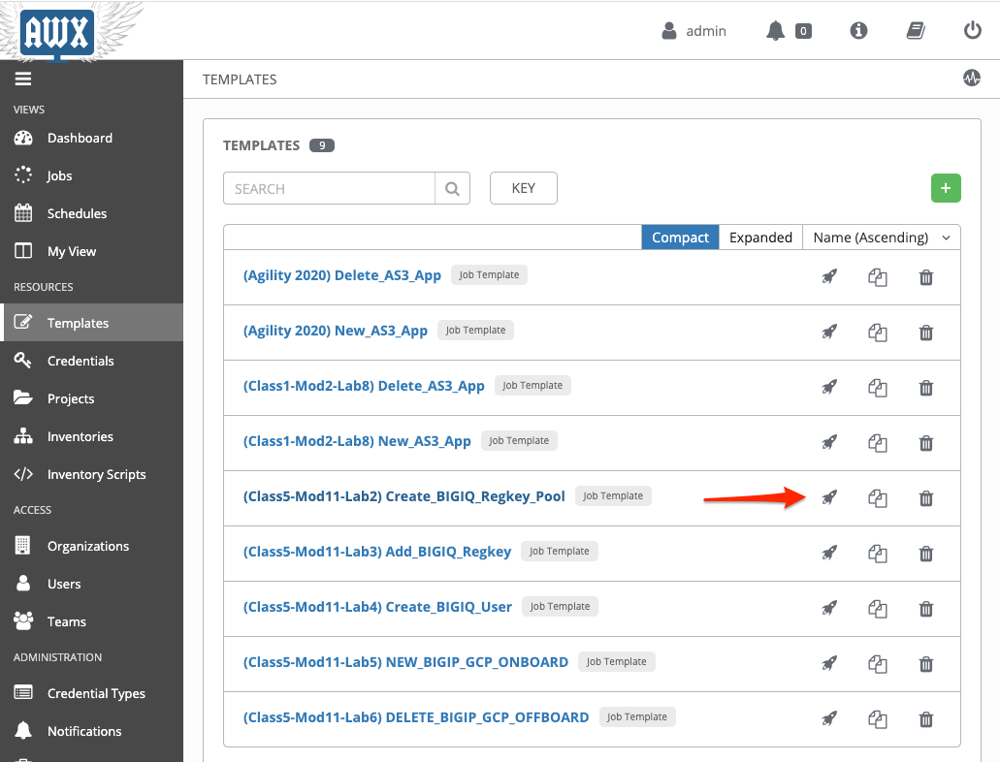
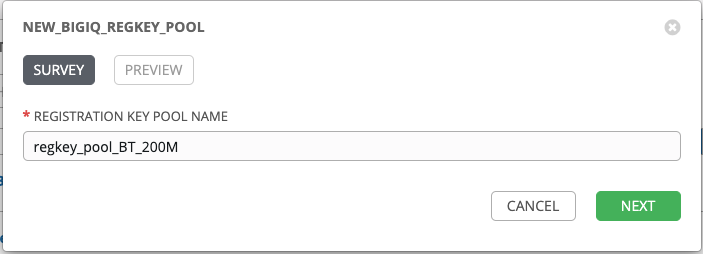
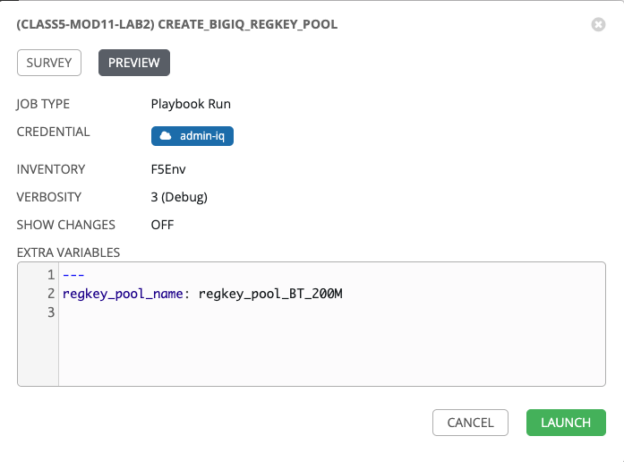
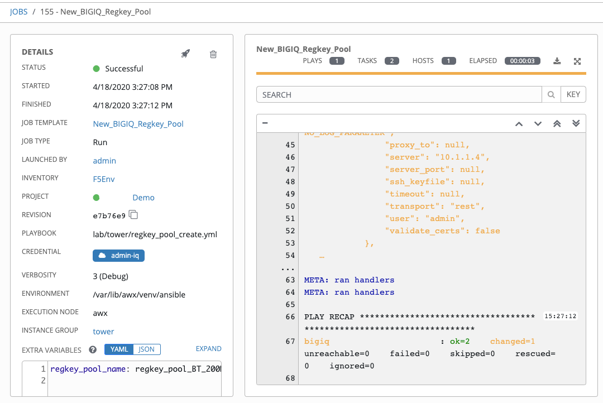
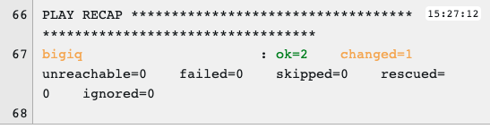

Lab 11.2: Create Regkey Pool
-----------------------------------

In this lab, we will create a new Regkey pool on BIG-IQ. BIG-IQ admin credentials are needed so we will create new Tower credentials.

Click on the *AWX (Ansible Tower)* button on the system *Ubuntu Lamp Server* in the lab environment.
Use ``admin/purple123`` to authenticate.

.. image:: pictures/lab-2-1.png
  :scale: 60%
  :align: center

1. Navigate to the **Credentials** page and notice the credentials of type **BIG-IQ_Creds**. The labs in these modules will use the **admin-iq** credential for creating resources on BIG-IQ. 

3. Navigate to the **Templates** page and review ``(Mod11-Lab2) Create_BIGIQ_Regkey_Pool``.

Make sure the **PLAYBOOK** ``lab/f5-ansible-bigiq-as3-demo/tower/regkey_pool_create.yml`` is selected. Also confirm that the admin_iq (BIG-IQ) credentials appear in the **CREDENTIALS** field.

You can go on the `GitHub repository`_ and check review the playbooks and Jinja2 templates.

.. _GitHub repository: https://github.com/f5devcentral/f5-big-iq-lab/tree/develop/lab/f5-ansible-bigiq-as3-demo/tower

4. Back on the **Templates** page, next to the *New_BIGIQ_Regkey_Pool* template, click on the *Start a job using this template*.

5. **SURVEY**: Enter in the name of your regkey pool.

+-----------------------------+---------------------+
| REGISTRATION KEY POOL NAME  | regkey_pool_BT_200M |
+-----------------------------+---------------------+

6. **PREVIEW**: Review the summary of the template deployment, then click on **LAUNCH**.

7. Follow the JOB deployment of the Ansible playbook.

8. When the job is completed, check the PLAY RECAP and make sure there nothing failed.

9. Login on **BIG-IQ** as **admin**, go to Devices tab > LICENSE MANAGEMENT > Licenses and check the newly created regkey pool.

.. image:: pictures/lab-2-9.png
  :scale: 60%
  :align: center

This completes the regkey pool creation lab. 