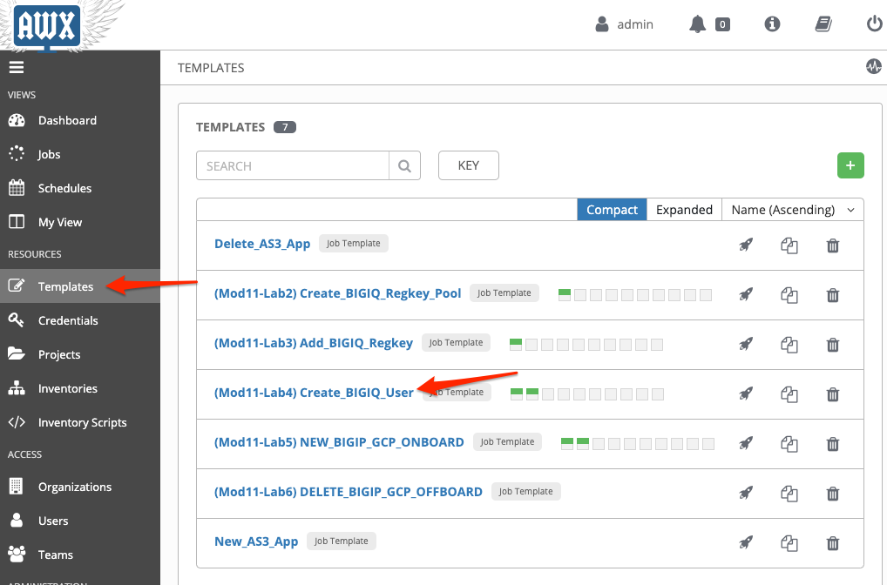
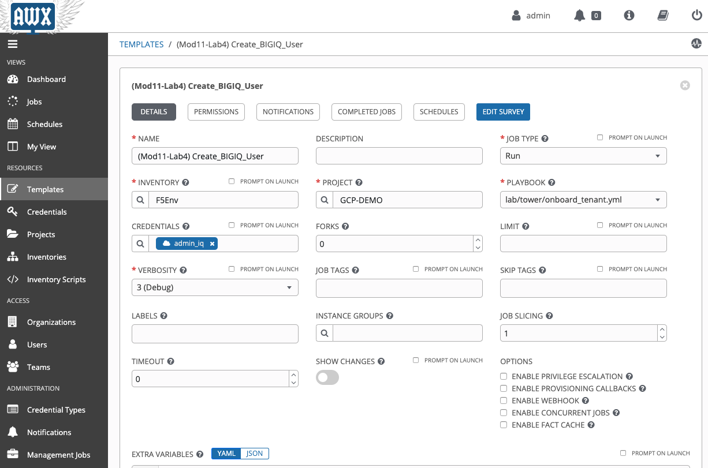
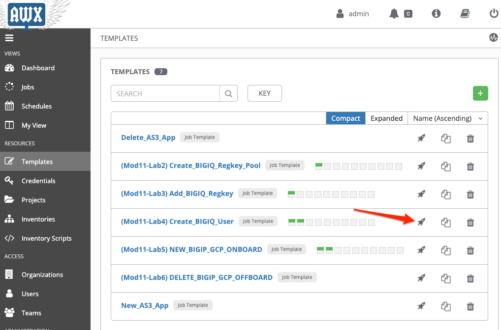
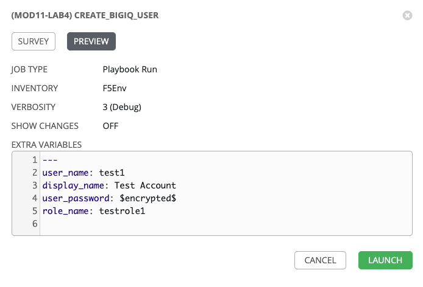
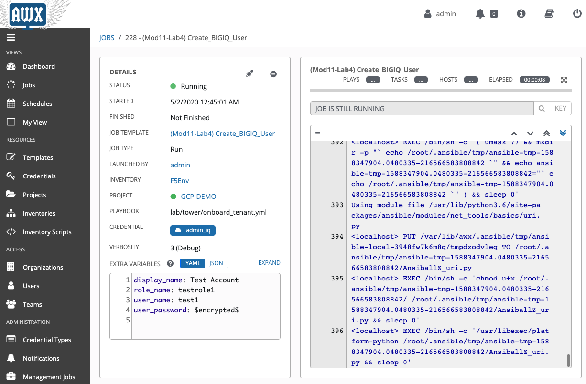

Lab 11.4: Create User
-----------------------------------

In this lab, we will add a new user to an existing custom role on BIG-IQ. 

**Prerequisites**

- BIG-IQ Custom Application Role Name

1. Navigate to the **Templates** page and review ``(Mod11-Lab4) Create_BIGIQ_User``.

Make sure the **PLAYBOOK** ``lab/f5-ansible-bigiq-as3-demo/tower/onboard_tenant.yml`` is selected. Also confirm that the admin_iq (BIG-IQ) credentials appear in the **CREDENTIALS** field.

You can go on the `GitHub repository`_ and check review the playbooks and Jinja2 templates.

.. _GitHub repository: https://github.com/f5devcentral/f5-big-iq-lab/tree/develop/lab/f5-ansible-bigiq-as3-demo/tower

2. Back on the **Templates** page, next to the *Add_BIGIQ_Regkey* template, click on the *Start a job using this template*.

3. **SURVEY**: Enter in the name of your regkey pool and the new key.

+-----------------------------+--------------------------+
| REGISTRATION KEY POOL NAME  | regkey_pool_BT_200M      |
+-----------------------------+--------------------------+
| REGISTRATION KEY            | XXXX-XXXX-XXXX-XXXX-XXXX |
+-----------------------------+--------------------------+

.. image:: pictures/lab-4-4.png
  :scale: 60%
  :align: center

4. **PREVIEW**: Review the summary of the template deployment, then click on **LAUNCH**.

5. Follow the JOB deployment of the Ansible playbook.

6. When the job is completed, check the PLAY RECAP and make sure there nothing failed.

.. image:: pictures/lab-4-7.png
  :scale: 60%
  :align: center

7. Login on **BIG-IQ** as **admin**, go to System tab > USER MANAGEMENT > Users. Confirm the new user exists.

.. image:: pictures/lab-4-8.png
  :scale: 60%
  :align: center

This completes the user creation lab. 