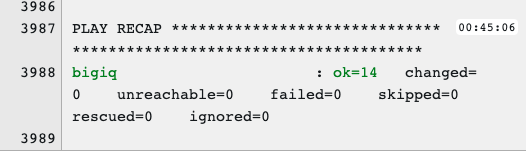
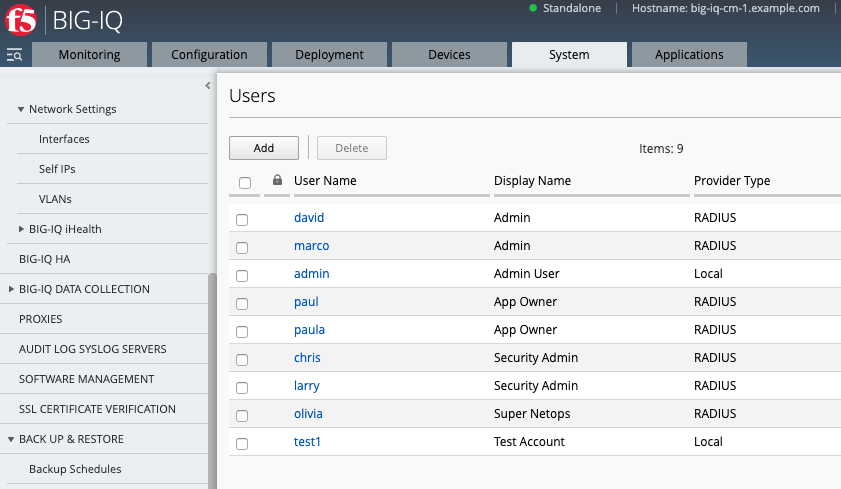

Lab 11.4: Create User
---------------------

.. note:: Estimated time to complete: **5 minutes**

In this lab, we will add a new user to an existing custom role on BIG-IQ. 

.. Note:: Currently there is no Ansible playbook to create custom roles so we will add this using the BIG-IQ UI first.

1. Login to BIG-IQ as **david** *(open a Remote Desktop session to the Ubuntu Jump-host or access directly to the BIG-IQ CM)*.

2. Go to System > ROLE MANAGEMENT > Roles > CUSTOM ROLES > Application Roles > click **Add**. 

.. image:: pictures/lab-4-1.png
  :scale: 60%
  :align: center

3. Enter in a name like **testrole1** as the role name. 

.. image:: pictures/lab-4-2.png
  :scale: 60%
  :align: center

4. Scroll down to the **AS3 Templates** section and select any AS3 template that you want to expose to the new user and click the arrow to get it in the **Selected** section. Then, click **Save & Close**. You can leave all other fields default.

.. image:: pictures/lab-4-3.png
  :scale: 60%
  :align: center

5. Next, in the *AWX (Ansible Tower)* window, navigate to the **Templates** page and review ``(Class5-Mod11-Lab4) Create_BIGIQ_User``.

.. image:: pictures/lab-4-4.png
  :scale: 60%
  :align: center

Make sure the **PLAYBOOK** ``lab/f5-ansible-bigiq-as3-demo/tower/onboard_tenant.yml`` is selected. Also confirm that the admin-iq (BIG-IQ) credentials appear in the **CREDENTIALS** field.

.. image:: pictures/lab-4-5.png
  :scale: 60%
  :align: center

You can go on the `GitHub repository`_ and check review the playbooks and Jinja2 templates.

.. _GitHub repository: https://github.com/f5devcentral/f5-big-iq-lab/tree/develop/lab/f5-ansible-bigiq-as3-demo/tower

6. Back on the **Templates** page, next to the *(Class5-Mod11-Lab4) Create_BIGIQ_User* template, click on the *Start a job using this template*.

.. image:: pictures/lab-4-6.png
  :scale: 60%
  :align: center

7. **SURVEY**: Enter in the required fields like below.

+----------------------------+--------------+
| USER NAME                  | username     |
+----------------------------+--------------+
| DISPLAY NAME: (FIRST LAST) | First Last   |
+----------------------------+--------------+
| PASSWORD                   | XXXXXXXXXXXX |
+----------------------------+--------------+
| EXISTING ROLE NAME         | testrole1    |
+----------------------------+--------------+

.. image:: pictures/lab-4-7.png
  :scale: 60%
  :align: center

8. **PREVIEW**: Review the summary of the template deployment, then click on **LAUNCH**.

.. image:: pictures/lab-4-8.png
  :scale: 60%
  :align: center

9. Follow the JOB deployment of the Ansible playbook.

.. image:: pictures/lab-4-9.png
  :scale: 60%
  :align: center

10. When the job is completed, check the PLAY RECAP and make sure there nothing failed.

11. Login on **BIG-IQ** as **admin**, go to System tab > USER MANAGEMENT > Users. Confirm the new user exists.

This completes the user creation lab. 