Lab 11.5: Discover, License, and Register BIG-IP on BIG-IQ using Declarative Onboarding
---------------------------------------------------------------------------------------

.. note:: Estimated time to complete: **5 minutes**

In this lab, we will create a BIG-IP on GCP and discover and register it on BIG-IQ. 

**Prerequisites**

- |gcpcreds|_  
- BIG-IP Management IP
- BIG-IP Username/Password
- BIG-IQ Regkey Pool Name

1. Navigate to the **Templates** page and review ``(Class5-Mod11-Lab5) NEW_BIGIP_GCP_ONBOARD``.

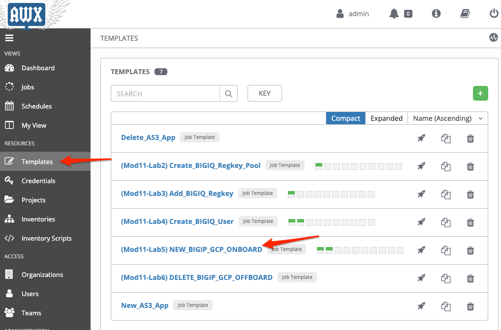

Make sure the **PLAYBOOK** ``lab/f5-ansible-bigiq-as3-demo/tower/create_onboard_bigip_gcp_managed_do.yml`` is selected. Also confirm that the admin-iq (BIG-IQ) and your GCP credentials appear in the **CREDENTIALS** field. Don't forget to click **SAVE** to save changes to the credentials.

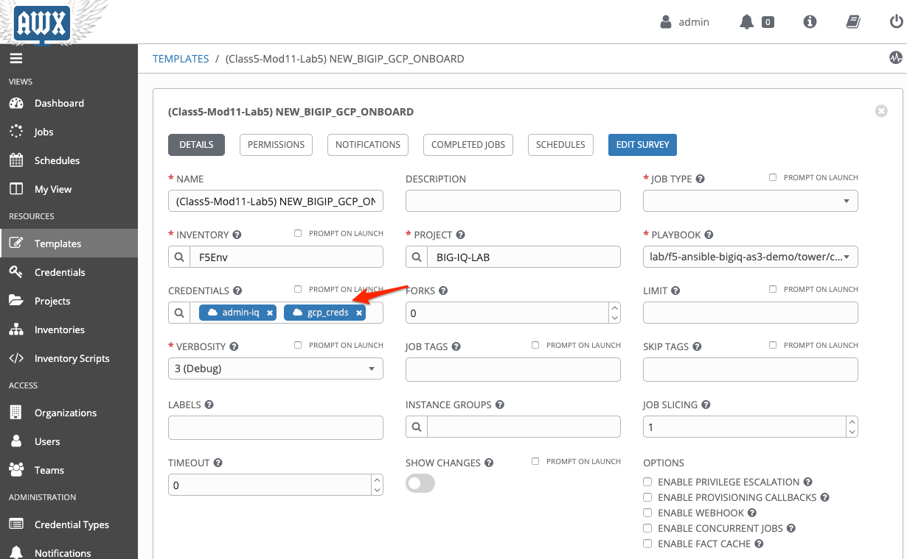

You can go on the `GitHub repository`_ and check review the playbooks and Jinja2 templates.

2. Back on the **Templates** page, next to the *(Class5-Mod11-Lab5) NEW_BIGIP_GCP_ONBOARD* template, click on the *Start a job using this template*.

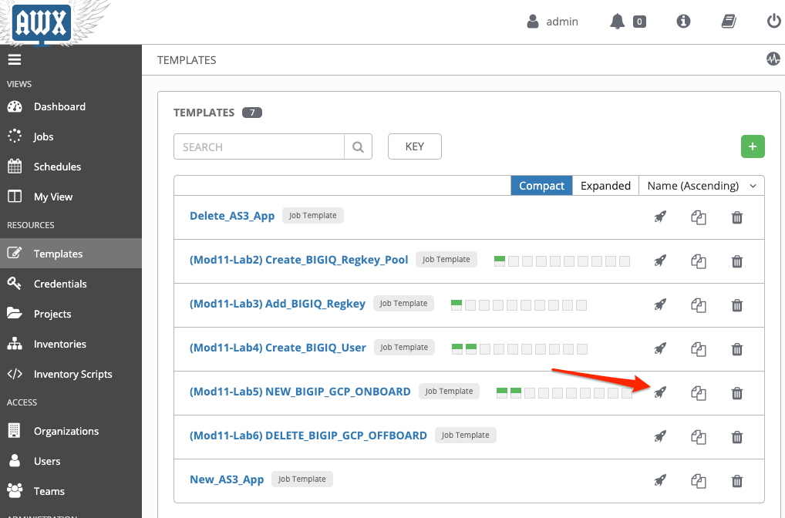

3. **SURVEY**: Enter in the required fields like below.

+------------------------------------------------------------+--------------------------+
| Name Prefix used for creating all GCP resources            | bigiq-lab-mod11          |
+------------------------------------------------------------+--------------------------+
| GCP Region to create BIG-IP                                | asia-northeast1          |
+------------------------------------------------------------+--------------------------+
| Zone for BIG-IP instance                                   | asia-northeast1-b        |
+------------------------------------------------------------+--------------------------+
| BIG-IP username                                            | admin                    |
+------------------------------------------------------------+--------------------------+
| BIG-IP Password                                            | XXXXXXXX                 |
+------------------------------------------------------------+--------------------------+
| REGISTRATION KEY POOL NAME                                 | regkey_pool_BT_200M      |
+------------------------------------------------------------+--------------------------+
| Type "asm" to provision F5 WAF, leave "null" if not needed | asm                      |
+------------------------------------------------------------+--------------------------+
| Existing Role Name                                         | testrole1                |
+------------------------------------------------------------+--------------------------+

.. warning:: Make sure you use a strong enough password for BIG-IP Password (see https://support.f5.com/csp/article/K10612010)

.. note:: Your values may differ from the example above

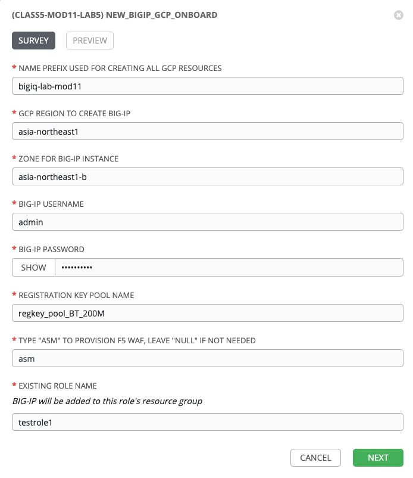

4. **PREVIEW**: Review the summary of the template deployment, then click on **LAUNCH**.

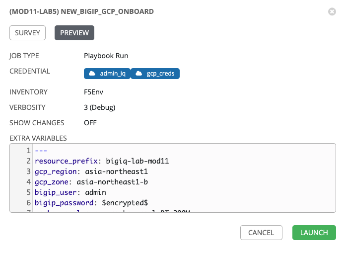

5. Follow the JOB deployment of the Ansible playbook.

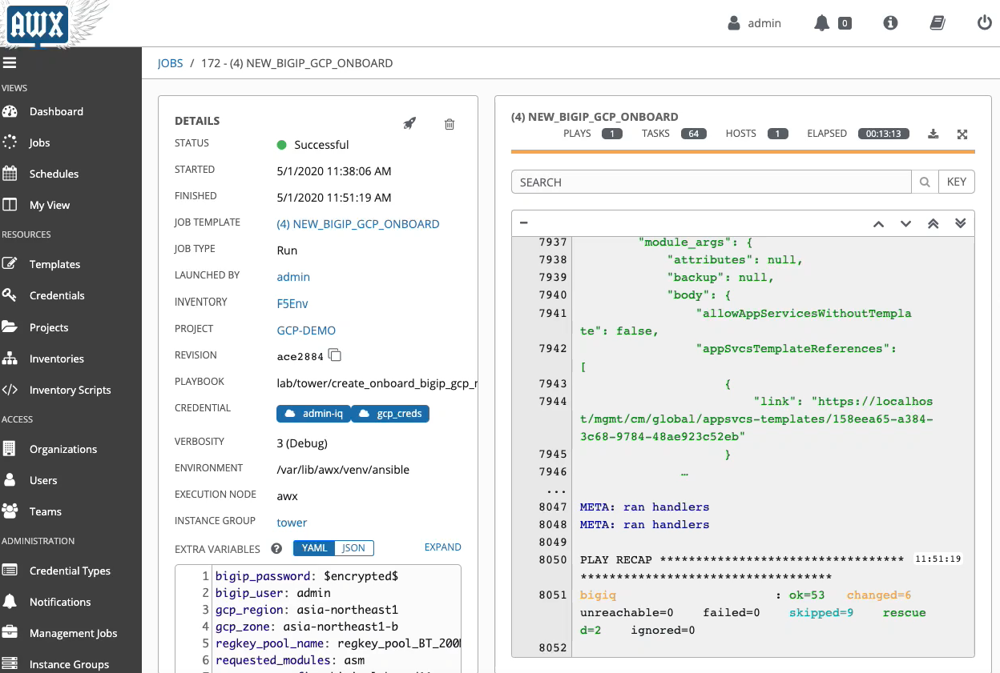

6. When the job is completed, check the PLAY RECAP and make sure there nothing failed.

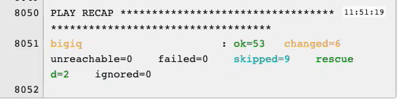

7. Login on **BIG-IQ** as **admin**, go to Devices tab > BIG-IP ONBOARDING and confirm that the onboarding task status. 

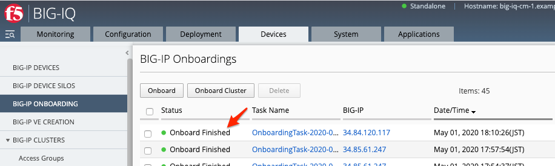

8. Click on BIG-IP DEVICES and confirm the discovered BIG-IP device. 

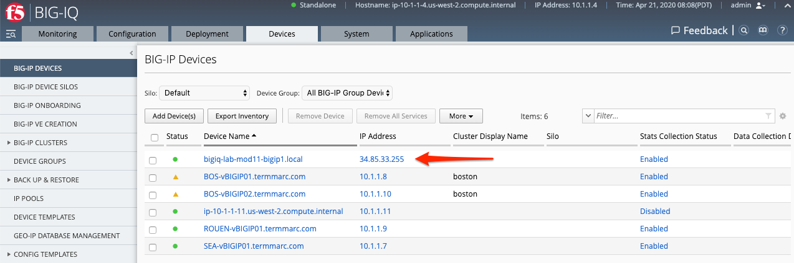

9. Click on Devices Tab > LICENSE MANAGEMENT > licenses > click the new regkey pool created earlier and confirm that the license you added earlier has been assigned to the new BIG-IP. 

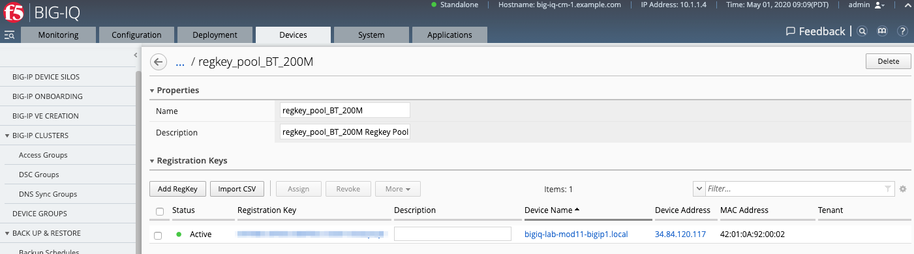

10. Log into GCP Console and confirm the instance. 

.. image:: pictures/lab-5-11.png
  :scale: 60%
  :align: center

11. On BIG-IQ, log out of admin, and log back in as the user you created earlier (choose Auth Provider: Local). The BIG-IP has been added to the same role assigned to this user so you should see the new BIG-IP device in the target list when creating an AS3 application deployment.

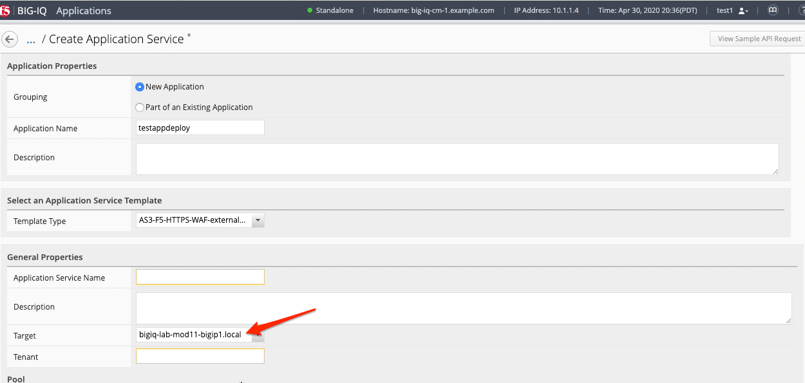

This completes the BIG-IP onboarding lab. 

.. |gcpcreds| replace:: GCP Credentials
.. _gcpcreds: https://cloud.google.com/iam/docs/creating-managing-service-account-keys
.. _GitHub repository: https://github.com/f5devcentral/f5-big-iq-lab/tree/develop/lab/f5-ansible-bigiq-as3-demo/tower

