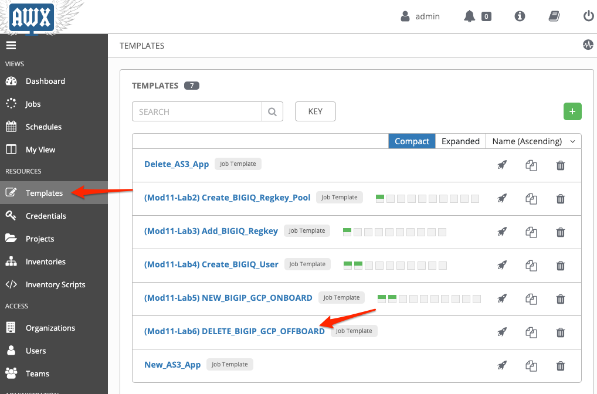
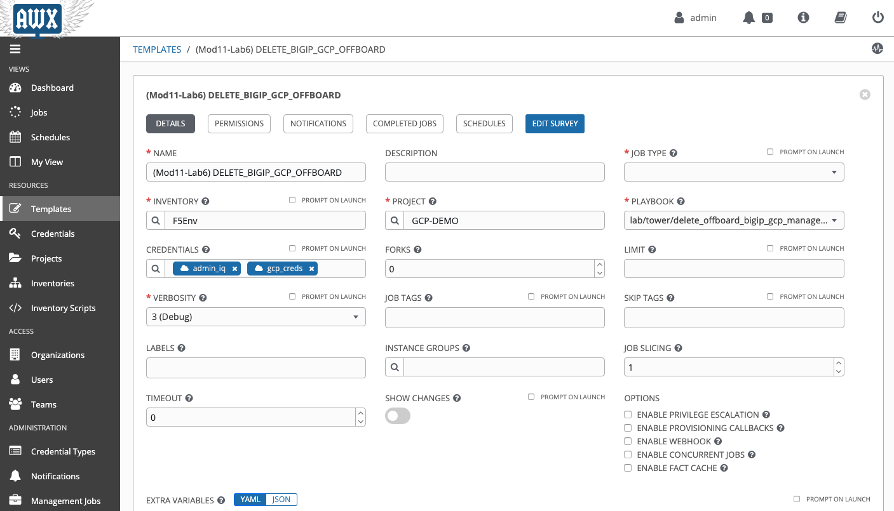
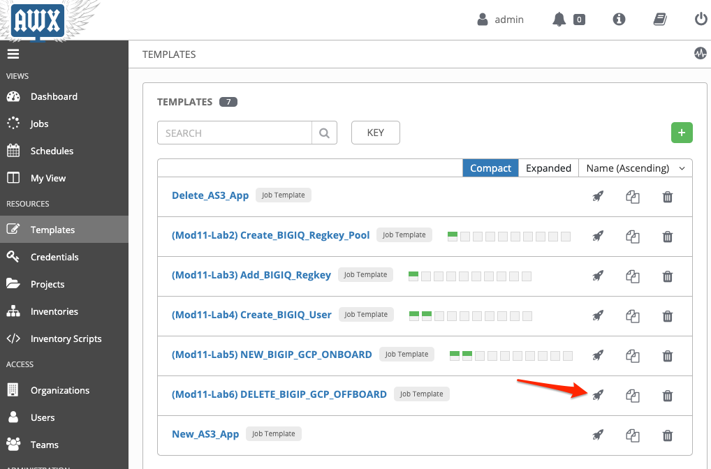
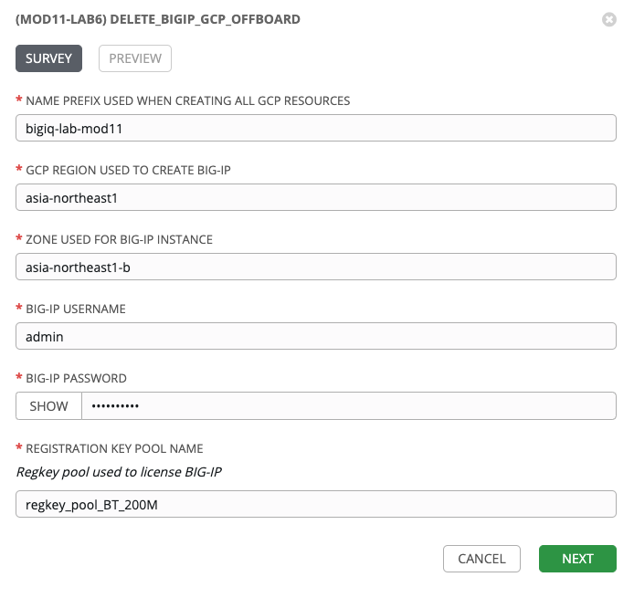
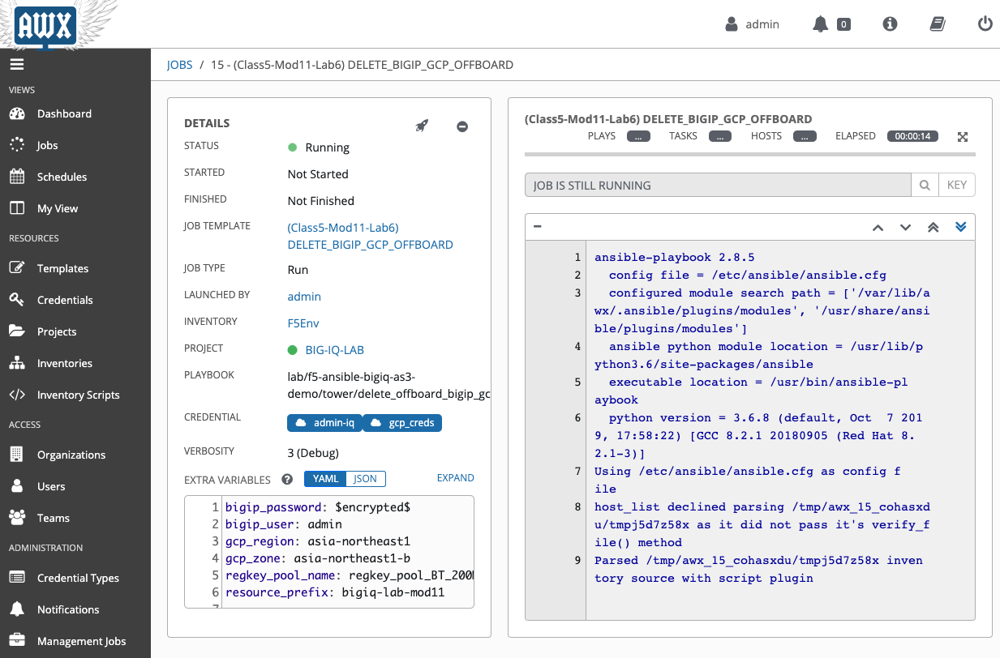
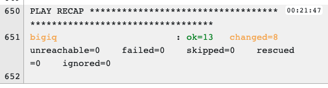
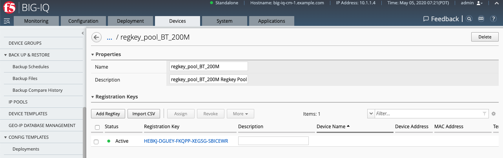
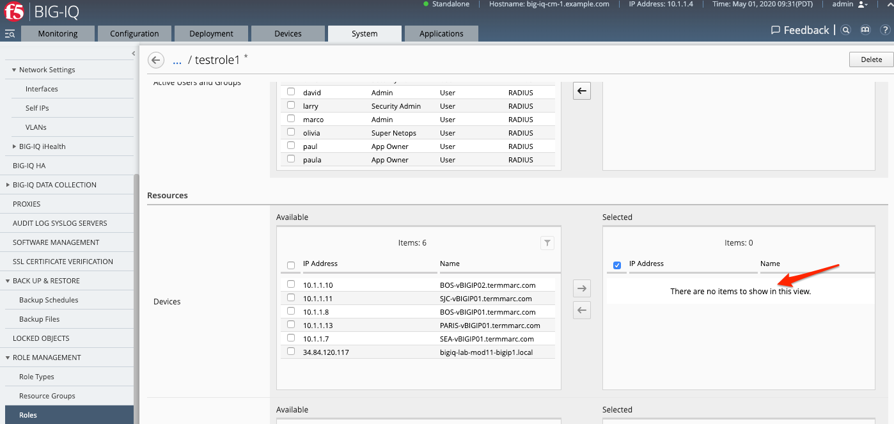
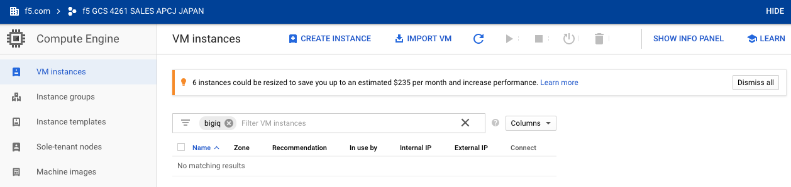

Lab 11.6: Offboard BIG-IP from BIG-IQ
-------------------------------------

.. note:: Estimated time to complete: **5 minutes**

In this lab, we will revoke the license, remove BIG-IP from the application custom role, remove the device from BIG-IQ, then finally delete the instance on GCP. 

**Prerequisites**

- |gcpcreds|_  
- BIG-IP Management IP
- BIG-IP Username/Password
- BIG-IQ Regkey Pool Name

1. Navigate to the **Templates** page and review ``(Class5-Mod11-Lab6) DELETE_BIGIP_GCP_OFFBOARD``.

Make sure the **PLAYBOOK** ``lab/f5-ansible-bigiq-as3-demo/tower/delete_offboard_bigip_gcp_managed_do.yml`` is selected. Also confirm that the admin-iq (BIG-IQ) and your GCP credentials appear in the **CREDENTIALS** field. Don't forget to click **SAVE** to save changes to the credentials. 

You can go on the `GitHub repository`_ and check review the playbooks and Jinja2 templates.

2. Back on the **Templates** page, next to the *(Class5-Mod11-Lab6) DELETE_BIGIP_GCP_OFFBOARD* template, click on the *Start a job using this template*.

3. **SURVEY**: Enter in the required fields like below.

+------------------------------------------------------------+--------------------------+
| Prefix used when creating all GCP resources                | bigiq-lab-mod11          |
+------------------------------------------------------------+--------------------------+
| GCP Region Used to create BIG-IP                           | asia-northeast1          |
+------------------------------------------------------------+--------------------------+
| Zone Used for BIG-IP instance                              | asia-northeast1-b        |
+------------------------------------------------------------+--------------------------+
| BIG-IP username                                            | admin                    |
+------------------------------------------------------------+--------------------------+
| BIG-IP Password                                            | XXXXXXXX                 |
+------------------------------------------------------------+--------------------------+
| REGISTRATION KEY POOL NAME                                 | regkey_pool_BT_200M      |
+------------------------------------------------------------+--------------------------+

.. note:: Your values may differ from the example above

4. **PREVIEW**: Review the summary of the template deployment, then click on **LAUNCH**.

.. image:: pictures/lab-6-5.png
  :scale: 60%
  :align: center

5. Follow the JOB deployment of the Ansible playbook.

6. When the job is completed, check the PLAY RECAP and make sure there nothing failed.

7. Login on **BIG-IQ** as **admin**, go to Devices tab > BIG-IP DEVICES and confirm that the device is no longer displayed. 

.. image:: pictures/lab-6-8.png
  :scale: 60%
  :align: center

8. Click on LICENSE MANAGEMENT > Licenses and confirm that the license has been revoked and available in the pool. 

9. Click System > ROLE MANAGEMENT > Roles > CUSTOM ROLES > Application Roles > click on the role you specified when creating the BIG-IP device. Confirm that the BIG-IP is no longer selected. 

10. Log into GCP Console and confirm the instance has been deleted.

This completes the BIG-IP offboarding lab. 

.. |gcpcreds| replace:: GCP Credentials
.. _gcpcreds: https://cloud.google.com/iam/docs/creating-managing-service-account-keys
.. _GitHub repository: https://github.com/f5devcentral/f5-big-iq-lab/tree/develop/lab/f5-ansible-bigiq-as3-demo/tower

